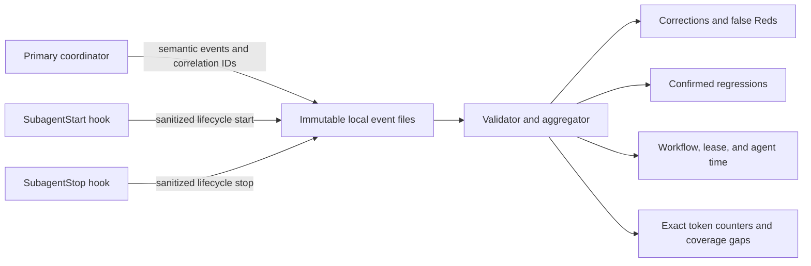

# Agent-Flow Metrics

This policy adds local, best-effort telemetry to the repository's [worker-first ExecPlan implementation workflow](./execplan-implementation-workflow.md). It measures corrections, false Reds, confirmed regressions, elapsed time, and exact reported token counters without changing the workflow's authority or evidence rules.

Metrics are observations, not quality gates. A missing hook, event, duration, or token counter cannot accept or reject Red, authorize Green, change a review verdict, prove behavior, alter task status, or block task closure.

## How it works



The two input paths are intentionally separate:

- [`.codex/hooks.json`](./hooks.json) observes `SubagentStart` and `SubagentStop` for `test_worker`, `code_worker`, and `independent_reviewer`. Hooks know lifecycle identity and time, but they do not know whether a failure is a false Red, a correction, or a regression.
- The primary coordinator uses [the metrics CLI](./metrics/agent_flow_metrics.py) to record semantic decisions after inspecting the actual handoff and repository evidence. Workers only echo the assigned workflow, cycle, and lease IDs.

Every invocation publishes one uniquely named JSON file under `logs/agent-flow-metrics/v1/events/`. The repository already ignores `logs/`, and the runtime location remains writable even when the Codex configuration layer is protected from shell writes. Files are written through an atomic same-directory replacement, so concurrent asynchronous hooks never append to a shared file and may safely finish out of order.

## Metric definitions

| Metric | Counted when | Not counted when |
|---|---|---|
| Correction | The coordinator records `correction_requested` with a new correction lease ID, the same assignment identity, and attempt 2 because a handoff was rejected or an actionable reviewer finding requires additional worker work | Initial assignments, attempts other than 2, clarifications with no new work, new behavior slices, or a stopped/reclassified branch |
| False Red | The coordinator records `red_rejected` because the observed failure cannot cross the Red acceptance barrier | A valid accepted Red, or a test-side mistake fixed before the first worker handoff |
| Confirmed regression | Triage proves that the current workflow change caused a required check which passed in the accepted baseline to fail, then the coordinator records `regression_confirmed` with that check's stable repository or plan-local ID; one stable check is counted at most once per workflow | Pre-existing, transient, infrastructure, unrelated, still-ambiguous, or duplicate/moved check reports |
| Elapsed time | A start and completion event share the same workflow, lease, or agent ID | Unpaired events; these remain visible as incomplete coverage instead of becoming zero-duration work |
| Token usage | The runtime or another authoritative source provides an exact nonnegative counter and the coordinator records `token_usage_reported` | Estimates, values inferred from text, or values scraped from a transcript |

The false-Red rate is rejected Reds divided by all Reds decided by the coordinator (`red_accepted + red_rejected`). With no decided Red, the rate is unknown rather than zero. Accepted reason codes for `red_rejected` are:

- `wrong_failure`
- `pre_existing_failure`
- `unrelated_failure`
- `setup_failure`
- `infrastructure_failure`
- `requirement_mismatch`

Workflow elapsed time measures the coordinator's recorded start-to-completion interval. Lease time measures assigned phases. Agent time comes from linked lifecycle hooks. Summed agent time can exceed workflow wall time when independent agents overlap, so the report keeps these scopes separate.

Input, cached-input, output, and reasoning token counters remain separate. Their relationship can depend on the reporting runtime, so the tool does not invent a composite billing total. A partial report says exactly which counters and lease-linked agents are missing. An exact report for the primary coordinator is allowed and contributes to totals, but it is shown separately as an identified unlinked report because the primary does not receive a worker lease.

Every coordinator event requires the same workflow and task identity. Lease start, completion, and correction records also require the same cycle, lease, phase, attempt, agent, and role identity; corrections use attempt 2 exactly. A token report for a lease-linked worker must match that task and role, while an identified primary report remains unlinked. Lifecycle pairs must match session, turn, agent, and role. A stable regression check belongs to only one cycle within a workflow.

Exact logical replays are idempotent: aggregation keeps the first observation, counts it once, and reports the dataset-wide replay count. The validator rejects and the summary excludes contradictory Red decisions, conflicting copies of one logical event or token report, cross-event identity conflicts, and a completion timestamp earlier than its start. An unpaired start or completion remains an explicit coverage gap because background hooks can be cancelled.

## Activate the lifecycle hooks

Project hooks are security-sensitive and do not run merely because the files exist. Review [the hook definition](./hooks.json) and [the invoked script](./metrics/agent_flow_metrics.py), then use `/hooks` in Codex to trust the exact project hook definition. Codex skips an untrusted or subsequently changed definition until it is reviewed again.

The Unix hook command uses `python3`; its Windows override uses `python`. Both resolve the Git root before invoking the repository script, so starting Codex from a subdirectory does not change the script location. Hooks run asynchronously with a five-second timeout and always return empty valid JSON. A hook parsing or storage failure exits successfully and does not request continuation, blocking, approval, or input rewriting.

Hook trust and a real subagent run are required before automatic lifecycle capture can be claimed as runtime evidence. The tracked configuration by itself proves only that instrumentation is available.

## Coordinator operation

Use stable, non-secret identifiers. A practical pattern is `<TASK_ID>-<YYYYMMDD>-<sequence>` for a workflow, `<workflow>-setup-01` or `<workflow>-cycle-01` for a cycle, and `<cycle>-red-01` for a lease.

Start a run:

```powershell
python -B .codex/metrics/agent_flow_metrics.py record `
  --event workflow_started `
  --workflow-id TASK-003-20260811-01 `
  --task-id TASK-003
```

After spawning a worker and receiving its agent ID, bind its assignment. It is safe if the automatic start event already exists because aggregation uses IDs rather than file arrival order:

```powershell
python -B .codex/metrics/agent_flow_metrics.py record `
  --event lease_started `
  --workflow-id TASK-003-20260811-01 `
  --task-id TASK-003 `
  --cycle-id TASK-003-20260811-01-cycle-01 `
  --lease-id TASK-003-20260811-01-cycle-01-red-01 `
  --phase red `
  --attempt 1 `
  --agent-id AGENT_ID `
  --agent-type test_worker
```

Record the Red decision:

```powershell
# Accepted Red
python -B .codex/metrics/agent_flow_metrics.py record `
  --event red_accepted `
  --workflow-id TASK-003-20260811-01 `
  --task-id TASK-003 `
  --cycle-id TASK-003-20260811-01-cycle-01 `
  --attempt 1

# Rejected Red and the resulting correction
python -B .codex/metrics/agent_flow_metrics.py record `
  --event red_rejected `
  --workflow-id TASK-003-20260811-01 `
  --task-id TASK-003 `
  --cycle-id TASK-003-20260811-01-cycle-01 `
  --attempt 1 `
  --reason-code wrong_failure

python -B .codex/metrics/agent_flow_metrics.py record `
  --event correction_requested `
  --workflow-id TASK-003-20260811-01 `
  --task-id TASK-003 `
  --cycle-id TASK-003-20260811-01-cycle-01 `
  --lease-id TASK-003-20260811-01-cycle-01-red-02 `
  --phase red `
  --attempt 2 `
  --agent-id AGENT_ID `
  --agent-type test_worker `
  --reason-code wrong_failure
```

Close each lease with the same task, cycle, lease, phase, attempt, agent, and role fields plus `--event lease_completed`. A correction gets a new lease ID and attempt 2; never reuse the rejected lease or record attempt 3. Record `regression_confirmed` only after the workflow's failure-triage rule is satisfied and pass `--check-id` with the stable ID of the previously passing check. That check ID may be reported only once in a workflow and cannot be moved between cycles. Preserve the decisive baseline and failing commands in the ExecPlan or task evidence because the metric event does not replace that proof.

```powershell
python -B .codex/metrics/agent_flow_metrics.py record `
  --event regression_confirmed `
  --workflow-id TASK-003-20260811-01 `
  --task-id TASK-003 `
  --cycle-id TASK-003-20260811-01-cycle-01 `
  --check-id TASK-003-build `
  --reason-code current_change
```

If exact counters are available, record one final authoritative report per participating agent without filling missing values. Retrying that same report is safe; a different report for the same workflow and agent is a conflict rather than an amount to add. Use the runtime's stable primary identifier and `--agent-type primary` for an exact coordinator report; it remains intentionally unlinked to worker leases:

```powershell
python -B .codex/metrics/agent_flow_metrics.py record `
  --event token_usage_reported `
  --workflow-id TASK-003-20260811-01 `
  --task-id TASK-003 `
  --agent-id AGENT_ID `
  --agent-type code_worker `
  --input-tokens 1200 `
  --cached-input-tokens 800 `
  --output-tokens 350
```

At the final stopping point, record `workflow_completed` with the same workflow and task IDs, validate the event directory, and generate the report:

```powershell
python -B .codex/metrics/agent_flow_metrics.py validate
python -B .codex/metrics/agent_flow_metrics.py summary `
  --workflow-id TASK-003-20260811-01 `
  --format markdown
```

Use `--format json` for machine-readable aggregation. The Markdown report includes counts, false-Red reasons and rate, workflow/lease/agent pairing coverage, time by phase and agent type, exact token totals by counter and agent, missing lease-linked reports, identified unlinked reports, and invalid-file warnings. With `--workflow-id`, metric values are workflow-filtered while replay and dataset-error counts remain explicitly dataset-wide.

## Validation and failure behavior

Run the isolated standard-library checks after changing the tool:

```powershell
python -B .codex/metrics/agent_flow_metrics.py self-test
python -m json.tool .codex/hooks.json
```

The eight-check self-test covers the privacy allowlist, valid non-blocking hook output, malformed input and storage failure, rejection of negative token values, out-of-order pairing, exact replay, conflicting events, invalid time transitions, workflow/task and correction/lease association, linked token roles, stable regression identity, lifecycle turns, metric counts, partial token coverage, and concurrent atomic publication.

The interactive `record` command rejects invalid semantic input so the coordinator can report a coverage gap. The lifecycle hook entry point instead fails open: it never changes the subagent's continuation behavior. `summary` excludes malformed, conflicting, or mis-associated events and reports them; `validate` returns nonzero when malformed files, logical conflicts, cross-event identity conflicts, or invalid paired transitions exist. Exact replays remain valid but are counted once and reported.

## Privacy and limitations

Lifecycle events persist only the schema and event identity, observation time, source, session and turn IDs, agent ID and type, model, and permission mode. Semantic events add only coordinator-selected correlation IDs, phase, attempt, reason code, and exact token counters.

The tool never stores prompts, assistant messages, transcript paths, transcript contents, working directories, command output, source code, or secrets. It does not parse Codex transcripts because that format is not a stable hook interface. Background hooks can be cancelled at session end, so missing lifecycle coverage is expected and explicit.

This is repository workflow tooling, not application source, a product test harness, or TASK-003 implementation evidence. It uses the Python standard library because the repository has no executable Node workspace until TASK-003 creates the accepted TypeScript scaffold.

## References

- [Worker-first ExecPlan implementation workflow](./execplan-implementation-workflow.md)
- [Project-scoped agent registry](./README.md)
- [DPL-DEC-015 metrics decision](../docs/execution/decision-and-progress-log.md)
- [Official Codex hooks documentation](https://learn.chatgpt.com/docs/hooks)
- [Official Codex subagent documentation](https://learn.chatgpt.com/docs/agent-configuration/subagents)
