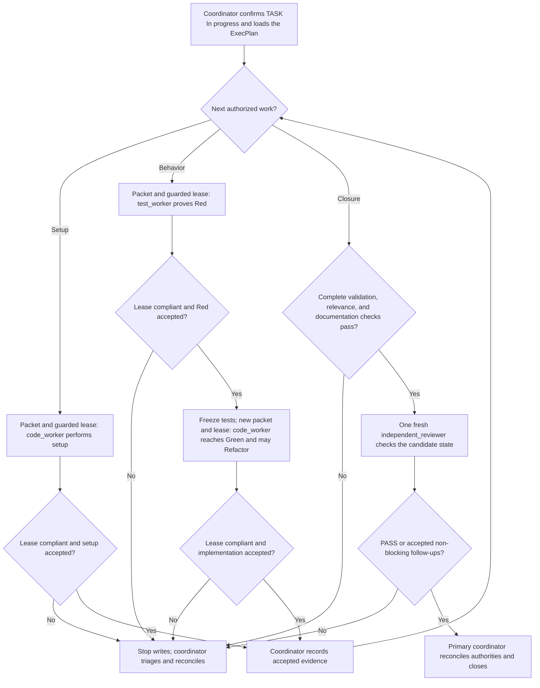

# Implement an ExecPlan with Worker Agents

This guide defines the normal implementation path for an authorized ExecPlan. It deliberately keeps exception handling outside the main graph: when a lease, handoff, command, requirement, or review result is not acceptable, writing stops and the primary coordinator decides what the new assignment must be.

The workflow adds three controls without replacing the ExecPlan:

- a small, extensible assignment packet so a worker receives enough context to start safely;
- a machine-verified write lease so the worker can change only the assigned paths; and
- serial Red-Green-Refactor handoffs with one independent review of each candidate final state.

## When to use this flow

Use it when the project owner authorizes implementation of an active ExecPlan and its canonical `TASK-*` is `In progress`. Do not use it to start a pending task, approve architecture, resolve a decision gate, or turn a plan into implementation evidence.

The flow supports:

- `setup` by `code_worker` for separately planned declarative or infrastructure work;
- `red` by `test_worker` for one observable behavior slice;
- `green` plus optional behavior-preserving Refactor by `code_worker` in one implementation turn.

Only one write-capable worker lease may be active in one worktree. The Red and Green workers for a behavior cycle are always sequential.

## Roles

| Role | Responsibility |
|---|---|
| Primary coordinator | Selects the next authorized slice, creates packets and leases, accepts or rejects handoffs, integrates evidence, handles approvals and exceptions, and owns final closure. |
| `test_worker` | Writes only the smallest assigned test-side change and proves the intended Red. |
| `code_worker` | Performs bounded setup or reaches minimum Green and optionally Refactors in the same turn. It never changes an accepted test. |
| `independent_reviewer` | Reviews the integrated candidate state and evidence read-only. It does not repair findings or close the task. |

## Worker Assignment Packet v1

Complete one packet immediately before every write-capable worker spawn. The packet is a minimum context floor, not a maximum: the coordinator may add relevant context, and the worker may inspect additional readable repository files when needed. Additional reading never expands the objective, authority, commands, dependencies, expected result, or write lease.

Create the stable workflow ID before the first assignment. Use one cycle ID for each bounded setup objective or behavior slice; its Red, Green, and optional Refactor assignments share that behavior-cycle ID.

Use this template:

```text
Worker Assignment Packet v1

Identity
- Workflow ID:
- Task ID:
- Cycle ID:
- Lease ID:
- Phase: setup | red | green
- Attempt: 1 | 2
- Worker role: test_worker | code_worker
- Lease owner:
- Guard contract digest: inserted after guard start

Authority and objective
- Owning ExecPlan:
- Controlling requirement / ADR / gate / SPEC / HS IDs:
- Objective:
- Starting barrier:
- Expected outcome:
- Non-goals:
- Stop and escalate when:

Write scope
- Allowed files:
- Allowed directory roots:
- Forbidden files:
- Forbidden directory roots:
- Frozen paths:

Validation
- Working directory:
- Commands to run:
- Expected decisive result:
- Known external side effects and cleanup:

Context
- Required repository reads:
- Additional context supplied by the coordinator:

Handoff
- Report identity and authority, touched paths, exact commands and decisive results,
  outcome, unexpected state, residual risks, and documentation impact.
```

Use `None` when a field is intentionally empty. Do not omit the field. Secrets, full transcripts, and unrelated conversation history do not belong in the packet.

The active role/phase pairs are `red` with `test_worker`, and `setup` or `green` with `code_worker`. Refactor, when useful, occurs after Green in that same `green` assignment.

### Binding fields and additional context

The packet may grow when the assignment needs more explanation, examples, logs, diagrams, or repository references. A worker may also discover and read additional relevant files. These additions are safe while they only improve understanding.

Stop the worker if new information changes a binding field: task or cycle identity, phase, worker role, objective, governing authority, expected outcome, validation command, dependency, side effect, or write scope. The coordinator must close the current lease and decide whether a new packet is authorized.

### Guard projection

Before spawning the worker, the coordinator passes these packet fields unchanged to the [automatic write-lease guard](./write-lease-guard.md):

| Packet field | Guard input |
|---|---|
| Workflow ID | `--workflow-id` |
| Task ID | `--task-id` |
| Cycle ID | `--cycle-id` |
| Lease ID | `--lease-id` |
| Phase | `--phase` |
| Attempt | `--attempt` |
| Lease owner | `--owner` |
| Worker role | `--agent-type` |
| Allowed files | repeated `--allow-file` |
| Allowed directory roots | repeated `--allow-dir-root` |
| Forbidden files | repeated `--forbid-file` |
| Forbidden directory roots | repeated `--forbid-dir-root` |

The coordinator drafts the packet, starts the guard, inserts the returned digest, confirms that the projection matches, and only then spawns the worker. The guard proves path and repository-control compliance; it does not prove that the test, code, command result, or design is correct.

## Normal flow



`X` is intentionally terminal. The diagram does not guess whether the problem belongs to the test, implementation, environment, authority, or lease. After inspection, the coordinator may create a corrected assignment, a new behavior slice, request owner direction, or stop the task. Any resumed work re-enters at `B` with a newly valid packet and lease.

## Serial TDD operation

For each behavior slice:

1. The coordinator creates a fresh cycle ID and assigns `red` to `test_worker`.
2. The test worker adds only the smallest relevant test and runs the focused command. The intended behavioral failure must be observable and unrelated failures do not count as Red.
3. The coordinator closes the lease, inspects the test and result, and either accepts the Red or stops for triage. Once accepted, test-owned paths are frozen for the rest of the cycle.
4. The coordinator assigns `green` to `code_worker` under a new packet and lease. The code worker first reproduces the accepted Red, writes only the production behavior required to make it pass, and may perform a small behavior-preserving Refactor while the focused test remains green.
5. The coordinator closes the implementation lease, inspects the complete production diff and unchanged frozen tests, and accepts the Green and any Refactor evidence together.
6. The coordinator records concise Red, Green, and post-Refactor evidence in the living ExecPlan before selecting the next slice.

A separately planned `setup` assignment may occur before any dependent behavior slice. It must not smuggle production behavior into configuration work and must have its own observable structural, build, or runtime check.

## Corrections and exceptions

A worker never continues writing after its lease is terminal. Guard violations, ambiguous concurrent changes, pre-existing failures, wrong Red failures, blocked dependencies, rejected handoffs, and review findings all take the same immediate action: stop writes and return control to the coordinator. Never repair them by reverting user or peer work automatically.

After triage, any authorized fix starts through the ordinary assignment loop with a reconciled tree, a complete packet, and a fresh baseline, lease ID, digest, and worker turn. The coordinator may label it attempt 2 when it is genuinely a correction of the same bounded assignment; a changed test contract, objective, authority, dependency, scope, or behavior is a new assignment. The graph does not encode separate correction routes.

## Concise worker handoffs

Every worker handoff contains only what the coordinator needs to verify and resume:

1. `Assignment` - packet identity, objective, controlling IDs, phase, attempt, and contract digest.
2. `Lease and changes` - allowed scope, touched paths, unexpected paths, and concise diff intent.
3. `Validation` - exact commands, exit codes, and decisive results; Green includes the reproduced Red and post-Refactor result.
4. `Outcome` - the role-specific outcome plus any blocker, residual risk, and documentation impact.

The coordinator compares the handoff with the packet, terminal receipt, actual diff, and command evidence. A worker summary alone never accepts a barrier.

## Final review and closure

After all planned slices and required evidence are integrated, the coordinator runs the ExecPlan's focused and complete checks, test-relevance audit, documentation validation, and authoritative status checks. A fresh `independent_reviewer` then reviews the complete candidate state, exact diff, packets, terminal receipts, TDD order, and evidence.

- `PASS` permits coordinator reconciliation and closure when every task gate also passes.
- `PASS WITH FOLLOW-UPS` permits closure only when the coordinator dispositions every item and none conflicts with a definition of done, validation result, or documentation gate.
- `REVISE` or `BLOCKED` stops closure. The coordinator classifies the finding and, if further work is authorized, resumes through a new ordinary assignment and later requests a fresh complete review.

The reviewer never edits the repository and no agent report can change authoritative task, gate, ADR, or approval state.

## Flow metrics

The [agent-flow metrics](./agent-flow-metrics.md) are an optional, best-effort sidecar. Use them when the operational learning is worth the recording overhead. Missing hooks, events, durations, or token counters never block a lease, TDD barrier, review, or task closure. Record token usage only from exact runtime counters.

## Copy-paste prompt example

```text
Act as the primary coordinator for the authorized TASK-* and its living ExecPlan.
Confirm that the canonical task is In progress and load only the mapped requirements,
accepted ADRs, active gates, and SPEC/HS rules needed for the next slice.

Use the worker-first implementation workflow. Keep one write-capable lease active at a
time. Before every worker spawn, complete Worker Assignment Packet v1, start the
automatic write-lease guard with its exact identity and four path lists, insert and
verify the returned contract digest, and send the complete packet. The packet is the
minimum required context, not a maximum; provide or allow additional relevant reading
without expanding any binding assignment field or write scope.

For each behavior slice, send the smallest Red to test_worker. Close the lease, inspect
the actual diff and focused failure, and accept Red only when it fails for the intended
behavioral reason. Freeze the accepted test paths. Then send Green to code_worker under
a fresh packet and lease. Require it to reproduce Red before production edits, make the
minimum change, and pass the focused command. It may Refactor in the same turn only
while behavior and frozen tests remain unchanged and validation stays green. Use
code_worker setup only for an independent declarative objective with its own check.

After every worker turn, terminally close the exact lease before accepting the handoff.
Inspect the receipt, actual diff, commands, and outcome, then record concise accepted
evidence in the ExecPlan. On any noncompliant lease, rejected handoff, wrong failure,
scope or authority change, blocked dependency, or conflict, stop writes and triage.
If more work is authorized after triage, re-enter the ordinary loop with a reconciled
tree and a fresh packet, baseline, lease ID, digest, and worker turn. Never continue
under a closed lease or silently expand the prior assignment.

When planned work is complete, run the ExecPlan's complete validation, relevance,
documentation, and authority checks. Spawn one fresh read-only independent_reviewer for
the integrated candidate state. PASS may proceed to coordinator-owned closure;
PASS WITH FOLLOW-UPS requires explicit disposition; REVISE or BLOCKED stops closure and
returns control to coordinator triage. After any authorized fix, rerun complete
validation and request a fresh complete review.

Metrics are optional and observational. Keep TASK status, approvals, evidence
acceptance, and final closure with the primary coordinator. Do not stage, commit, push,
or claim implementation evidence without the corresponding repository and runtime proof.
```

## Related authorities

- [Repository guidelines](../AGENTS.md)
- [ExecPlan convention](../PLANS.md)
- [Project-scoped agent guide](./README.md)
- [Automatic write-lease guard](./write-lease-guard.md)
- [Agent-flow metrics](./agent-flow-metrics.md)
- [ADR-0010](../docs/adrs/0010-use-a-targeted-automated-testing-strategy.md)
