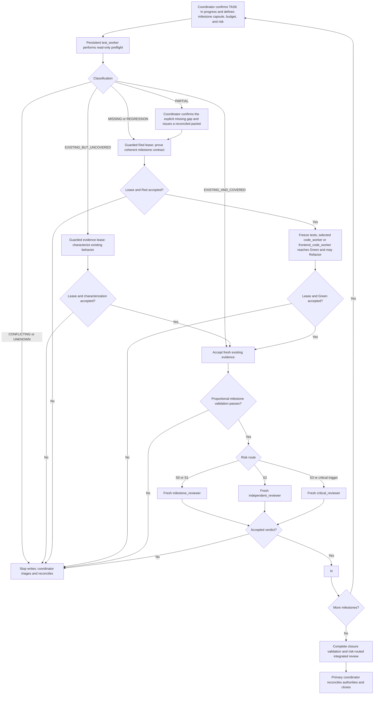

# Implement an ExecPlan with Worker Agents

This guide defines the normal implementation path for an authorized ExecPlan. Work advances by coherent, independently verifiable milestone slices rather than one agent turn per assertion or microbehavior. It deliberately keeps exception handling outside the main graph: when a classification, lease, handoff, command, requirement, budget, or review result is not acceptable, writing stops and the primary coordinator decides what the new assignment must be.

The workflow adds three controls without replacing the ExecPlan, plus one conditional frontend-visual profile:

- a compact milestone capsule and assignment packet so each role starts with only the authority and evidence it needs;
- a machine-verified write lease so the worker can change only the assigned paths; and
- separate test and code contexts, serial Red-Green-Refactor handoffs when behavior is missing or regressed, milestone review, and risk-scaled final review; and
- a reuse-first, browser-evidenced overlay only for milestones that materially change rendered UI; the standard profile remains unchanged for every other milestone.

## When to use this flow

Use it when the project owner authorizes implementation of an active ExecPlan and its canonical `TASK-*` is `In progress`. Do not use it to start a pending task, approve architecture, resolve a decision gate, or turn a plan into implementation evidence.

The flow supports:

- read-only preflight by the milestone's persistent `test_worker` before any test lease;
- `evidence` by `test_worker` for a passing characterization of existing uncovered behavior;
- `setup` by `code_worker` for separately planned declarative or infrastructure work;
- `red` by `test_worker` for one coherent observable milestone-slice contract;
- `green` plus optional behavior-preserving Refactor by `code_worker` for the standard profile or `frontend_code_worker` for the frontend-visual profile in one implementation turn; and
- proportional milestone review followed by risk-routed integrated review.

Only one write-capable worker lease may be active in one worktree. Test and implementation workers remain separate and their write phases are always sequential. The unchanged standard route is implicit. Before preflight, the coordinator determines whether the milestone instead triggers the conditional frontend-visual overlay and keeps one test-worker instance plus only the applicable implementation-worker instance alive for the current milestone so bounded follow-ups retain role-local context. Persistence never carries a lease across turns: every write follow-up receives a fresh packet, baseline, digest, and terminally closed lease. Retire both workers at the milestone barrier; if the runtime cannot preserve an instance, respawn from the capsule.

## Roles

| Role | Responsibility |
|---|---|
| Primary coordinator | Defines milestone contracts and budgets, creates capsules, packets, and leases, accepts or rejects handoffs, integrates evidence, routes risk, handles approvals and exceptions, and owns final closure. |
| `test_worker` | Performs read-only preflight, then owns a coherent test-side Red or passing characterization under a lease. It never writes production behavior. |
| `code_worker` | Performs bounded setup or reaches minimum milestone Green and optionally Refactors in the same turn. It never changes an accepted test. |
| `frontend_code_worker` | Reaches minimum Green and optionally Refactors only for a `frontend-visual` milestone with an accepted reuse audit and visual contract. It never performs standard-profile work or changes an accepted test. |
| `milestone_reviewer` | Reviews one ordinary completed milestone and its reusable evidence proportionally. It does not repair findings or close the task. |
| `independent_reviewer` | Reviews ordinary higher-risk milestones or the integrated final state at Sol high. It does not repair findings or close the task. |
| `critical_reviewer` | Performs maximum-effort review only for a named critical-risk trigger. It does not repair findings or close the task. |

## Worker Assignment Packet v1

Worker Assignment Packet v1 is superseded by the milestone-scoped packet below. This compatibility heading remains so completed historical plans keep resolving; new work must use v2.

## Milestone Assignment Packet v2

Create one compact milestone capsule before preflight and update it only when accepted milestone evidence changes. Complete an assignment packet before preflight and every write turn. The capsule is the role's default context boundary: link exact authority anchors instead of copying whole documents, and expand reading only to resolve a named uncertainty. Additional reading never expands the objective, authority, commands, dependencies, expected result, budget, or write lease.

Create the stable workflow ID before the first assignment. Use one milestone ID for each independently verifiable ExecPlan milestone slice. Preflight, evidence or Red, Green, optional Refactor, bounded corrections, and milestone review share that milestone ID.

Use this template:

```text
Milestone Assignment Packet v2

Identity
- Workflow ID:
- Task ID:
- Milestone ID:
- Assignment ID:
- Lease ID: None for preflight
- Phase: preflight | evidence | setup | red | green
- Attempt: 1 | 2
- Worker role: test_worker | code_worker | frontend_code_worker
- Lease owner:
- Guard contract digest: None for preflight; inserted after guard start for writes

Milestone capsule
- Owning ExecPlan:
- Observable acceptance contract:
- Exact requirement / ADR / gate / SPEC / HS anchors:
- Current-state and preflight evidence IDs:
- Relevant boundaries and paths:
- Non-goals:
- Named uncertainties:
- Risk tier: S0 | S1 | S2 | S3
- Review and escalation triggers:

Write scope
- Allowed files:
- Allowed directory roots:
- Forbidden files:
- Forbidden directory roots:
- Frozen paths:

Validation
- Working directory:
- Focused command:
- Milestone command:
- Expected decisive result and reusable evidence IDs:
- Relevant-tree fingerprint:
- Environment fingerprint or Non-reusable:
- Known external side effects and cleanup:

Budget and stopping
- Maximum worker turns:
- Maximum corrections:
- Maximum repeated identical failure:
- Maximum no-diff outcomes:
- Validation cadence:
- Stop and escalate when:

Handoff
- Report identity and authority, touched paths, exact commands and decisive results,
  outcome, unexpected state, residual risks, and documentation impact.
```

Use `None` when a field is intentionally empty. Do not omit the field. Secrets, full transcripts, whole authority documents, and unrelated conversation history do not belong in the packet.

For `frontend-visual`, append this conditional block after the milestone capsule. Omit the entire block for `standard`; standard packets gain no visual-audit or browser-evidence obligation.

```text
Frontend-visual capsule
- Implementation profile: frontend-visual
- Frontend-quality skill: .agents/skills/frontend-quality/SKILL.md
- Exact UI/design authority anchors:
- Reuse-audit evidence ID:
- Reuse dispositions: REUSE_AS_IS | EXTEND | EXTRACT_LOCAL | CREATE, with exact paths
- Required state matrix:
- Required viewport and interaction matrix:
- Browser or visual-evidence target and reproducibility identity:
- Prohibited visual scope, dependencies, fields, copy, effects, and motion:
```

The primary accepts the read-only reuse audit and frontend-visual capsule before test preflight. A missing or contradictory field stops the visual branch; the implementation worker cannot invent or silently revise it. Use the [frontend-quality skill](../.agents/skills/frontend-quality/SKILL.md) to classify the profile and prepare or review this block.

Preflight is a read-only `test_worker` turn with no lease. Active standard write pairs are `evidence` or `red` with `test_worker`, and `setup` or `green` with `code_worker`. An active frontend-visual write pair uses the same `test_worker` route followed by `green` with `frontend_code_worker`; frontend setup and nonvisual frontend work remain standard-profile `code_worker` assignments. A same-contract correction uses attempt 2 with the original role/phase/profile combination rather than inventing a `correction` phase. Refactor, when useful, occurs after Green in that same Green assignment.

### Binding fields, capsule expansion, and evidence identity

The coordinator may add a concise log excerpt, diagram, or exact repository reference when it resolves a named uncertainty. A worker may discover and read an additional relevant file, but must report why the capsule was insufficient. These additions are safe only while they improve understanding without silently widening context or scope.

Stop the worker if new information changes a binding field: task or milestone identity, phase, worker role, objective, governing authority, expected outcome, risk tier, validation command, dependency, side effect, budget, write scope, or, when present, the implementation profile or any accepted frontend-visual capsule field. The coordinator must close any current lease and decide whether a new packet or milestone contract is authorized.

Accepted command evidence may be reused only when all of these still match: exact command, working directory, relevant-tree fingerprint, environment fingerprint, and guard-backed no-drift state. Evidence against a mutable PostgreSQL, Redis, browser, network, clock, or other external boundary is `Non-reusable` unless the packet pins an isolated run identity and state. Reuse avoids duplicate execution; it never converts a worker report into proof. Any mismatch invalidates the evidence and requires the proportional command to run again.

### Guard projection

Before each write turn, the coordinator passes these packet fields unchanged to the [automatic write-lease guard](./write-lease-guard.md):

| Packet field | Guard input |
|---|---|
| Workflow ID | `--workflow-id` |
| Task ID | `--task-id` |
| Milestone ID | `--cycle-id` |
| Lease ID | `--lease-id` |
| Phase | `--phase` |
| Attempt | `--attempt` |
| Lease owner | `--owner` |
| Worker role | `--agent-type` |
| Allowed files | repeated `--allow-file` |
| Allowed directory roots | repeated `--allow-dir-root` |
| Forbidden files | repeated `--forbid-file` |
| Forbidden directory roots | repeated `--forbid-dir-root` |

For a write turn, the coordinator drafts the packet, starts the guard, inserts the returned digest, confirms that the projection matches, and only then authorizes the persistent or newly spawned worker to write. Preflight has no guard because it is read-only. The guard proves path and repository-control compliance; it does not prove that the classification, test, code, command result, evidence identity, or design is correct.

## Normal flow



`X` is intentionally terminal. The diagram does not guess whether the problem belongs to classification, test, implementation, environment, authority, budget, or lease. After inspection, the coordinator may authorize one bounded same-contract correction, redefine the milestone before writes resume, request owner direction, or stop the task. Any resumed write work uses a newly valid packet and lease.

## Preflight routing

The persistent test worker returns exactly one classification before any test write:

| Classification | Required route |
|---|---|
| `EXISTING_AND_COVERED` | Record the exact implementation, test, and focused-command evidence. Do not add a test or spawn Green. |
| `EXISTING_BUT_UNCOVERED` | Use a guarded `evidence` assignment to add one passing characterization test. Do not manufacture Red or spawn Green. |
| `MISSING` | Use the ordinary Red then Green route. |
| `REGRESSION` | Prove the regression with a focused Red, then use the ordinary Green route. |
| `PARTIAL` | The coordinator confirms the explicit missing gap and narrows the milestone contract; only that gap follows Red then Green. If the gap cannot be isolated without changing a binding field, stop and issue a reconciled packet before writing. |
| `CONFLICTING` | Stop because implementation, tests, or authorities disagree. Reconcile the contract before writing. |
| `UNKNOWN` | Stop because available evidence cannot support another classification. Acquire evidence or request direction. |

Search absence alone never proves `MISSING`. The preflight handoff must cite exact source or test locations and the safe focused command when one exists. If a read-only preflight command cannot run without creating caches, generated output, or mutable external state, return `UNKNOWN` or let the coordinator run an explicitly safe diagnostic; do not silently write without a lease.

## Coherent milestone-slice TDD

For each milestone slice whose preflight result is `MISSING` or `REGRESSION`:

1. The coordinator uses the milestone ID and assigns `red` to the persistent `test_worker` under a fresh lease.
2. The test worker adds the smallest coherent test-side change sufficient to prove one indivisible milestone outcome. Related assertions may travel together when splitting them would create artificial handoffs; future milestone behavior may not.
3. The coordinator closes the lease, inspects the actual test diff and focused result, and either accepts the Red or stops for triage. Once accepted, test-owned paths are frozen for the rest of the milestone.
4. The coordinator assigns `green` under a new packet and lease to the persistent `code_worker` for `standard` or `frontend_code_worker` for `frontend-visual`. The worker may reuse the accepted Red without rerunning it only when its full evidence identity remains fresh. Otherwise it reproduces Red before editing.
5. The selected implementation worker writes only the production behavior required by the accepted milestone contract and may perform a small behavior-preserving Refactor while frozen tests stay unchanged. It reruns the focused check after an actual Refactor, not when no Refactor occurred. The frontend worker additionally follows the accepted reuse dispositions and visual capsule; it receives no design or scope authority from the stronger model route.
6. The coordinator closes the implementation lease, inspects the complete production diff and unchanged frozen tests, and accepts Green and any Refactor evidence together.
7. The coordinator runs the milestone validation cadence, records concise evidence identities in the living ExecPlan, routes review by risk, and retires both milestone workers after acceptance.

This is still one observable Red-Green-Refactor cycle at a time. “Coherent” changes the handoff granularity, not the order: production code never precedes an accepted Red when behavior is missing or regressed.

A separately planned `setup` assignment may occur before any dependent milestone slice. It must not smuggle production behavior into configuration work and must have its own observable structural, build, or runtime check.

## Corrections and exceptions

A worker never continues writing after its lease is terminal. Guard violations, ambiguous concurrent changes, stale evidence, exhausted budgets, pre-existing failures, wrong Red failures, blocked dependencies, rejected handoffs, and review findings all take the same immediate action: stop writes and return control to the coordinator. Never repair them by reverting user or peer work automatically.

After triage, the coordinator may send the same persistent role one correction follow-up only when the milestone contract, objective, authority, dependency, expected outcome, and scope remain unchanged. It uses attempt 2, a fresh complete packet, reconciled tree, baseline, lease ID, and digest. A second unsuccessful correction, a repeated identical decisive failure, two no-diff write handoffs in the milestone, or any binding-field change stops automatic continuation and requires rescoping, a fresh instance, owner direction, or task stop. Permission to fix one named finding never resets this budget.

Default milestone budgets are one preflight, one coherent Red or characterization, one Green, at most one correction per role, and one review correction loop. A milestone may define stricter limits. More than three TDD cycles inside one milestone indicates that the milestone or contract should be split or re-evaluated; do not silently continue microcycling.

## Concise worker handoffs

Every worker handoff contains only what the coordinator needs to verify and resume:

1. `Assignment` - workflow, task, milestone, assignment, objective, controlling IDs, phase, attempt, evidence IDs, and contract digest when applicable.
2. `Lease and changes` - allowed scope, touched paths, unexpected paths, and concise diff intent.
3. `Validation` - exact commands, exit codes, decisive results, and evidence reused or invalidated; Green includes reused or reproduced Red and a post-Refactor result only when Refactor occurred.
4. `Outcome` - the role-specific outcome plus any blocker, residual risk, and documentation impact.

The coordinator compares the handoff with the packet, terminal receipt, actual diff, and command evidence. A worker summary alone never accepts a barrier.

## Milestone and final review

After each milestone's worker handoffs are accepted, the coordinator runs the milestone's proportional affected checks and routes review:

- `S0`: inside an implementation ExecPlan, a fresh `milestone_reviewer` performs the smallest semantic review at Terra high and reuses deterministic evidence. S0 work outside an implementation ExecPlan needs no LLM reviewer unless another trigger applies.
- `S1`: a fresh `milestone_reviewer` reviews the scoped milestone at Terra high.
- `S2`: a fresh `independent_reviewer` reviews the milestone at Sol high.
- `S3`: a fresh `critical_reviewer` reviews at Sol max.

For a `frontend-visual` milestone, the same risk route also reviews the accepted reuse dispositions and the assigned real-browser evidence. This does not promote the risk tier, add a second reviewer, make Storybook an acceptance boundary, or claim responsive behavior owned by a later task.

Critical triggers override the nominal tier: security; irreversible migration or data-loss risk; concurrency, locking, or recovery; custom serialization, integrity, or identity contracts; cross-platform byte equivalence; an unresolved Blocker or Major from an ordinary reviewer; or explicit project-owner direction. Reviewers reuse fresh evidence under the identity rule and rerun only missing, stale, contradictory, externally mutable, or risk-critical checks.

After all milestones are integrated, the coordinator runs the ExecPlan's closure checks, test-relevance audit, documentation validation, and authoritative status checks. A fresh `independent_reviewer` performs ordinary integrated review; use `critical_reviewer` only when an integrated critical trigger remains. The final reviewer concentrates on cross-milestone interaction, unresolved findings, changed evidence, and closure rather than replaying every already accepted milestone.

- `PASS` permits coordinator reconciliation and closure when every task gate also passes.
- `PASS WITH FOLLOW-UPS` permits closure only when the coordinator dispositions every item and none conflicts with a definition of done, validation result, or documentation gate.
- `REVISE`, `BLOCKED`, or `ESCALATE TO CRITICAL REVIEW` stops advancement. The coordinator classifies the finding and, if further work is authorized, uses the bounded correction rule or risk escalation before requesting proportional re-review.

The reviewer never edits the repository and no agent report can change authoritative task, gate, ADR, or approval state.

## Flow metrics

The [agent-flow metrics](./agent-flow-metrics.md) are an optional, best-effort sidecar. Use them when the operational learning is worth the recording overhead. Missing hooks, events, durations, or token counters never block a lease, TDD barrier, review, or task closure. Record token usage only from exact runtime counters.

## Copy-paste prompt example

```text
Act as the primary coordinator for the authorized TASK-* and its living ExecPlan.
Confirm that the canonical task is In progress. Define the next coherent, independently
verifiable milestone slice. Keep the existing standard packet unchanged by default. Only
when the contract materially changes rendered UI, apply the frontend-visual overlay and
record its marker in the conditional capsule. Define the milestone's
acceptance contract, exact authority anchors,
non-goals, risk tier, validation cadence, and worker, correction, no-diff, and repeated-
failure budgets. Put only that information and accepted evidence identities in Milestone
Assignment Packet v2; expand reading only to resolve a named uncertainty.

For frontend-visual, use .agents/skills/frontend-quality/SKILL.md before preflight, accept
the reuse audit and complete the conditional frontend-visual capsule. Do not add that
overhead to standard milestones. Keep one persistent test_worker and only the selected
code_worker or frontend_code_worker for this milestone.
Have test_worker perform read-only preflight before any test lease and return exactly
EXISTING_AND_COVERED, EXISTING_BUT_UNCOVERED, MISSING, REGRESSION, PARTIAL,
CONFLICTING, or UNKNOWN. Existing covered behavior needs no write. Existing uncovered
behavior receives a guarded evidence lease for a passing characterization. Missing or
regressed behavior receives one coherent guarded Red, followed sequentially by Green.
PARTIAL routes only its coordinator-confirmed explicit gap through Red and Green;
CONFLICTING or UNKNOWN stops for coordinator triage.

Before every write turn, start the automatic write-lease guard with the packet's exact
identity and four path lists, insert and verify the digest, and authorize writing only
under that lease. Close and inspect the lease, actual diff, command evidence, and handoff
before advancing. Freeze an accepted test boundary. Send Green under a fresh packet and
lease to code_worker for standard or frontend_code_worker for frontend-visual. Reuse
accepted Red evidence only when the
command, working directory, relevant-tree fingerprint, environment fingerprint, and
no-drift state still match; otherwise reproduce it. Make minimum Green and run a second
focused check only after an actual Refactor.

Allow at most one same-contract correction per role under a fresh lease. Stop after the
same decisive failure twice, two no-diff write handoffs, exhausted budgets, or any
binding-field change. Never continue under a closed lease, reset a correction budget,
or silently turn one milestone into a stream of microcycles.

Run proportional affected validation at the milestone barrier and route review by risk:
S0 or S1 milestone_reviewer, S2 independent_reviewer, and S3 or a critical trigger
critical_reviewer. Reuse fresh evidence; rerun only missing, stale,
contradictory, externally mutable, or risk-critical checks. Retire the milestone workers
after acceptance. For frontend-visual, have that same reviewer inspect the accepted reuse
dispositions and assigned real-browser evidence without changing the risk tier or adding
a second reviewer.

At task closure, run the ExecPlan's complete validation, relevance, documentation, and
authority checks. Use a fresh independent_reviewer for ordinary integrated review or a
critical_reviewer when a critical trigger remains. PASS may proceed to coordinator-owned
closure; PASS WITH FOLLOW-UPS requires explicit disposition; REVISE, BLOCKED, or
escalation stops advancement and returns control to coordinator triage.

Metrics are optional and observational. Keep TASK status, approvals, evidence
acceptance, and final closure with the primary coordinator. Do not stage, commit, push,
or claim implementation evidence without the corresponding repository and runtime proof.
```

## Related authorities

- [Repository guidelines](../AGENTS.md)
- [Documentation map](../README.md#documentation-map)
- [Task-closure documentation gate](../README.md#task-closure-documentation-gate)
- [ExecPlan convention](../PLANS.md)
- [Project-scoped agent guide](./README.md)
- [Automatic write-lease guard](./write-lease-guard.md)
- [Agent-flow metrics](./agent-flow-metrics.md)
- [Verify repository skill](../.agents/skills/verify-repository/SKILL.md)
- [Frontend quality skill](../.agents/skills/frontend-quality/SKILL.md)
- [ADR-0016, current milestone-slice TDD decision](../docs/adrs/0016-use-milestone-slice-tdd-with-independent-test-and-implementation-ownership.md)
- [ADR-0010, superseded historical testing decision](../docs/adrs/superseded/0010-use-a-targeted-automated-testing-strategy.md)
