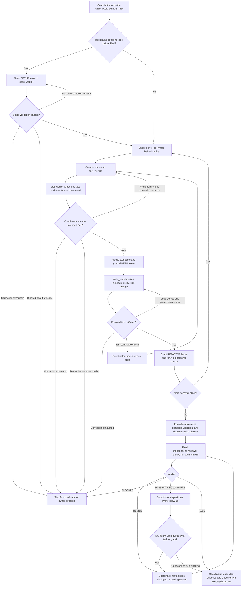

# Implement an ExecPlan with Worker Agents

This guide explains the repository's worker-first flow for executing a write-authorized implementation ExecPlan. It keeps the primary Codex thread focused on scope, decisions, integration, and closure while bounded workers perform the normal repository writes.

The guide is a workflow policy. It does not start a task, change product scope, resolve a decision gate, approve architecture, or prove that an implementation passes. The exact `TASK-*`, its owning ExecPlan, repository authorities, and runtime evidence remain controlling.

## When to use this flow

Use this flow when the project owner asks Codex to implement an active ExecPlan that changes application behavior, tests, configuration, or other implementation artifacts.

Do not use it to compare consequential options, prepare an ADR, or resolve a decision gate. Decision work continues to use the contract-first, primary-writer workflow in the [project-scoped agent guide](./README.md#collaboration-topology).

Before spawning a writer, the coordinator must confirm that:

- the exact `TASK-*` and active ExecPlan are named;
- task dependencies, decision gates, and authorization joins permit the assigned artifact;
- the task state and execution record allow implementation to start or continue;
- the parent session permits workspace writes, because live parent permissions can constrain spawned agents;
- the working tree and existing changes are understood; and
- every assignment has an explicit write lease and stopping condition.

## Roles

| Role | Normal permission | Responsibility | Must not do |
|---|---|---|---|
| Primary coordinator | Workspace capable, normally non-writing | Select the next slice, grant leases, inspect handoffs and diffs, route corrections, reconcile state, and own closure | Delegate scope, approval, task status, or closure ownership |
| [`test_worker`](./agents/test-worker.toml) | Workspace write | Add one smallest test, prove the intended Red state, and return concise evidence | Edit production behavior or authorize Green |
| [`code_worker`](./agents/code-worker.toml) | Workspace write | Perform explicitly assigned setup, minimum Green implementation, and behavior-preserving Refactor | Change an accepted test or start another TDD slice |
| [`independent_reviewer`](./agents/independent-reviewer.toml) | Read only | Falsify the integrated result, reproduce safe validation, and return a verdict | Edit findings, approve architecture, or close the task |

The coordinator remains the sole integration, evidence, approval-handling, and closure owner. It normally delegates repository edits to workers. If it must make an exceptional edit, it records the reason, paths, and validation in the ExecPlan or final handoff.

## Write leases

A write lease is a temporary assignment for one agent turn. It contains:

- the exact cycle or setup mode;
- allowed paths;
- forbidden paths;
- the required command and expected result;
- authority IDs and source documents;
- whether task-scoped evidence documentation may be updated; and
- stop and escalation conditions.

Only one agent may own a path at a time. The test and code workers never write concurrently during the same Red-Green-Refactor cycle. Shared manifests, lockfiles, root configuration, schemas, lifecycle helpers, ExecPlans, execution records, and current-status documents require a single explicit owner and an ordered handoff.

## Correction and stopping limits

Each worker receives one initial assignment and at most one coordinator-authorized correction for that lease. If the correction still fails, changes the expected behavior, needs an unleased path or dependency, or crosses an authority boundary, the worker stops and the coordinator reclassifies the work instead of continuing an unbounded loop.

Once Red is accepted and production work begins, its test paths stay frozen. A material test correction ends that cycle and requires a new test lease plus fresh Red evidence. The final integrated review permits at most two unsuccessful correction cycles before project-owner direction is required.

## Flow



## Step-by-step operation

### 1. Establish the baseline

The coordinator follows the root [documentation map](../README.md#documentation-map), reads the owning ExecPlan and exact routed authorities, inspects the working tree, and confirms the next permitted artifact. It does not infer readiness from a plan alone.

If the ExecPlan requires manifests, test registration, or other declarative foundations before a meaningful Red can run, the coordinator gives `code_worker` a bounded `SETUP` lease. Setup validation is structural, build-based, or runtime-based; it is not an artificial TDD cycle and must not add production behavior.

### 2. Produce one valid Red

The coordinator defines one observable behavior and the correct test boundary, but leaves the smallest defensible test design to `test_worker`. The test worker writes only leased test-side paths and runs the focused command.

The coordinator accepts Red only when the test fails for the intended behavioral reason. A dependency error, unrelated type failure, stale process, occupied port, or pre-existing failure is not valid Red evidence unless the ExecPlan names that condition as the target.

### 3. Reach Green without changing the test

After accepting Red, the coordinator freezes the test-owned paths and gives `code_worker` a `GREEN` lease. The code worker receives the exact Red command and decisive failure, writes the minimum production behavior, and runs the same focused scope.

If the code worker believes the accepted test is wrong, it returns `TEST CONTRACT CONFLICT` without modifying the test. The coordinator then decides whether the test worker must correct and re-establish Red or whether the task needs authority clarification.

The code worker must reproduce the accepted Red before editing. A different failure returns `RED MISMATCH` and freezes the lease until the coordinator has classified it.

### 4. Refactor and validate

Once Green is confirmed, `code_worker` may receive a `REFACTOR` lease. Refactor adds no behavior. The worker reruns the focused test and the proportional checks named by the coordinator.

The next behavior slice cannot start until the current cycle is Green and its evidence is recorded in the living ExecPlan and required execution handoff. Evidence-document writes may be delegated only through a separate documentation lease.

### 5. Triage failures before editing

| Failure class | Route |
|---|---|
| Wrong assertion, false Red, or requirement mismatch | Return to `test_worker`, then reproduce Red |
| Production behavior defect | Return to `code_worker` with the accepted test frozen |
| Harness, dependency, process, or infrastructure defect | Assign bounded `SETUP` work; do not weaken the test |
| Consequential architecture or scope conflict | Stop the dependent branch and follow the governing decision workflow |
| Unrelated existing failure | Record separately; it cannot serve as Red evidence |

When the failure source is genuinely ambiguous, the coordinator may request parallel read-only diagnosis, but only one write lease is granted after the evidence is reconciled.

### 6. Review and close

At a major milestone and before task closure, perform the ADR-0010 test-relevance audit, affected and complete validation, documentation-impact review, and authoritative validators required by the ExecPlan.

A fresh `independent_reviewer` then inspects the complete implementation, tests, evidence, documentation, and exact diff. It returns `PASS`, `PASS WITH FOLLOW-UPS`, `REVISE`, or `BLOCKED`. A `REVISE` finding is routed to the responsible worker under a new lease, and the reviewer rechecks the complete revised state rather than only the correction.

`PASS WITH FOLLOW-UPS` does not bypass reconciliation. The coordinator must disposition every follow-up. If any item conflicts with the definition of done, a hard gate, a required validation result, or the documentation gate, route it as a correction and obtain complete fresh re-review. Only genuinely non-blocking items with an explicit owner and durable tracking may proceed to final reconciliation.

After two unsuccessful final-review correction cycles, stop and ask the project owner for direction. The coordinator alone decides whether the final evidence satisfies the task and documentation gates; a worker or reviewer report cannot close the task.

## Concise handoffs

Workers return the fixed sections defined in their TOML contracts. They should provide exact commands, exit codes, and only the decisive output needed to recognize the result. Raw installation logs, complete stack traces, and repetitive test output stay in the worker thread unless the coordinator requests a specific excerpt.

The coordinator reviews the actual changed files and does not treat a worker summary as self-validating proof. This separation keeps the primary context small without weakening evidence ownership.

## Copy-paste prompt example

Replace `<TASK_ID>` and `<EXECPLAN_PATH>` before running this prompt. The named task must already be authorized to start or continue.

```text
Implement <EXECPLAN_PATH> for <TASK_ID> using the repository's worker-first
ExecPlan implementation workflow in .codex/execplan-implementation-workflow.md.
This request authorizes in-scope local repository writes and non-destructive
validation, but it does not authorize destructive actions, external writes,
new product scope, architecture decisions, gate resolution, or owner-controlled
approvals.

Act as the primary coordinator and final closure owner. Keep the primary context
focused: normally delegate edits and detailed command execution to the workers,
receive their fixed concise handoffs, inspect the actual diffs, and write directly
only when a safe integration edit cannot be delegated. Record any exceptional
primary-thread edit and its reason.

Before implementation:
1. Follow the documentation map and read the exact task, active ExecPlan, mapped
   requirements, accepted ADRs, active gates, SPEC/HS rules, current evidence,
   and repository state.
2. Confirm that dependencies, gates, authorization joins, task state, permissions,
   and the working tree allow the next artifact. Stop with evidence if they do not.
3. Identify any declarative bootstrap needed before the first meaningful Red.
   Assign it to code_worker in SETUP mode under an explicit path lease and validate
   it without adding production behavior.

For each behavior slice, complete exactly one Red-Green-Refactor cycle:
1. Define the observable behavior, correct test boundary, focused command,
   expected failure class, authority IDs, allowed paths, forbidden paths, and stop
   conditions.
2. Send that lease to test_worker. Require one smallest test and its structured
   handoff. Inspect the diff and accept Red only when the command fails for the
   intended behavioral reason. Return invalid Red to the same worker for correction.
3. Freeze the accepted test paths. Send code_worker a GREEN lease containing the
   exact accepted Red evidence. Prohibit test edits and require only the minimum
   production change. If it reports TEST CONTRACT CONFLICT, triage before any edit.
4. After Green, send a REFACTOR lease that permits no new behavior and requires the
   focused and proportional checks. Do not start the next slice until the current
   cycle is Green and its evidence is recorded.

Grant only one writer ownership of a path at a time. Never run test_worker and
code_worker concurrently on the same cycle. Use separate documentation leases to
have the worker that owns the evidence update the living ExecPlan or execution
record, but do not let a worker change task, gate, ADR, authorization, requirement,
or acceptance state.

When a test or broader validator fails, freeze writes and classify the failure as
test contract, production behavior, setup/infrastructure, unrelated existing
failure, or authority conflict. Route only the supported correction. Stop the
dependent branch for a consequential scope or architecture conflict.

At the final milestone, run the test-relevance audit, all task-authoritative checks,
the documentation-impact gate, and repository validators. Spawn a fresh read-only
independent_reviewer to inspect the complete final state and exact diff, reproduce
safe validation, and return a verdict. Route REVISE findings to the owning worker
and request complete re-review. For PASS WITH FOLLOW-UPS, disposition every item;
if any item conflicts with the definition of done, a hard gate, required validation,
or the documentation gate, route it as a correction and request complete re-review.
Track only genuinely non-blocking follow-ups with an explicit owner. After two
unsuccessful final-review correction cycles, stop for project-owner direction.

Close the task only after the definition of done, runtime evidence, documentation
gate, and final reconciliation all pass. The final handoff must list each Red,
Green, and post-Refactor command, the reviewer verdict, residual risks, skipped or
blocked checks, every follow-up disposition, and one explicit Documentation impact
result.
```

## Related authorities

- [Repository guidelines](../AGENTS.md)
- [ExecPlan convention](../PLANS.md)
- [Canonical implementation plan](../docs/IMPLEMENTATION_PLAN.md)
- [ADR-0010 testing strategy](../docs/adrs/0010-use-a-targeted-automated-testing-strategy.md)
- [Project-scoped agent registry and decision workflow](./README.md)
- [DPL-DEC-014 worker-first implementation decision](../docs/execution/decision-and-progress-log.md)
- [Official OpenAI documentation for Codex subagents](https://learn.chatgpt.com/docs/agent-configuration/subagents)
