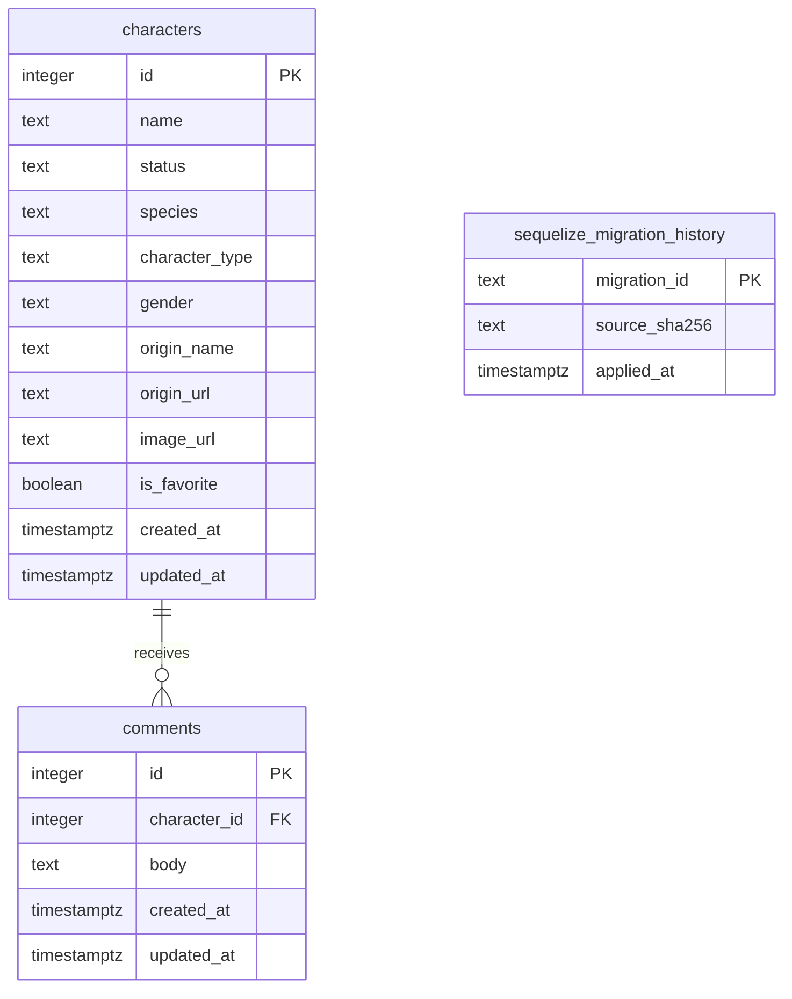

# Entity-relationship diagram

This text-native ERD describes the PostgreSQL schema created by the accepted migration lifecycle. It is derived from the [relational schema migration](../apps/api/src/infrastructure/database/migrations/20260814000000-create-relational-schema.ts), the [migration-history storage owner](../apps/api/src/infrastructure/database/migrations/files/storage.ts), and the existing [fresh-schema inventory check](../apps/api/src/infrastructure/database/migration-lifecycle.integration.test.ts).

## Exact relational contract

All columns are `NOT NULL`.

| Table | Column | PostgreSQL type | Key, identity, or default |
|---|---|---|---|
| `characters` | `id` | `integer` | Primary key `characters_pkey`; supplied character ID, not an identity |
| `characters` | `name` | `text` | No default |
| `characters` | `status` | `text` | No default |
| `characters` | `species` | `text` | No default |
| `characters` | `character_type` | `text` | No default |
| `characters` | `gender` | `text` | No default |
| `characters` | `origin_name` | `text` | No default |
| `characters` | `origin_url` | `text` | No default |
| `characters` | `image_url` | `text` | Validated official avatar URL stored as an ordinary character attribute |
| `characters` | `is_favorite` | `boolean` | Default `false` |
| `characters` | `created_at` | `timestamp with time zone` | Default `CURRENT_TIMESTAMP` |
| `characters` | `updated_at` | `timestamp with time zone` | Default `CURRENT_TIMESTAMP` |
| `comments` | `id` | `integer` | Primary key `comments_pkey`; `GENERATED BY DEFAULT AS IDENTITY` |
| `comments` | `character_id` | `integer` | Foreign key `comments_character_id_fkey` to `characters.id` |
| `comments` | `body` | `text` | No default; `comments_body_length_check` requires `char_length(body)` from 1 through 1,000 |
| `comments` | `created_at` | `timestamp with time zone` | Default `CURRENT_TIMESTAMP` |
| `comments` | `updated_at` | `timestamp with time zone` | Default `CURRENT_TIMESTAMP` |
| `sequelize_migration_history` | `migration_id` | `text` | Primary key `sequelize_migration_history_pkey` |
| `sequelize_migration_history` | `source_sha256` | `text` | No default; authenticates the applied migration source |
| `sequelize_migration_history` | `applied_at` | `timestamp with time zone` | Default `CURRENT_TIMESTAMP` |

Each character can have zero or more comments, and each comment belongs to exactly one character. The `comments_character_id_fkey` uses `ON UPDATE RESTRICT` and `ON DELETE RESTRICT`. The `comments_character_id_idx` B-tree index covers `comments.character_id`; primary-key indexes also exist for all three primary keys.

`sequelize_migration_history` is migration-lifecycle metadata. It records the applied migration identifier, its authenticated source SHA-256, and application time; it has no product-domain relationship to `characters` or `comments`.

The direct avatar URL is deliberately only `characters.image_url`. There is no image relation, application-owned image-byte table, proxy table, cache table, or image lifecycle table in this schema.
