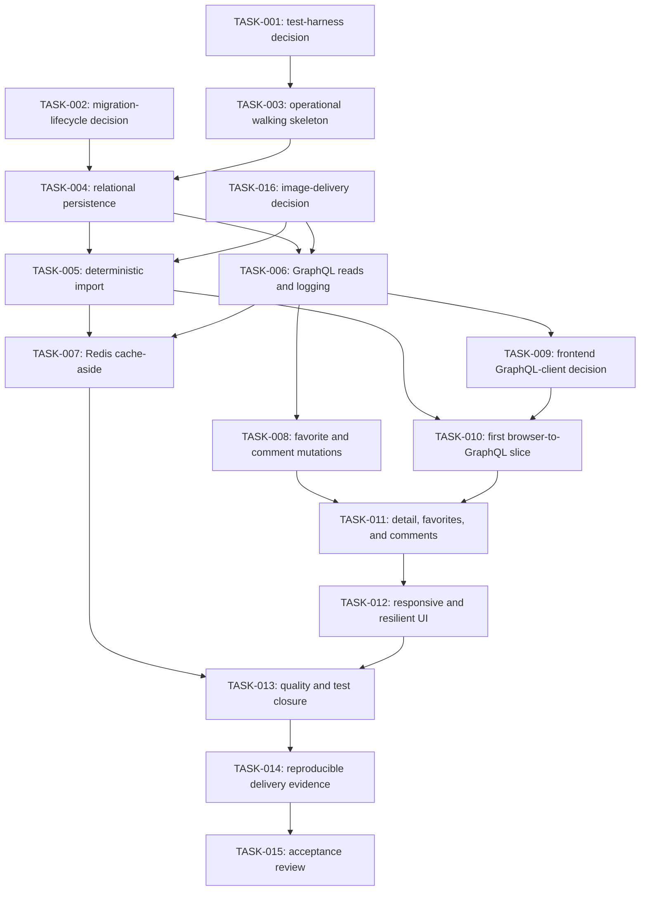

# Implementation Plan

## Current planning state

The repository is still in its requirements and architecture phase. This plan records architectural decision gates and a dependency graph for implementation work; it does not claim that an application scaffold, dependencies, commands, migrations, tests, or runtime behavior exist. The current project direction is to make `TASK-003` the first implementation node and use it to establish an operational walking skeleton before feature delivery begins.

Mandatory requirements and deliverables remain defined in the [requirements specification](./REQUIREMENTS.md). Optional requirements retain the source assessment's classification, and their repository dispositions remain authoritative in the [ADR index](./adrs/README.md#optional-scope-decisions).

Use the repository [documentation map](../README.md#documentation-map) for authority and task routing. This plan owns sequencing, task IDs, gates, and implementation-enabling task outcomes; it cannot expand product or assessment scope, approve an unresolved architectural choice, or prove implementation.

Non-executable examples in the [Gherkin specification index](./specs/README.md) are derived planning artifacts. They may refine observable intent while a test-harness gate is pending, but they are not application tests until an executable runner, binding, or automated assertion invokes them.

## Roadmap role and AI-assistant execution model

This document is the canonical implementation roadmap. Its `TASK-*` records are nodes in a directed acyclic graph (DAG), and each dependency is an edge that must be satisfied before the downstream node starts. The graph is a development-coordination model for people and AI assistants; it is not the GraphQL data graph, a runtime application feature, or a reason to add an agent-framework dependency to the product.

Use these rules when executing the graph:

1. A node is **ready** only when every `May start after` task is `Complete` and every gate named by that node is `Resolved`. `Ready` is an eligibility condition, not an additional persisted task status.
2. One primary owner or coordinating assistant owns a node, its status, its evidence, and its documentation closure. Bounded subagents may inspect or implement independent parts, but they do not inherit closure ownership.
3. Run ready nodes in parallel only when their write scopes do not overlap or when the primary owners agree on an explicit merge order. Shared ADR numbers, root manifests, schemas, and current-status documents require coordination.
4. Before implementation, the node owner reads only the mapped requirements, optional dispositions, accepted ADRs, active gates, `SPEC-*`/`HS-*` rules, applicable design documents and recorded reversible decisions, and current repository evidence needed by that node.
5. Move a node from `Pending` to `In progress` only with an evidence-linked progress-log entry. Production behavior then advances through one observable Red-Green-Refactor cycle at a time under ADR-0010.
6. Mark a node `Complete` only after its falsifiable definition of done, task-specific validation, test-relevance review when applicable, and universal documentation gate all pass. Downstream assistants must not infer completion from plans, generated files, or another assistant's unverified handoff.
7. If execution exposes a consequential choice outside an accepted ADR, stop only the dependent branch, create or activate the applicable decision gate, and continue other ready nodes when their scopes remain independent.

This roadmap is not an ExecPlan. The repository has adopted the root [ExecPlan convention](../PLANS.md), and node-scoped plans are registered in the [plan index](./plans/README.md). Active plans live directly under `docs/plans/`; completed plans remain as historical evidence under `docs/plans/completed/`. An ExecPlan may provide concrete commands, discoveries, decisions, and recovery steps for its owning node, but it cannot replace this graph, change dependencies, resolve gates, or expand requirement scope. The completed [TASK-001](./plans/completed/TASK-001-test-harness-decision.md) and [TASK-002](./plans/completed/TASK-002-sequelize-migration-lifecycle-decision.md) ExecPlans preserve their execution history.

The [project-scoped Codex agent guide](../.codex/README.md) defines reusable read-only research, decision-analysis, and independent-review roles. These roles are execution helpers, not graph nodes or task owners: the primary coordinating agent keeps repository write ownership, status and evidence integration, project-owner approval handling, and the universal documentation gate.

## Decision-gate policy

A decision gate records an unresolved, consequential choice whose implementation would be costly to reverse. A pending gate does not reserve an ADR number or imply that an option has been selected.

Resolve each gate as follows:

1. Create a new ADR with the next unused ID and status `Proposed` when the dependent implementation milestone becomes imminent.
2. Evaluate credible alternatives, consequences, risks, reversal triggers, and measurable validation under the repository's ADR rubric.
3. Obtain project-owner approval and change the ADR to `Accepted` before adding the artifacts blocked by the gate.
4. Link the accepted ADR from this plan, change the gate to `Resolved`, and retain the record as planning history.

An accepted ADR records implementation direction only. Resolving a gate is not evidence that the selected tooling or behavior has been implemented.

## Active decision gates

| Gate | Status | Required decision | Must be resolved before | Governing context |
|---|---|---|---|---|
| DG-001 | Resolved | [ADR-0011](./adrs/0011-define-the-typescript-test-harness.md) selects Vitest projects, jsdom, milestone-aware unit/integration/application boundaries, and one Chromium-only Playwright process smoke. | Resolved direction may be implemented only by TASK-003 and later owning tasks; acceptance is not harness evidence. | NFR-004; OR-001, OR-004, OR-007 (adopted optional); ADR-0001, ADR-0002, ADR-0010, ADR-0011 |
| DG-002 | Resolved | [ADR-0012](./adrs/0012-use-a-build-first-programmatic-migration-lifecycle.md) selects a private build-first programmatic Umzug 3 lifecycle on stable Sequelize 6, with strict TypeScript authoring and one verified immutable native-ESM build for every execution context. | Resolved direction may be implemented only by TASK-004 and later owning tasks; acceptance is not runner, migration, migrated-database, or ERD evidence. | FR-BE-003, FR-BE-004, NFR-003, DEL-002, AC-009, AC-012; OR-001 (adopted optional); ADR-0001, ADR-0002, ADR-0003, ADR-0008, ADR-0010, ADR-0011, ADR-0012 |
| DG-003 | Pending | Select the frontend GraphQL client and query-cache implementation, including operation type generation, error handling, cache behavior, explicit post-mutation refetching, and its test boundary. | Adding the client dependency or provider, generating client operation artifacts, writing the first frontend data-access test that depends on the selected client or cache, or writing frontend query, mutation, hook, or cache configuration code. | FR-FE-001, FR-FE-002, FR-FE-003, FR-FE-004, FR-FE-005, NFR-001, OR-003 (adopted optional), AC-001, AC-002, AC-003, AC-004, AC-005; ADR-0002, ADR-0006, ADR-0009, ADR-0010 |
| DG-004 | Pending | Select the character-image delivery boundary: copy assets during ingestion, serve them through an application-owned proxy or asset boundary, or explicitly allow narrowly scoped browser requests to the upstream image host. | Adding persistence or ingestion behavior for image locations, defining runtime GraphQL or cached `imageUrl` values, adding an image proxy or asset route, or implementing browser image requests in TASK-010. | FR-FE-001, FR-FE-003, NFR-001, NFR-005, AC-001, AC-003; ADR-0001, ADR-0003, ADR-0004, ADR-0006, ADR-0007, ADR-0008, ADR-0009, ADR-0010, ADR-0011, ADR-0012 |

## Gate sequence and parallelism

1. DG-001 was resolved by ADR-0011 at repository-foundation time because every production behavior must begin with an executable failing test under ADR-0010. The harness remains unimplemented until TASK-003.
2. DG-002 is resolved by accepted ADR-0012. Its database-backed persistence artifacts remain owned by TASK-004 after that task's dependencies are complete. DG-004 remains pending, so import or API mapping must not assume an image-delivery strategy.
3. Resolve DG-003 after the project-owned GraphQL operations are stable and before frontend data-access implementation. It does not block backend schema, service, repository, or static frontend layout work.
4. Resolve DG-004 before TASK-005 imports image locations, TASK-006 gives `imageUrl` its runtime meaning, or TASK-010 loads character images. The decision must explicitly reconcile the browser and upstream boundaries in ADR-0001 and ADR-0004, preserve the project-data API boundary in ADR-0006, and apply the ADR lifecycle to any required supersession.

Neutral requirements and architecture documentation may continue while a gate is pending. Declarative workspace or infrastructure work may proceed only when it does not select or depend on an option controlled by a pending gate.

## Universal task-closure gate

Every future implementation work item inherits the repository [task-closure documentation gate](../README.md#task-closure-documentation-gate). Its definition of done must identify affected documentation or record a concrete `Documentation impact: None` reason, update and link authorized documentation changes, and run the relevant documentation validation before the item can be marked complete. This universal closure gate is separate from the architectural decision gates in this plan and never resolves one of them implicitly.

## Gate definitions of done

### DG-001 - TypeScript test harness

- **Status:** Resolved by accepted [ADR-0011](./adrs/0011-define-the-typescript-test-harness.md); no harness implementation exists yet.
- The accepted ADR compares at least three credible runner strategies and explains the selected ESM and strict-TypeScript integration.
- It defines the browser-like DOM environment for React tests and the process boundary for PostgreSQL and Redis integration tests.
- It defines distinct, reproducible unit, integration, application, and root test scopes without claiming the commands already exist.
- It defines the smallest real-browser smoke boundary needed to observe the `TASK-003` web shell while keeping broad end-to-end coverage deferred.
- Its validation can prove that frontend, backend, migration, and Redis tests execute through the documented boundaries required by ADR-0010.

### DG-002 - Sequelize migration lifecycle

- **Status:** Resolved by accepted [ADR-0012](./adrs/0012-use-a-build-first-programmatic-migration-lifecycle.md); no migration runner, migration, migrated database, or ERD exists yet.
- The accepted ADR compares at least three credible migration-runner and artifact-lifecycle strategies without reconsidering mandatory Sequelize or the accepted strict-TypeScript source direction.
- It defines how the same version-controlled migrations run in local setup and isolated integration tests.
- It states forward, rollback, failure, and concurrent-execution behavior without making migrations depend on the public character API.
- Its validation can prove migration from an empty PostgreSQL database and alignment between migration state and the required ERD.

### DG-003 - Frontend GraphQL client and query cache

- The accepted ADR compares at least three credible client and query-cache strategies.
- It preserves ADR-0009 ownership: URL parameters own navigation state, the GraphQL client owns server data, and component state owns transient controls.
- It does not require normalized entity identity and defines explicit detail refetching after favorite and comment mutations.
- It defines how generated operation types, GraphQL errors, request mocking, and cache behavior are validated without duplicating server-owned state.

### DG-004 - Character-image delivery boundary

- The accepted ADR compares copying assets during ingestion, an application-owned image proxy or asset boundary, and a narrowly scoped direct-browser asset exception.
- It states whether stored `imageUrl` values remain upstream URLs or become application-owned locations and identifies any migration, ingestion, storage, cache, security, or cleanup consequences.
- It preserves the project GraphQL API as the only browser character-data API and keeps any application route asset-only rather than an arbitrary proxy or product REST surface; direct external asset requests explicitly reconcile the conflicting portions of ADR-0001 and ADR-0004, and any conflict with ADR-0006 follows the ADR lifecycle rather than silently weakening an accepted boundary.
- Its validation proves the selected path with deterministic fixtures, a layout-safe image failure, no runtime character-data query to the public API, and no undocumented product REST surface.

## Implementation work sequence

### Delivery milestones

Milestones describe useful convergence points; they do not add edges or force serialization beyond the task graph.

| Milestone | Graph nodes | Observable outcome |
|---|---|---|
| M0 - Decision readiness | TASK-001, TASK-002, and TASK-016 in parallel | The test, migration, and image-delivery choices needed by the first implementation branches are owner-approved and measurable. |
| M1 - Operational walking skeleton | TASK-003 | One documented root workflow starts a visible React shell and a live Express process; the repository can build, type-check, test, and smoke-check the minimal applications. |
| M2 - Data and API foundation | TASK-004, then TASK-005 and TASK-006 in parallel | PostgreSQL is created from migrations, the fixed data set can be imported, and the project-owned GraphQL read boundary works against the database. |
| M3 - First product vertical slice | TASK-009 and TASK-010 after TASK-005 and TASK-006 | A browser renders the imported character list through the project GraphQL API, including sorting and adopted interface filters. |
| M4 - Cache and interaction branches | TASK-007 and TASK-008 may advance in parallel with M3; TASK-011 joins the interaction branch | Redis search caching, favorites, comments, and the detail route are complete without widening the API boundary. |
| M5 - Resilient interface | TASK-012 | Required flows and failure states are responsive, accessible, and layout-safe at the selected viewports. |
| M6 - Portfolio closure | TASK-013, TASK-014, and TASK-015 in sequence | Quality, delivery reproducibility, and both acceptance views have evidence from a clean environment. |

### Canonical task graph

TASK-001 and TASK-002 are complete and have resolved DG-001 and DG-002 through accepted ADR-0011 and ADR-0012. TASK-016 remains an immediately ready planning node. TASK-003 is ready by dependency, but it remains `Pending` and has not started. TASK-004 remains `Pending` because TASK-003 is incomplete, while TASK-016 joins the importer and GraphQL branches at TASK-005 and TASK-006.

The operational walking skeleton is deliberately thinner than the first product vertical slice. `TASK-003` proves that the repository, web process, API process, infrastructure, test boundary, and developer workflow are wired. It does not prove GraphQL character behavior, persistence, Redis readiness, or an acceptance criterion. The first browser-to-backend product flow is `TASK-010`, after the GraphQL contract, imported data, and frontend-client gate are ready.

### Task status and dependency index

This table is the canonical current status for `TASK-*` work. `Pending` means prerequisites or work remain; `In progress` requires an evidence-linked execution-log entry; `Complete` requires the task's falsifiable definition of done and documentation gate. `Blocked` means an external condition prevents further progress after safe in-scope alternatives have been exhausted; the execution log must identify the condition, evidence, owner or dependency, and smallest next action. TASK-001 and TASK-002 are complete; no implementation work has begun.

| Task | Status | May start after | Additional completion join or approval |
|---|---|---|---|
| TASK-001 | Complete | None | Project-owner approval received for ADR-0011; closure gates passed |
| TASK-002 | Complete | None | Project-owner approval received for ADR-0012; closure gates passed |
| TASK-016 | Pending | None | Project-owner approval of the gate-resolution ADR |
| TASK-003 | Pending | TASK-001 | None |
| TASK-004 | Pending | TASK-002, TASK-003 | None |
| TASK-005 | Pending | TASK-004, TASK-016 | None |
| TASK-006 | Pending | TASK-004, TASK-016 | None; deterministic database fixtures allow parallel work with TASK-005 |
| TASK-007 | Pending | TASK-005, TASK-006 | None |
| TASK-008 | Pending | TASK-006 | None |
| TASK-009 | Pending | TASK-006 | Project-owner approval of the gate-resolution ADR |
| TASK-010 | Pending | TASK-005, TASK-009 | None |
| TASK-011 | Pending | TASK-008, TASK-010 | None |
| TASK-012 | Pending | TASK-011 | None |
| TASK-013 | Pending | TASK-007, TASK-012 | Test-relevance audit and all authoritative quality gates |
| TASK-014 | Pending | TASK-013 | Clean-clone delivery verification |
| TASK-015 | Pending | TASK-014 | No unresolved release-blocking gate or ADR follow-up |

TASK-003 is ready by dependency after TASK-001 completion and DG-001 resolution, but it remains `Pending` until separately started. TASK-002 is `Complete`, ADR-0012 has resolved DG-002, and TASK-016 remains ready planning work. TASK-004 remains `Pending` until TASK-003 also completes. TASK-016 joins before TASK-005 and TASK-006. After those dependencies complete, TASK-005 and TASK-006 may proceed in parallel. TASK-007 and TASK-008 branch from the backend path; TASK-009 selects the frontend client after stable GraphQL operations exist; TASK-010 joins the imported-data, GraphQL, client, and walking-skeleton branches for the first product vertical slice. TASK-008 then joins TASK-009 and TASK-010 before TASK-011, and every implementation branch joins before TASK-013 through TASK-015. Production-behavior work must not start until every gate named by the task is resolved. Each production task must complete one observable Red-Green-Refactor cycle at a time under ADR-0010.

TASK-001 allocated ADR-0011, and TASK-002 allocated ADR-0012. TASK-016 must recheck and coordinate the next unused sequential ADR number before creating its record. The `TASK-016` identifier is a stable task ID; its graph position is controlled by dependencies rather than numeric order.

Reversible execution choices that are not controlled by a decision gate, such as URL parameter names and the default sort direction, must be recorded in the [decision and progress log](./execution/decision-and-progress-log.md) before dependent implementation begins. Such a record cannot change requirement scope, optional disposition, accepted architecture, or gate status.

### TASK-001 - Resolve the TypeScript test-harness gate

- **Outcome:** DG-001 has an owner-approved accepted ADR that defines executable unit, integration, application, real-browser smoke, and root test boundaries without claiming that a harness already exists.
- **Execution plan:** The completed [TASK-001 test-harness decision ExecPlan](./plans/completed/TASK-001-test-harness-decision.md) records research, approval, validation, and documentation closure without implementing the harness.
- **Mapped scope:** NFR-004; OR-001, OR-004, and OR-007 (adopted optional); AC-001 through AC-012 validation support.
- **Governing decisions:** ADR-0001, ADR-0002, ADR-0010, ADR-0011.
- **Prerequisites and gates:** None; project-owner approval has accepted ADR-0011 and resolved DG-001.
- **Expected artifacts:** Accepted ADR-0011, updated [ADR index](./adrs/README.md), this resolved gate record, and directly affected specification guidance.
- **Validation:** The ADR and documentation validators and `git diff --check` pass; the test-relevance and negative-artifact searches find no application/test source, disabled tests, harness configuration, manifest, lockfile, browser binary, or application scaffold. ADR-0011 makes runner, DOM, milestone-aware unit/integration/application, narrow real-browser smoke, and root command boundaries falsifiable without introducing broad end-to-end coverage.
- **Documentation impact:** ADR index, implementation plan, specification execution state, and execution log.
- **Done when:** Achieved on 2026-08-10: the project owner accepted ADR-0011, DG-001 is `Resolved` with a link, the documentation and relevance gates pass, and no test dependency or command is described as implemented without repository evidence.

### TASK-002 - Resolve the Sequelize migration-lifecycle gate

- **Outcome:** DG-002 has an owner-approved accepted ADR defining local, test, rollback, failure, and concurrency behavior for migrations.
- **Execution plan:** The completed [TASK-002 Sequelize migration-lifecycle decision ExecPlan](./plans/completed/TASK-002-sequelize-migration-lifecycle-decision.md) records research, approval, validation, and documentation closure without implementing a runner.
- **Mapped scope:** FR-BE-003, FR-BE-004, NFR-003, DEL-002, AC-009, AC-012; OR-001 (adopted optional).
- **Governing decisions:** ADR-0001, ADR-0002, ADR-0003, ADR-0008, ADR-0010, ADR-0011, ADR-0012.
- **Prerequisites and gates:** None; project-owner approval accepted ADR-0012, resolved DG-002, and the documentation-closure gates passed.
- **Expected artifacts:** Accepted ADR-0012, updated ADR index, this resolved gate record, and directly affected migration/specification guidance.
- **Validation:** The decision and pre-approval evidence cover empty-database execution, source and emitted artifacts, rollback, failure, isolated concurrency, cross-platform identity, and artifact integrity. The ADR and documentation validators and `git diff --check` pass; relevance and negative-artifact searches find no implementation or disabled test.
- **Documentation impact:** ADR index, implementation plan, system module diagram, specification execution state, and execution log.
- **Done when:** Achieved on 2026-08-10: the project owner accepted ADR-0012, DG-002 is `Resolved` with a link, the documentation and relevance gates pass, and no migration artifact is presented as implemented.

### TASK-016 - Resolve the character-image delivery gate

- **Outcome:** DG-004 has an owner-approved accepted ADR defining how browser-visible character images cross the upstream, ingestion, storage, GraphQL, and web boundaries.
- **Execution plan:** The active [TASK-016 character-image delivery decision ExecPlan](./plans/TASK-016-character-image-delivery-decision.md) defines contract-first research, approval, validation, and closure without selecting or implementing a strategy.
- **Mapped scope:** FR-FE-001, FR-FE-003, NFR-001, NFR-005, AC-001, AC-003.
- **Governing decisions:** ADR-0001, ADR-0003, ADR-0004, ADR-0006, ADR-0007, ADR-0008, ADR-0009, ADR-0010, ADR-0011, and ADR-0012 when the selected boundary has migration consequences.
- **Prerequisites and gates:** None; this task is immediately ready, may run alongside TASK-003, and resolves DG-004.
- **Expected artifacts:** The next unused ADR coordinated with other active gate tasks, the updated ADR index, this gate record, the affected image-delivery guidance, and directly affected specification routing.
- **Validation:** Run the ADR validator and verify that the selected path defines URL and byte ownership, ingestion and persistence effects, browser and server request boundaries, deterministic tests, failure and recovery behavior, downstream task ownership, and the exact preservation or governed supersession relationship to ADR-0001, ADR-0004, and ADR-0006.
- **Documentation impact:** ADR index, implementation plan, system module diagram, image-delivery guidance, specifications, and execution log.
- **Done when:** The ADR is accepted by the project owner and DG-004 is marked `Resolved` with a link before TASK-005 imports image locations, TASK-006 maps runtime `imageUrl` values, or TASK-010 implements image loading; no asset strategy is described as implemented without repository evidence.

### TASK-003 - Establish the operational walking skeleton

- **Outcome:** A minimal modular-monolith workspace runs a visible React 18 application shell and an Express process with an operational liveness response, giving later nodes a small, repeatable path for observing repository changes.
- **Mapped scope:** NFR-001, NFR-003, NFR-004; OR-001 and OR-008 (adopted optional); AC-007 and AC-012 foundations.
- **Governing decisions:** ADR-0001, ADR-0002, ADR-0004, ADR-0006, ADR-0010.
- **Prerequisites and gates:** TASK-001; do not add TASK-004-owned migration artifacts or artifacts controlled by unresolved DG-003 or DG-004.
- **Expected artifacts:** Authoritative workspace and package manifests; `apps/web`, `apps/api`, and `packages/shared`; documented Node.js/browser targets; strict TypeScript configuration; root infrastructure definition; non-secret example configuration; ignore rules; a minimal React shell; an Express `GET /healthz` route that returns HTTP 200 with the deterministic JSON body `{ "status": "ok" }`; focused web and HTTP tests; and the one narrow application smoke selected by DG-001. Migration commands remain in TASK-004, and frontend GraphQL client artifacts remain in TASK-009 and later tasks.
- **Validation:** Record separate Red-Green-Refactor evidence for the rendered web shell and the HTTP liveness contract. From a clean checkout, run the authoritative install, strict type-check, test, independent application build, and root development workflow; verify the web shell in a real browser, verify `/healthz` over HTTP, and verify isolated PostgreSQL/Redis container health. The smoke must start and observe both application processes without requiring domain data.
- **Documentation impact:** Root current status, configuration and command navigation, implementation plan, and execution log, including the reversible package-manager, runtime-target, port/origin, and process-orchestration choices before dependent artifacts are added.
- **Done when:** A clean checkout can install, build, test, and start the minimal workspace through documented repository commands; the real-browser smoke observes the React shell; the HTTP smoke observes the Express liveness response; PostgreSQL and Redis report healthy independently; and the browser/server dependency direction is explicit.

The liveness route is operational process evidence only. It does not query PostgreSQL, Redis, GraphQL, or the public Rick and Morty API; it does not report readiness; it exposes no product data; and the React application does not call it. It is not a parallel REST product API and does not satisfy AC-007, SPEC-008, SPEC-014, SPEC-017, or any product acceptance criterion. A browser-to-API data path begins only in TASK-010 through the project GraphQL API.

### TASK-004 - Create relational persistence from migrations

- **Outcome:** An empty PostgreSQL database can be migrated to the accepted character/comment model through Sequelize.
- **Mapped scope:** FR-BE-003, NFR-003, DEL-002, AC-009, AC-012.
- **Governing decisions:** ADR-0002, ADR-0003, ADR-0004, ADR-0005, ADR-0010, ADR-0011, ADR-0012.
- **Prerequisites and gates:** TASK-002 and TASK-003; DG-001 and DG-002 resolved through those completed tasks.
- **Expected artifacts:** The build-first programmatic Umzug boundary selected by ADR-0012, migration configuration and source, Sequelize models/adapters, isolated persistence integration tests, and executable migration commands.
- **Validation:** Record Red for an empty-database integration test, Green after migrations create the accepted tables, columns, indexes, constraints, and foreign key, then repeat the same scope after Refactor.
- **Documentation impact:** Migration/setup guidance, future ERD source, current status, implementation plan, and execution log.
- **Done when:** Forward migration from empty state and the documented rollback/failure behavior pass against isolated PostgreSQL with no external API call.

### TASK-005 - Import the deterministic 15-character baseline

- **Outcome:** An explicit importer transactionally stores upstream IDs 1 through 15 and preserves application-owned state on repeat runs.
- **Mapped scope:** FR-BE-004, AC-009.
- **Governing decisions:** ADR-0004, ADR-0007, ADR-0008, ADR-0010.
- **Prerequisites and gates:** TASK-004 and TASK-016; DG-001, DG-002, and DG-004 are already resolved through the completed dependency paths; may run in parallel with TASK-006.
- **Expected artifacts:** Validated upstream adapter, import service and command, deterministic fixtures, and integration tests for idempotency, rollback, ownership preservation, and post-commit invalidation requests.
- **Validation:** Record Red, Green, and post-Refactor evidence for exactly 15 distinct IDs, repeatability, bounded upstream failure, atomic rollback, and no live external API use in automated tests.
- **Documentation impact:** Import/configuration guidance, current delivery status, implementation plan, and execution log.
- **Done when:** A clean migrated database can be initialized reproducibly and the import-specific portions of SPEC-010, SPEC-011, and HS-012 have passing evidence; API runtime behavior remains owned by TASK-006 and TASK-008.

### TASK-006 - Expose GraphQL reads, filters, and request logging through Express

- **Outcome:** The Express HTTP boundary exposes project-owned character list/detail queries, all five filters, stable errors, and bounded request metadata logging.
- **Mapped scope:** FR-BE-001, FR-BE-002, FR-BE-006, NFR-003, AC-007, AC-008, AC-011.
- **Governing decisions:** ADR-0003, ADR-0004, ADR-0006, ADR-0010.
- **Prerequisites and gates:** TASK-004 and TASK-016; DG-001, DG-002, and DG-004 are already resolved through the completed dependency paths. Use deterministic database fixtures so this task need not wait for TASK-005.
- **Expected artifacts:** Version-controlled GraphQL schema, Express integration, thin resolvers, application services, repositories, validation/error mapping, request middleware, and unit/integration tests.
- **Validation:** Record TDD evidence for the Express-hosted boundary, list/detail projections, each filter and one combined filter, literal metacharacters, missing/invalid IDs, internal-error redaction, and one bounded structured log record.
- **Documentation impact:** GraphQL contract and usage guidance, current status, implementation plan, specifications when behavior changes, and execution log.
- **Done when:** The Express/query portions of SPEC-008, plus SPEC-009, SPEC-013 and the applicable HS-008, HS-010, and HS-014 scenarios, have executable passing evidence through authoritative commands; mutations remain owned by TASK-008.

### TASK-007 - Add bounded Redis cache-aside search behavior

- **Outcome:** Equivalent character searches reuse a validated finite-lived Redis projection and safely fall back to PostgreSQL.
- **Mapped scope:** FR-BE-005, NFR-003, AC-010; OR-008 (adopted optional).
- **Governing decisions:** ADR-0004, ADR-0006, ADR-0007, ADR-0010.
- **Prerequisites and gates:** TASK-005 and TASK-006; DG-001, DG-002, and DG-004 are already resolved through the completed dependency paths.
- **Expected artifacts:** Canonical key builder, cache adapter/service integration, namespaced real-Redis tests, injected failure tests, and import invalidation integration.
- **Validation:** Record TDD evidence for miss, hit, empty result, TTL, canonical equivalence and distinction, malformed values, isolation, bounded timeout, fail-open behavior, SCAN/UNLINK invalidation, and post-commit invalidation failure.
- **Documentation impact:** Redis configuration and operational guidance, current status, implementation plan, and execution log.
- **Done when:** SPEC-012 and HS-013 have reproducible evidence against real namespaced Redis plus controlled failures.

### TASK-008 - Persist favorite and comment mutations

- **Outcome:** GraphQL mutations persist single-user favorite state and bounded plain-text comments in PostgreSQL.
- **Mapped scope:** FR-FE-004, FR-FE-005, FR-BE-001, FR-BE-003, AC-004, AC-005.
- **Governing decisions:** ADR-0003, ADR-0004, ADR-0005, ADR-0006, ADR-0010.
- **Prerequisites and gates:** TASK-006; DG-001, DG-002, and DG-004 are already resolved through the completed dependency path.
- **Expected artifacts:** Application services, mutation resolvers, validation, deterministic comment ordering/pagination, and GraphQL/persistence tests.
- **Validation:** Record TDD evidence for persistence across API restarts, valid and invalid comments, newest-first bounded reads, missing IDs, safe markup rendering contract, and no interaction-driven search-cache invalidation.
- **Documentation impact:** GraphQL mutation examples, single-user limitation, current status, implementation plan, and execution log.
- **Done when:** Backend mutation and persistence evidence covers the server-owned portions required by SPEC-004, SPEC-005, SPEC-008, HS-005, HS-009, and HS-015; end-to-end UI completion remains owned by TASK-011.

### TASK-009 - Resolve the frontend GraphQL client gate

- **Outcome:** DG-003 has an owner-approved accepted ADR for the client, query cache, generated operations, error behavior, refetching, and test boundary.
- **Mapped scope:** FR-FE-001 through FR-FE-005, NFR-001, AC-001 through AC-005; OR-003 (adopted optional).
- **Governing decisions:** ADR-0002, ADR-0006, ADR-0009, ADR-0010.
- **Prerequisites and gates:** Stable operations from TASK-006; this task resolves DG-003, while DG-001, DG-002, and DG-004 are already resolved through the completed dependency path.
- **Expected artifacts:** The next unused ADR, updated ADR index, this gate record, and affected frontend specification guidance.
- **Validation:** Run the ADR validator and verify that generated types, request mocking, error mapping, explicit detail refetching, and cache ownership are measurable.
- **Documentation impact:** ADR index, implementation plan, system module diagram, specifications, and execution log.
- **Done when:** The ADR is accepted by the project owner and DG-003 is marked `Resolved` with a link before a client dependency or operation artifact is added.

### TASK-010 - Deliver the character list, sorting, and adopted interface filters

- **Outcome:** The React list route renders character cards, deterministic A-Z/Z-A sorting, and URL-owned status/species/gender filters.
- **Mapped scope:** FR-FE-001, FR-FE-002, NFR-001, AC-001, AC-002; OR-003 and OR-004 (adopted optional).
- **Governing decisions:** ADR-0001, ADR-0002, ADR-0006, ADR-0009, ADR-0010.
- **Design inputs:** [UI field visibility](./ui/README.md#ui-field-visibility-decision) and [visual foundations](./ui/visual-foundations.md); use the [Storybook pilot guidance](./ui/storybook-workflow.md) only if that reversible pilot is activated.
- **Prerequisites and gates:** TASK-005 and TASK-009; DG-001 through DG-004 are already resolved through the completed dependency paths.
- **Expected artifacts:** List route, generated operations, query integration, card and controls, URL normalization, loading/empty/error states, and focused component/route tests.
- **Validation:** Record TDD evidence for card fields, stable bidirectional sorting, each adopted filter, combined URL/query state, reload, and browser back/forward restoration. Extend the single narrow application smoke to prove that a real browser renders the 15 imported characters through the project GraphQL API while public Rick and Morty API access is disabled. Record the reversible URL parameter names and default sort in the execution log before dependent code.
- **Documentation impact:** UI behavior/usage guidance, specification mapping, current status, implementation plan, and execution log.
- **Done when:** SPEC-001, SPEC-002, SPEC-006 and the list/sort/filter portions of HS-015, HS-016, and HS-017 pass through the authoritative frontend test boundary, and the narrow browser smoke demonstrates the first browser-to-GraphQL-to-PostgreSQL product path without a runtime public-API dependency.

### TASK-011 - Deliver character detail, favorites, and comments

- **Outcome:** The addressable detail route renders character data and supports durable favorite and comment interactions with clear mutation errors.
- **Mapped scope:** FR-FE-003, FR-FE-004, FR-FE-005, NFR-001, NFR-005, AC-003, AC-004, AC-005; OR-004 (adopted optional).
- **Governing decisions:** ADR-0005, ADR-0006, ADR-0009, ADR-0010.
- **Design inputs:** [UI field visibility and states](./ui/README.md#ui-field-visibility-decision) and [visual foundations](./ui/visual-foundations.md); use the [Storybook pilot guidance](./ui/storybook-workflow.md) only if that reversible pilot is active.
- **Prerequisites and gates:** TASK-008 and the routing foundation from TASK-010; DG-001 through DG-004 are already resolved through the completed dependency paths.
- **Expected artifacts:** Detail route/view, favorite and comment controls, explicit post-mutation detail refetch, validation/error presentation, and component/route tests.
- **Validation:** Record TDD evidence for card navigation, direct route loading, not-found behavior, reload persistence, valid/invalid comments, plain-text rendering, refetching, and failed-mutation state.
- **Documentation impact:** UI and GraphQL interaction guidance, current status, implementation plan, and execution log.
- **Done when:** SPEC-003 through SPEC-005 and applicable HS-009, HS-015, HS-016, and HS-017 checks have reproducible evidence.

### TASK-012 - Complete responsive and resilient UI states

- **Outcome:** List and detail flows remain readable and operable across the selected viewports and all required data/image states.
- **Mapped scope:** NFR-001, NFR-002, NFR-005, AC-006; OR-004 (adopted optional).
- **Governing decisions:** ADR-0009, ADR-0010.
- **Design inputs:** [UI data-driven constraints](./ui/README.md#data-driven-design-constraints), [planned mockup coverage](./ui/README.md#planned-mockup-coverage), and [responsive visual foundations](./ui/visual-foundations.md#responsive-type-scale).
- **Prerequisites and gates:** TASK-011.
- **Expected artifacts:** Tailwind styles using both Grid and Flexbox appropriately, accessible labels/alternative text, layout-safe image fallback, and responsive component/browser checks.
- **Validation:** Record TDD evidence at the smallest component boundary, then deterministic build/browser checks at 375, 768, and 1280 pixels for loading, empty, error, image failure, list, and detail states.
- **Documentation impact:** User-facing behavior guidance or screenshots only when they reflect reproducible implementation, plus current status, plan, and execution log.
- **Done when:** SPEC-007 and applicable HS-016 behavior pass without clipped required content or broken recovery controls.

### TASK-013 - Close code-quality and adopted test commitments

- **Outcome:** The implemented system has strict TypeScript, intentional module boundaries, relevant comments, and a risk-focused automated test portfolio with no residual scaffolding.
- **Mapped scope:** NFR-004; OR-001, OR-004, OR-007, OR-008 (adopted optional).
- **Governing decisions:** ADR-0001, ADR-0002, ADR-0006, ADR-0007, ADR-0010.
- **Prerequisites and gates:** TASK-007 and TASK-012; all active implementation gates and other implementation branches are complete through those dependency paths.
- **Expected artifacts:** Passing type/lint/build/test automation, at least three meaningful frontend component/layout tests, backend search unit coverage, real boundary integration coverage, and a recorded test-relevance audit.
- **Validation:** Run every authoritative repository quality command; inspect dependency direction, skipped/focused tests, test-only production branches, unused fixtures/mocks/helpers/snapshots, and requirement/ADR traceability.
- **Documentation impact:** Verification guidance, plan/task status, review evidence, and execution log.
- **Done when:** HS-006, HS-007, HS-017, and HS-019 have reproducible evidence and affected plus full test scopes pass after the relevance audit.

### TASK-014 - Deliver reproducible repository evidence

- **Outcome:** Reviewers can access, understand, configure, run, test, build, initialize, and exercise the complete application from a clean public clone.
- **Mapped scope:** DEL-001, DEL-002, DEL-003, NFR-006, AC-012.
- **Governing decisions:** ADR-0001, ADR-0003, ADR-0006, ADR-0008, ADR-0010, ADR-0012.
- **Prerequisites and gates:** TASK-013 completed.
- **Expected artifacts:** Public committed source, ERD derived from migration state, prerequisites/configuration/install/infrastructure/migration/import/dev/test/build instructions, and examples for all four GraphQL use cases.
- **Validation:** Verify anonymous repository access, perform the documented workflow from a clean clone, compare the ERD with a freshly migrated schema, and run every documented command and GraphQL example.
- **Documentation impact:** Root delivery status, executable setup/API/ERD documentation, implementation plan, review index, and execution log.
- **Done when:** SPEC-015 through SPEC-017 and HS-018 pass with reproducible repository and runtime evidence.

### TASK-015 - Perform final acceptance and repository-baseline review

- **Outcome:** A dated review reports every AC independently and separates minimum-assessment readiness from adopted optional repository commitments.
- **Mapped scope:** FR-FE-001 through FR-FE-005; FR-BE-001 through FR-BE-006; NFR-001 through NFR-006; DEL-001 through DEL-003; AC-001 through AC-012; adopted OR-001, OR-003, OR-004, OR-007, OR-008.
- **Governing decisions:** ADR-0001 through ADR-0010 plus every accepted gate-resolution ADR added by TASK-001, TASK-002, TASK-009, and TASK-016.
- **Prerequisites and gates:** TASK-014 completed; all earlier tasks are complete through its dependency path, with no unresolved release-blocking gate or ADR follow-up.
- **Expected artifacts:** A dated acceptance review, exact command evidence, residual gap list, and synchronized root delivery status.
- **Validation:** Apply the repository acceptance matrix and all authoritative quality gates from a clean environment; use browser checks only after deterministic build and service checks pass.
- **Documentation impact:** Review record, root current status, implementation plan, and execution log.
- **Done when:** Every criterion has a reproducible status and smallest next action, both readiness views are explicit, and the task-closure documentation gate passes.

## Requirement-to-task coverage

This is planning traceability, not implementation evidence. Exact behavioral examples live in the [Gherkin specification index](./specs/README.md).

| Scope | Planned implementation and validation owner |
|---|---|
| FR-FE-001, FR-FE-002; AC-001, AC-002 | TASK-016 for the image-delivery decision; TASK-010 for behavior, then TASK-012 and TASK-015 |
| FR-FE-003, FR-FE-004, FR-FE-005; AC-003, AC-004, AC-005 | TASK-016 for the image-delivery decision; TASK-008 and TASK-011 for behavior, then TASK-012 and TASK-015 |
| FR-BE-001, FR-BE-002, FR-BE-006; AC-007, AC-008, AC-011 | TASK-006, then TASK-015 |
| FR-BE-003; AC-009 persistence portion | TASK-002, TASK-004, then TASK-014 and TASK-015 |
| FR-BE-004; AC-009 initialization portion | TASK-005, then TASK-014 and TASK-015 |
| FR-BE-005; AC-010 | TASK-007, then TASK-015 |
| NFR-001 | TASK-003, TASK-009, TASK-010, TASK-011, TASK-012, TASK-016, then TASK-015 |
| NFR-002, NFR-005; AC-006 | TASK-012, then TASK-015 |
| NFR-003 | TASK-003 through TASK-008, then TASK-015 |
| NFR-004 | Every production task under ADR-0010, with portfolio closure in TASK-013 |
| NFR-006; DEL-001, DEL-002, DEL-003; AC-012 | TASK-014, then TASK-015 |
| Adopted OR-001, OR-003, OR-004, OR-007, OR-008 | TASK-003, TASK-006, TASK-007, TASK-010 through TASK-013, then TASK-015 |
| Deferred OR-002, OR-005, OR-006, OR-009 | No implementation task; HS-004 remains a scope guard |

## Dormant architectural triggers

The following conditions are outside the current delivery baseline and are not active gates. Promote the applicable item to a decision gate before expanding scope:

- Public anonymous mutation traffic or user identity requires the security, ownership, abuse-control, and retention decision required by ADR-0005.
- A scheduled or multi-instance import requires the worker coordination and cache-invalidation decision required by ADR-0007 and ADR-0008.
- Soft deletion requires a superseding persistence decision because ADR-0003 defers it and it would affect default scopes, imports, and cache invalidation.
- Pagination or material dataset growth requires revisiting the deferred indexing and query-plan decision in ADR-0003, server-side ordering and the GraphQL contract in ADR-0006, the cached projection and key policy in ADR-0007, and frontend URL state in ADR-0009.

## References

- [Documentation map and current status](../README.md)
- [Repository guidelines](../AGENTS.md)
- [Technical assessment](./FULL_STACK_TECHNICAL_ASSESSMENT.md)
- [Requirements specification](./REQUIREMENTS.md)
- [ADR index](./adrs/README.md)
- [Target system module diagram](./SYSTEM_DIAGRAM.md)
- [Gherkin specification index](./specs/README.md)
- [UI design documentation](./ui/README.md)
- [Execution records](./execution/README.md)
