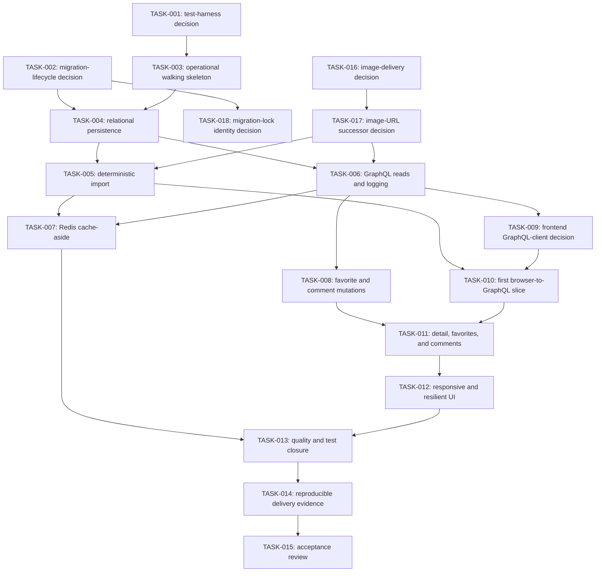

# Implementation Plan

## Current planning state

The repository has completed TASK-003 through TASK-006 after establishing the initial requirements and architecture foundation. TASK-007 is `In progress` for Milestone 6 after hosted pull-request run `32391250007` on pushed commit `0e56e1f` passed unit 139/139 but failed integration 72/74 because the CI job omitted the explicit Redis test namespace. Its three product milestones, deterministic-loading correction, local closure packet, and AC-010 behavior remain implemented. The run-isolated workflow correction now passes focused workflow tests 2/2, real-Redis focus 3/3, root typecheck, exact cleanup, and fresh S1 review. PostgreSQL initializes on the first list, detail, or comment read; Redis remains unconnected until a list cache operation. TASK-006 supplies the typed Express GraphQL list/detail boundary, PostgreSQL-backed five-filter path, bounded newest-first comment reads, stable redacted errors with separate diagnostics, demand-lazy resource ownership, and bounded all-Express request records; DPL-DEC-043 keeps mutations in TASK-008. AC-007, AC-008, AC-009, AC-010, and AC-011 product behavior passes; minimum-assessment readiness remains `Fail` at 5/12. TASK-007 closure requires an authorized commit/push, a passing exact hosted run, and fresh integrated re-review.

TASK-009 is `Complete` after the project owner approved exact independently reviewed proposal SHA-256 `2A691BB6C2A025F264B9ABE70E93F45801B932404C4005090D0EB71808267158` on 2026-08-18, DG-003 was resolved, and the documentation gate passed. [Accepted ADR-0017](./adrs/0017-use-tanstack-query-with-a-project-owned-typed-graphql-executor.md) selects TanStack Query with a project-owned typed GraphQL executor. Acceptance is implementation direction only; TASK-010 remains pending separate execution authorization and no client-controlled implementation artifact exists.

Mandatory requirements and deliverables remain defined in the [requirements specification](./REQUIREMENTS.md). Optional requirements retain the source assessment's classification, and their repository dispositions remain authoritative in the [ADR index](./adrs/README.md#optional-scope-decisions).

Use the repository [documentation map](../README.md#documentation-map) for authority and task routing. This plan owns sequencing, task IDs, gates, and implementation-enabling task outcomes; it cannot expand product or assessment scope, approve an unresolved architectural choice, or prove implementation.

Non-executable examples in the [Gherkin specification index](./specs/README.md) are derived planning artifacts. They may refine observable intent while a test-harness gate is pending, but they are not application tests until an executable runner, binding, or automated assertion invokes them.

## Roadmap role and AI-assistant execution model

This document is the canonical implementation roadmap. Its `TASK-*` records are nodes in a directed acyclic graph (DAG), and each dependency is an edge that must be satisfied before the downstream node starts. The graph is a development-coordination model for people and AI assistants; it is not the GraphQL data graph, a runtime application feature, or a reason to add an agent-framework dependency to the product.

Use these rules when executing the graph:

1. A node is **ready** only when every `May start after` task is `Complete` and every gate named by that node is `Resolved`. `Ready` is an eligibility condition, not an additional persisted task status.
2. One primary owner or coordinating assistant owns a node, its status, its integrated evidence, and its documentation closure. For an authorized implementation ExecPlan, `test_worker` and `code_worker` independently own the test and implementation phases of each coherent milestone slice and may edit only the bounded paths in their sequential write leases; the coordinator opens and terminally closes each lease through the repository's automatic write-lease guard before accepting a handoff. Workers do not inherit integration, approval, status, evidence-acceptance, or closure ownership.
3. Run ready nodes in parallel only when their write scopes do not overlap or when the primary owners agree on an explicit merge order. Within one Git worktree, the automatic guard permits only one active worker write lease; use separate worktrees when independent task owners intentionally execute in parallel. Never run `test_worker` and `code_worker` concurrently within the same Red-Green-Refactor cycle. Shared ADR numbers, root manifests, lockfiles, schemas, ExecPlans, execution records, and current-status documents require one explicit owner and an ordered handoff.
4. Before implementation, the node owner reads only the mapped requirements, optional dispositions, accepted ADRs, active gates, `SPEC-*`/`HS-*` rules, applicable design documents and recorded reversible decisions, and current repository evidence needed by that node.
5. Move a node from `Pending` to `In progress` only with an evidence-linked progress-log entry. Production behavior then advances through one preflight-classified, coherent milestone-slice Red-Green-Refactor cycle at a time under ADR-0016. Use ADR-0016's exact seven classifications: covered existing behavior records evidence, uncovered existing behavior adds passing characterization without Green, only missing behavior, regressions, or a coordinator-confirmed partial gap may open Red, and conflicting or unknown evidence stops dependent work.
6. Mark a node `Complete` only after its falsifiable definition of done, task-specific validation, test-relevance review when applicable, and universal documentation gate all pass. Downstream assistants must not infer completion from plans, generated files, or another assistant's unverified handoff.
7. If execution exposes a consequential choice outside an accepted ADR, stop only the dependent branch, create or activate the applicable decision gate, and continue other ready nodes when their scopes remain independent.
8. A future node that materially touches ADR-0015's migration lifecycle must complete ADR-0016's extension-cost watch before Red and compare the estimate with observed change amplification before closure. Preserve the existing large migration-lifecycle integration test as delivered evidence; do not split it during unrelated feature work, and place new scenarios in focused family-specific files behind shared fixtures when the accepted boundary permits. A requirement, reproduced incident, compatibility change, or successor ADR must justify every net-new lifecycle variant; examples and prior exhaustive matrices do not create product scope by themselves.

This roadmap is not an ExecPlan. The repository has adopted the root [ExecPlan convention](../PLANS.md), and node-scoped plans are registered in the [plan index](./plans/README.md). Active plans live directly under `docs/plans/`; completed plans remain as historical evidence under `docs/plans/completed/`. An ExecPlan may provide concrete commands, discoveries, decisions, and recovery steps for its owning node, but it cannot replace this graph, change dependencies, resolve gates, or expand requirement scope. The completed [TASK-001](./plans/completed/TASK-001-test-harness-decision.md), [TASK-002](./plans/completed/TASK-002-sequelize-migration-lifecycle-decision.md), and [TASK-018](./plans/completed/TASK-018-postgresql-migration-lock-identity-decision.md) ExecPlans preserve their execution history. TASK-018 resolved DG-005 without changing TASK-004 dependencies; the project owner later supplied the separate TASK-004 execution authorization on 2026-08-14.

The [project-scoped Codex agent guide](../.codex/README.md) defines ten reusable roles and separates risk-classified research from implementation work. Research, analysis, non-authoritative drafting, and review remain read-only, with the primary as the sole authoritative research-derived artifact writer. During an authorized [worker-first ExecPlan implementation](../.codex/execplan-implementation-workflow.md), the primary normally delegates bounded repository edits to the workspace-write test and code workers while retaining integration, status, evidence acceptance, project-owner approval handling, and the universal documentation gate. Research routing does not modify that implementation topology. These roles are execution helpers, not graph nodes or task owners.

## Decision-gate policy

A decision gate records an unresolved, consequential choice whose implementation would be costly to reverse. A pending gate may have no ADR or an evaluated `Proposed` ADR, but it remains unresolved and grants no implementation authority until project-owner approval.

Resolve each gate as follows:

1. Create a new ADR with the next unused ID and status `Proposed` when the dependent implementation milestone becomes imminent.
2. Evaluate credible alternatives, consequences, risks, reversal triggers, and measurable validation under the repository's ADR rubric.
3. Obtain project-owner approval and change the ADR to `Accepted` before adding the artifacts blocked by the gate.
4. Link the accepted ADR from this plan, change the gate to `Resolved`, and retain the record as planning history.

An accepted ADR records implementation direction only. Resolving a gate is not evidence that the selected tooling or behavior has been implemented.

## Authorization boundaries

`AUTH-*` records project-owner-controlled, non-architectural authorization that an accepted technical direction requires before implementation. An authorization record does not allocate an ADR, resolve a `DG-*` gate, add a task-graph edge, establish a legal conclusion, or prove implementation. Its status and scope must remain explicit wherever an implementation task depends on it.

| Authorization | Status | Recorded disposition and evidence | Authorized scope | Continuity |
|---|---|---|---|---|
| [AUTH-001](#auth-001---character-image-content-rights-authorization) | Authorized | **A — Documented authorization.** On 2026-08-11, the project owner explicitly confirmed that this personal, educational, non-commercial portfolio has authorization to display the official API's character images through ADR-0014's direct URLs and ordinary browser/intermediary caching. On 2026-08-14, the owner confirmed that the project will remain within that portfolio scope. | Image-specific work may proceed through ADR-0014's exact direct-URL boundary and each owning task after its other prerequisites. This authorization is not implementation evidence. | AUTH-001 remains `Authorized` only while the recorded portfolio, source, URL mapping, provider conditions, and direct-delivery boundary remain unchanged. The scope-bound reopen rule below governs any departure. |

### AUTH-001 - Character-image content-rights authorization

- **Status:** Authorized on 2026-08-11 under disposition A; the project owner confirmed the scope boundary on 2026-08-14.
- **Owner evidence:** The project owner explicitly confirms authorization for this personal, educational, non-commercial portfolio to display the official API's character images through the exact ADR-0014 direct URLs, including ordinary browser and intermediary caching, and confirms that the project will not move into commercial use.
- **Permitted boundary:** AUTH-001 authorizes character-image use only within that recorded portfolio scope and ADR-0014's exact direct-URL behavior. Each owning task must still satisfy its other prerequisites. Ordinary implementation work that preserves every element of this boundary does not require authorization renewal.
- **Continuity and reopen rule:** AUTH-001 remains `Authorized` only while the recorded boundary remains unchanged. Before dependent image-specific work proceeds, reopen AUTH-001 if any provider or content source; host, URL, path, or character mapping; project or commercial scope; provider terms, authorization, objection, or takedown status; delivery mechanism, including proxying, application-owned bytes, or redistribution; or disposition label changes. A proposed departure from ADR-0014's accepted technical semantics follows the applicable ADR lifecycle and also reopens AUTH-001 whenever it changes one of these authorization dimensions.
- **Evidence limit:** This record satisfies ADR-0014's owner-controlled authorization prerequisite. It is not independent legal verification, implementation evidence, runtime proof, or acceptance evidence.

Every downstream AUTH-001 join in this plan assumes the scope-bound continuity above. Reopening AUTH-001 pauses only affected image-specific work until the project owner records a current disposition; it does not by itself change a task status, task edge, gate status, or ADR status.

## Active decision gates

| Gate | Status | Required decision | Must be resolved before | Governing context |
|---|---|---|---|---|
| DG-001 | Resolved | [ADR-0011](./adrs/0011-define-the-typescript-test-harness.md) selects Vitest projects, jsdom, milestone-aware unit/integration/application boundaries, and one Chromium-only Playwright process smoke. | Resolved direction may be implemented only by TASK-003 and later owning tasks; acceptance is not harness evidence. | NFR-004; OR-001, OR-004, OR-007 (adopted optional); ADR-0001 (Superseded), ADR-0002, ADR-0010, ADR-0011, ADR-0014 |
| DG-002 | Resolved | Now-Superseded [ADR-0012](./adrs/superseded/0012-use-a-build-first-programmatic-migration-lifecycle.md) historically selected the private build-first programmatic Umzug 3 lifecycle; accepted [ADR-0015](./adrs/0015-use-a-build-first-migration-lifecycle-with-exact-catalog-byte-lock-identity.md) carries that lifecycle forward as the current whole-record authority. | Resolved direction may be implemented only by TASK-004 and later owning tasks. Separate TASK-004 execution authorization was received on 2026-08-14; acceptance remains distinct from runner, migration, migrated-database, or ERD evidence. | FR-BE-003, FR-BE-004, NFR-003, DEL-002, AC-009, AC-012; OR-001 (adopted optional); ADR-0001 (Superseded), ADR-0002, ADR-0003, ADR-0008, ADR-0010, ADR-0011, ADR-0012 (Superseded), ADR-0014, ADR-0015 |
| DG-003 | Resolved | [Accepted ADR-0017](./adrs/0017-use-tanstack-query-with-a-project-owned-typed-graphql-executor.md) selects TanStack Query with a project-owned typed GraphQL executor for operation generation, media-aware errors, cache behavior, exact post-mutation detail convergence, and its test boundary. | Resolved direction may be implemented only by TASK-010, TASK-011, or another owning task after its dependencies and separate execution authorization. Acceptance is not dependency, generated-artifact, test, or runtime evidence. | FR-FE-001, FR-FE-002, FR-FE-003, FR-FE-004, FR-FE-005, NFR-001, OR-003 (adopted optional), AC-001, AC-002, AC-003, AC-004, AC-005; ADR-0002, ADR-0006, ADR-0009, ADR-0016, ADR-0017 |
| DG-004 | Resolved | Now-Superseded [ADR-0013](./adrs/superseded/0013-materialize-character-images-during-ingestion.md) historically selected validated ingestion-time copies in PostgreSQL and an exact same-origin content-addressed asset route, and superseded ADR-0004. | Historical resolution only; future image-delivery work follows resolved DG-006, accepted ADR-0014, and Authorized AUTH-001. | FR-FE-001, FR-FE-003, NFR-001, NFR-005, AC-001, AC-003; ADR-0001 (Superseded), ADR-0003, ADR-0004 (Superseded), ADR-0006, ADR-0007, ADR-0008, ADR-0009, ADR-0010, ADR-0011, ADR-0012 (Superseded), ADR-0013 (Superseded), ADR-0014, ADR-0015 |
| DG-005 | Resolved | Accepted [ADR-0015](./adrs/0015-use-a-build-first-migration-lifecycle-with-exact-catalog-byte-lock-identity.md), prepared by completed [TASK-018](#task-018---resolve-the-postgresql-migration-lock-namespace-identity), selects `RESTRICTED-ASCII-DOMAIN`, exact catalog-bound `migrations:v2` identity, PostgreSQL 18.6, the closed local/CI startup profile, opaque target provenance, and destructive lock-deadline recovery. Fresh independent review returned `PASS` with no finding on exact proposal SHA-256 `8B7B9EC9508DF01E57EA067344896814CD0B0B1B3D8083B889C7ED44AA5432B1`; the project owner explicitly approved those bytes on 2026-08-14. | Historical gate only. The separate TASK-004 execution authorization was received on 2026-08-14; controlled artifacts may now be added only through the active task and its worker-first/TDD barriers. | FR-BE-003, FR-BE-004, NFR-003, DEL-002, AC-009, AC-012; OR-001 (adopted optional); ADR-0002, ADR-0003, ADR-0008, ADR-0010, ADR-0011, ADR-0012 (Superseded), ADR-0014, ADR-0015 |
| DG-006 | Resolved | Accepted [ADR-0014](./adrs/0014-persist-and-deliver-character-image-urls-directly.md) selects persistence and direct browser use of the exact validated official `Character.image` URL after comparing a fixed-target runtime proxy and retained ingestion-time byte materialization. | Resolved direction may be implemented only by owning downstream tasks after their dependencies. [AUTH-001](#auth-001---character-image-content-rights-authorization) is Authorized under disposition A for the accepted direct boundary; acceptance and authorization are not image-delivery evidence. | FR-FE-001, FR-FE-003, NFR-001, NFR-005, AC-001, AC-003; ADR-0001 (Superseded), ADR-0003, ADR-0004 (Superseded), ADR-0006, ADR-0007, ADR-0008, ADR-0009, ADR-0010, ADR-0013 (Superseded), ADR-0014 |

## Gate sequence and parallelism

1. DG-001 was resolved by ADR-0011 at repository-foundation time because every production behavior must begin with an executable failing test under ADR-0010. TASK-003 subsequently implemented the registered unit, application, and Chromium process-smoke scopes. TASK-004 activated the real-PostgreSQL integration scope; later task-specific scopes remain absent until their owning tasks implement them.
2. DG-002 remains historically resolved through now-Superseded ADR-0012, and TASK-002 remains complete. TASK-016 review exposed an NFC alias in ADR-0012's migration-lock identity. Accepted ADR-0015 carries forward the unaffected lifecycle and replaces that identity with the restricted-ASCII/catalog-bound v2 contract. Fresh independent review passed on exact proposal SHA-256 `8B7B9EC9508DF01E57EA067344896814CD0B0B1B3D8083B889C7ED44AA5432B1`, and explicit owner approval resolved DG-005. The completed approval join changed no TASK dependency edge; the later separate owner directive started TASK-004 on 2026-08-14.
3. Resolve DG-003 after the project-owned GraphQL operations are stable and before frontend data-access implementation. It does not block backend schema, service, repository, or static frontend layout work.
4. DG-004 remains historically resolved by now-Superseded ADR-0013. Its materialized-byte direction is preserved with TASK-016 as history and is no longer the implementation target; accepted ADR-0014 and resolved DG-006 now govern image delivery.
5. DG-005 was resolved on 2026-08-14 through fresh independent `PASS` and explicit owner approval of exact ADR-0015 proposal SHA-256 `8B7B9EC9508DF01E57EA067344896814CD0B0B1B3D8083B889C7ED44AA5432B1`. TASK-018 is complete; ADR-0015 is accepted; ADR-0012 is reciprocally superseded; and its `rick-and-morty-explorer:migrations:v1` meaning must not be implemented, reused, or reinterpreted. The separate project-owner execution directive was received later on 2026-08-14. TASK-004 retained exactly TASK-002 and TASK-003 as dependencies and is now `Complete`. Its original implementation and hosted run `31928215615` remain historical evidence; the 2026-08-16 review returned `REVISE` because the authenticated artifact omitted two inherited compiler configurations. That finding and a follow-up LF/CRLF emitted-byte instability were corrected through bounded TDD. The corrected committed checkout passes all 35 checks with identical artifact identity, corrected hosted run `31947144452` passes on exact commit `c59618e54e6b5a96072dfcb2111b52253fb869fd`, the fresh acceptance re-review returns `PASS` with no Blocker, Major, or Minor, and the task-closure documentation gate passes.
6. DG-006 was resolved through TASK-017 by project-owner approval of fresh-final-IR-B-`PASS` ADR-0014. The accepted successor preserves TASK-016 and ADR-0013 as history, supersedes ADR-0001 and ADR-0013 as whole records, carries forward their unaffected constraints, and selects exact validated direct avatar URLs without image bytes, an asset route, or a runtime proxy. AUTH-001 is `Authorized` under the scope-bound continuity and reopen policy above. Image-specific work may proceed only in its owning downstream tasks after their remaining dependencies; no implementation is implied.

Neutral requirements and architecture documentation may continue while a gate is pending. Declarative workspace or infrastructure work may proceed only when it does not select or depend on an option controlled by a pending gate.

## Universal task-closure gate

Every future implementation work item inherits the repository [task-closure documentation gate](../README.md#task-closure-documentation-gate). Its definition of done must identify affected documentation or record a concrete `Documentation impact: None` reason, update and link authorized documentation changes, and run the relevant documentation validation before the item can be marked complete. This universal closure gate is separate from the architectural decision gates in this plan and never resolves one of them implicitly.

## Gate definitions of done

### DG-001 - TypeScript test harness

- **Status:** Resolved by accepted [ADR-0011](./adrs/0011-define-the-typescript-test-harness.md). TASK-003 now implements its first unit, application, type-check, and Chromium smoke scopes; later tasks incrementally activate integration and product scopes.
- The accepted ADR compares at least three credible runner strategies and explains the selected ESM and strict-TypeScript integration.
- It defines the browser-like DOM environment for React tests and the process boundary for PostgreSQL and Redis integration tests.
- It defines distinct, reproducible unit, integration, application, and root test scopes without claiming the commands already exist.
- It defines the smallest real-browser smoke boundary needed to observe the `TASK-003` web shell while keeping broad end-to-end coverage deferred.
- Its validation can prove that frontend, backend, migration, and Redis tests execute through the documented boundaries required by ADR-0010.

### DG-002 - Sequelize migration lifecycle

- **Status:** Historically Resolved by now-Superseded [ADR-0012](./adrs/superseded/0012-use-a-build-first-programmatic-migration-lifecycle.md); accepted [ADR-0015](./adrs/0015-use-a-build-first-migration-lifecycle-with-exact-catalog-byte-lock-identity.md) is the current whole-record authority. Separately authorized TASK-004 has passing local evidence for the complete task-scoped artifact, lifecycle, command, failure, rollback, and concurrency boundary against isolated PostgreSQL 18.6; the TASK-014-owned ERD remains pending.
- The accepted ADR compares at least three credible migration-runner and artifact-lifecycle strategies without reconsidering mandatory Sequelize or the accepted strict-TypeScript source direction.
- It defines how the same version-controlled migrations run in local setup and isolated integration tests.
- It states forward, rollback, failure, and concurrent-execution behavior without making migrations depend on the public character API.
- Its validation can prove migration from an empty PostgreSQL database and alignment between migration state and the required ERD.

### DG-003 - Frontend GraphQL client and query cache

- **Status:** `Resolved` by [Accepted ADR-0017](./adrs/0017-use-tanstack-query-with-a-project-owned-typed-graphql-executor.md) after fresh final independent `PASS` and explicit project-owner approval of exact proposal SHA-256 `2A691BB6C2A025F264B9ABE70E93F45801B932404C4005090D0EB71808267158` on 2026-08-18.
- The accepted ADR compares at least three credible client and query-cache strategies.
- It preserves ADR-0009 ownership: URL parameters own navigation state, the GraphQL client owns server data, and component state owns transient controls.
- It does not require normalized entity identity and defines explicit detail refetching after favorite and comment mutations.
- It defines how generated operation types, GraphQL errors, request mocking, and cache behavior are validated without duplicating server-owned state.

### DG-004 - Character-image delivery boundary

- **Status:** Historically Resolved by now-Superseded [ADR-0013](./adrs/superseded/0013-materialize-character-images-during-ingestion.md); current image delivery is governed by accepted ADR-0014 through resolved DG-006.
- The accepted ADR compares copying assets during ingestion, an application-owned image proxy or asset boundary, and a narrowly scoped direct-browser asset exception.
- It states whether stored `imageUrl` values remain upstream URLs or become application-owned locations and identifies any migration, ingestion, storage, cache, security, or cleanup consequences.
- It preserved the project GraphQL API as the only browser character-data API, kept its selected application route asset-only rather than an arbitrary proxy or product REST surface, reconciled ADR-0001, and superseded ADR-0004 through reciprocal lifecycle metadata without weakening ADR-0006.
- Its validation proves the selected path with deterministic fixtures, a layout-safe image failure, no runtime character-data query to the public API, and no undocumented product REST surface.

### DG-005 - PostgreSQL migration-lock namespace identity

- **Status:** Resolved by fresh independent `PASS` and explicit project-owner approval of exact [ADR-0015](./adrs/0015-use-a-build-first-migration-lifecycle-with-exact-catalog-byte-lock-identity.md) proposal SHA-256 `8B7B9EC9508DF01E57EA067344896814CD0B0B1B3D8083B889C7ED44AA5432B1` on 2026-08-14. ADR-0015 is accepted and ADR-0012 is reciprocally superseded. Separately authorized TASK-004 now has passing local evidence for the complete task-scoped successor lifecycle; the TASK-014-owned ERD remains incomplete.
- The successor compares exact catalog-byte identity with an explicitly restrictive admissible namespace domain under the migration lifecycle's own concurrency and portability requirements and selects the proportional lower-case ASCII domain for the current local/CI portfolio.
- It carries forward every unaffected ADR-0012 clause, uses reciprocal lifecycle metadata, and selects a new version literal rather than reinterpreting or reusing `rick-and-morty-explorer:migrations:v1`.
- It must define the exact compatibility versions and current-minor upgrade rule; lower-case ASCII database/schema/user domain; pre-connection loopback/no-TLS, credential, port, and blanket nonempty-`PG*` guard; opaque target issuance; exact forwarded startup `options` and serializer-appended encoding pair; eight-field startup identity; reproducible two-field text database/schema binding; v2 framing and signed PostgreSQL key binding; database-local collision behavior; dedicated-session ownership; deadline-triggered physical-session destruction; and same-namespace serialization without claiming implementation evidence.
- Project-owner approval resolves only DG-005. Historical DG-002 resolution and TASK-002 completion remain unchanged, and existing TASK dependency edges are not modified.

### DG-006 - Character-image URL successor boundary

- **Status:** Resolved by accepted [ADR-0014](./adrs/0014-persist-and-deliver-character-image-urls-directly.md) after fresh final IR-B `PASS` and exact project-owner approval; ADR-0001 and ADR-0013 are Superseded, and no image-delivery implementation exists.
- The successor compares direct use of the official upstream `Character.image` URL, a fixed-target runtime application proxy, and retained ingestion-owned byte materialization against identical source-first criteria.
- It distinguishes `Character.image` from the character resource's `url`, states the exact persisted `characters.image_url` meaning, and defines GraphQL, Redis, browser, CSP/referrer/credential, failure, fallback, rights, testing, and reversal behavior.
- It counts total schema, code, dependency, infrastructure, operational, test, and documentation surface when judging proportionality rather than treating stored byte volume as the complete cost.
- It preserves accepted and completed history, reconciles ADR-0001 and ADR-0013 through governed successor lifecycle, carries forward unaffected ADR-0004 constraints, and makes no implementation claim.
- Project-owner approval resolved only DG-006. TASK-016 and DG-004 remain historical closure evidence. AUTH-001 separately records disposition A as `Authorized`, so downstream image-specific work may follow the accepted successor only in its owning tasks after their remaining prerequisites.

## Implementation work sequence

### Delivery milestones

Milestones describe useful convergence points; they do not add edges or force serialization beyond the task graph.

| Milestone | Graph nodes | Observable outcome |
|---|---|---|
| M0 - Decision readiness | Completed TASK-001, TASK-002, TASK-016, TASK-017, and TASK-018 | All current M0 decision joins are resolved and measurable. Separate TASK-004 execution authorization was received on 2026-08-14 and M2 work is now in progress. |
| M1 - Operational walking skeleton | TASK-003 | One documented root workflow starts a visible React shell and a live Express process; the repository can build, type-check, test, and smoke-check the minimal applications. |
| M2 - Data and API foundation | TASK-004, then TASK-005 and TASK-006 in parallel | PostgreSQL is created from migrations, the fixed data set can be imported, and the project-owned GraphQL read boundary works against the database. |
| M3 - First product vertical slice | TASK-009 and TASK-010 after TASK-005 and TASK-006 | A browser renders the imported character list through the project GraphQL API, including sorting and adopted interface filters. |
| M4 - Cache and interaction branches | TASK-007 and TASK-008 may advance in parallel with M3; TASK-011 joins the interaction branch | Redis search caching, favorite/comment mutations, and the detail UI are complete on top of TASK-006's accepted read contract without widening the API boundary. |
| M5 - Resilient interface | TASK-012 | Required flows and failure states are responsive, accessible, and layout-safe at the selected viewports. |
| M6 - Portfolio closure | TASK-013, TASK-014, and TASK-015 in sequence | Quality, delivery reproducibility, and both acceptance views have evidence from a clean environment. |

### Canonical task graph

TASK-001, TASK-002, TASK-003, TASK-004, TASK-005, TASK-006, TASK-016, TASK-017, and TASK-018 are complete. TASK-005 completed under the project owner's separate 2026-08-18 execution authorization after three accepted milestones, complete root validation, fresh independent integrated `PASS`, and its documentation gate. TASK-016 retains the historical DG-004 closure through now-Superseded ADR-0013; TASK-017 resolved DG-006 through accepted ADR-0014 and replaces TASK-016 as the current image-decision dependency join before TASK-005 and TASK-006 without rewriting TASK-016 history. TASK-018 resolved DG-005 through accepted ADR-0015 after fresh independent `PASS` and explicit owner approval of exact proposal SHA-256 `8B7B9EC9508DF01E57EA067344896814CD0B0B1B3D8083B889C7ED44AA5432B1`. TASK-018 has no edge to TASK-004 and changed none of TASK-004's dependencies. AUTH-001 is `Authorized` under disposition A for the accepted direct boundary. TASK-003 completed its foundation without transferring image artifacts into scope or proving product acceptance. The project owner separately authorized TASK-004 execution on 2026-08-14; its implementation, runtime, clean-checkout, hosted-CI, fresh-review, and documentation-closure joins now pass. TASK-006 completed its owner-authorized list, filter, request-log, detail/comment-read, stable-error, lifecycle, integrated-validation, independent-review, and documentation joins on 2026-08-17.

The operational walking skeleton is deliberately thinner than the first product vertical slice. `TASK-003` proves that the repository, web process, API process, infrastructure, test boundary, and developer workflow are wired. It does not prove GraphQL character behavior, persistence, Redis readiness, or an acceptance criterion. The first browser-to-backend product flow is `TASK-010`, after the GraphQL contract, imported data, and frontend-client gate are ready.

### Task status and dependency index

This table is the canonical current status for `TASK-*` work. `Pending` means prerequisites or work remain; `In progress` requires an evidence-linked execution-log entry; `Complete` requires the task's falsifiable definition of done and documentation gate. `Blocked` means an external condition prevents further progress after safe in-scope alternatives have been exhausted; the execution log must identify the condition, evidence, owner or dependency, and smallest next action. TASK-001 through TASK-006, TASK-009, TASK-016, TASK-017, and TASK-018 are complete; TASK-007 is in progress.

| Task | Status | May start after | Additional completion join or approval |
|---|---|---|---|
| TASK-001 | Complete | None | Project-owner approval received for ADR-0011; closure gates passed |
| TASK-002 | Complete | None | Project-owner approval received for ADR-0012; closure gates passed |
| TASK-016 | Complete | None | Project-owner approval received for ADR-0013; closure gates passed |
| TASK-017 | Complete | TASK-016 | Project-owner approval received for ADR-0014; DG-006 resolved; closure gates passed |
| TASK-018 | Complete | TASK-002 | Accepted ADR-0015 and resolved DG-005 after exact independent `PASS` and explicit owner approval; no TASK-004 dependency edge or execution authorization |
| TASK-003 | Complete | TASK-001 | GitHub Actions runtime and task-closure documentation gates passed |
| TASK-004 | Complete | TASK-002, TASK-003 | Corrected artifact, PostgreSQL runtime, clean-checkout, hosted-CI, fresh independent re-review, and task-closure documentation gates passed |
| TASK-005 | Complete | TASK-004, TASK-017 | Owner-authorized on 2026-08-18; three behavior milestones, full closure validation, fresh independent `PASS`, and documentation gate passed; AUTH-001 Authorized |
| TASK-006 | Complete | TASK-004, TASK-017 | Owner-authorized on 2026-08-16; four behavior milestones, build-first closure packet, fresh independent `PASS`, and documentation gate passed on 2026-08-17 |
| TASK-007 | In progress | TASK-005, TASK-006 | Product behavior and local hosted-CI namespace candidate accepted; exact hosted run and re-review pending; AUTH-001 remains Authorized for cached image URLs |
| TASK-008 | Pending | TASK-006 | None |
| TASK-009 | Complete | TASK-006 | ADR-0017 accepted, DG-003 resolved, and documentation gate passed on 2026-08-18 |
| TASK-010 | Pending | TASK-005, TASK-009 | Prerequisites satisfied; separate execution authorization required; AUTH-001 Authorized for browser image work |
| TASK-011 | Pending | TASK-008, TASK-010 | AUTH-001 Authorized for detail image work |
| TASK-012 | Pending | TASK-011 | AUTH-001 Authorized for image fallback and display work |
| TASK-013 | Pending | TASK-007, TASK-012 | Test-relevance audit and all authoritative quality gates |
| TASK-014 | Pending | TASK-013 | Clean-clone delivery verification |
| TASK-015 | Pending | TASK-014 | No unresolved release-blocking gate or ADR follow-up |

TASK-009 produced, independently reviewed, and received owner approval for [Accepted ADR-0017](./adrs/0017-use-tanstack-query-with-a-project-owned-typed-graphql-executor.md) through its [completed ExecPlan](./plans/completed/TASK-009-frontend-graphql-client-decision.md). DG-003 is `Resolved`, TASK-009 is `Complete`, and TASK-010 is dependency-ready but remains pending separate execution authorization.

TASK-003 is `Complete` after TASK-001 completion, DG-001 resolution, separate project-owner execution authorization, successful implementation/runtime verification, and its documentation gate. TASK-002, TASK-004, TASK-005, TASK-006, TASK-009, TASK-016, TASK-017, and TASK-018 are also `Complete`; TASK-007 is `In progress`; ADR-0015, ADR-0016, and ADR-0017 are accepted; DG-003 and DG-005 are resolved; and AUTH-001 is `Authorized` under disposition A. TASK-004 through TASK-006 retain their accepted evidence. TASK-007's canonical finite-lived Redis search caching, bounded fail-open behavior, Redis list-cache-demand-lazy connection, scoped post-import invalidation, deterministic-loading correction, and SPEC-012/HS-013/AC-010/NFR-003 product evidence pass. Hosted run `32391250007` contradicted repository closure because `.github/workflows/ci.yml` omitted the explicit namespace required by the strict real-Redis tests. Milestone 6 now has a locally accepted run-isolated job environment correction and retains hosted verification plus integrated re-review as its remaining closure joins. The project owner's option A in DPL-DEC-043 keeps read pagination/order in TASK-006 and mutations in TASK-008 without changing the dependency graph.

TASK-001 allocated ADR-0011, TASK-002 allocated ADR-0012, and TASK-016 allocated ADR-0013 only after their pre-draft research and independent-review barriers passed and collision checks reconfirmed the sequence. TASK-017 likewise allocated ADR-0014 only after `DRAFT READY`, triggered fresh IR-A `PASS`, and a collision check confirmed ADR-0013 as the prior highest number; fresh final IR-B passed before project-owner approval. TASK-018 was allocated only after a repository-wide task-ID collision check confirmed TASK-017 as the prior highest task. It later allocated Proposed ADR-0015 only after full research/re-entry, renewed `DRAFT READY`, a distinct fresh IR-A `PASS`, and a fresh ADR collision check confirmed ADR-0014 as the prior highest record. Fourth- and fifth-correction evidence and historical direct SHA-256 `9B90D8BF366E83E038F53AFA5D520B28786F9C768B765B8FA45EC34D4A4C1528` remain preserved; the owner subsequently selected the proportional restricted profile and authorized its direct documentation-only rewrite. Stable IDs retain chronology even when a successor changes the current graph join.

Reversible execution choices that are not controlled by a decision gate, such as URL parameter names and the default sort direction, must be recorded in the [decision and progress log](./execution/decision-and-progress-log.md) before dependent implementation begins. Such a record cannot change requirement scope, optional disposition, accepted architecture, or gate status.

### TASK-001 - Resolve the TypeScript test-harness gate

- **Outcome:** DG-001 has an owner-approved accepted ADR that defines executable unit, integration, application, real-browser smoke, and root test boundaries without claiming that a harness already exists.
- **Execution plan:** The completed [TASK-001 test-harness decision ExecPlan](./plans/completed/TASK-001-test-harness-decision.md) records research, approval, validation, and documentation closure without implementing the harness.
- **Mapped scope:** NFR-004; OR-001, OR-004, and OR-007 (adopted optional); AC-001 through AC-012 validation support.
- **Governing decisions:** ADR-0001, ADR-0002, ADR-0010, ADR-0011.
- **Prerequisites and gates:** None; project-owner approval has accepted ADR-0011 and resolved DG-001.
- **Expected artifacts:** Accepted ADR-0011, updated [ADR index](./adrs/README.md), this resolved gate record, and directly affected specification guidance.
- **Validation:** The ADR and documentation validators and `git diff --check` pass; the test-relevance and negative-artifact searches find no application/test source, disabled tests, harness configuration, manifest, lockfile, browser binary, or application scaffold. ADR-0011 makes runner, DOM, milestone-aware unit/integration/application, narrow real-browser smoke, and root command boundaries falsifiable without introducing broad end-to-end coverage.
- **Documentation impact:** ADR index, implementation plan, specification execution state, and execution log.
- **Done when:** Achieved on 2026-08-10: the project owner accepted ADR-0011, DG-001 is `Resolved` with a link, the documentation and relevance gates pass, and no test dependency or command is described as implemented without repository evidence.

### TASK-002 - Resolve the Sequelize migration-lifecycle gate

- **Outcome:** DG-002 has an owner-approved accepted ADR defining local, test, rollback, failure, and concurrency behavior for migrations.
- **Execution plan:** The completed [TASK-002 Sequelize migration-lifecycle decision ExecPlan](./plans/completed/TASK-002-sequelize-migration-lifecycle-decision.md) records research, approval, validation, and documentation closure without implementing a runner.
- **Mapped scope:** FR-BE-003, FR-BE-004, NFR-003, DEL-002, AC-009, AC-012; OR-001 (adopted optional).
- **Governing decisions:** ADR-0001, ADR-0002, ADR-0003, ADR-0008, ADR-0010, ADR-0011, ADR-0012.
- **Prerequisites and gates:** None; project-owner approval accepted ADR-0012, resolved DG-002, and the documentation-closure gates passed.
- **Expected artifacts:** Accepted ADR-0012, updated ADR index, this resolved gate record, and directly affected migration/specification guidance.
- **Validation:** The decision and pre-approval evidence cover empty-database execution, source and emitted artifacts, rollback, failure, isolated concurrency, cross-platform identity, and artifact integrity. The ADR and documentation validators and `git diff --check` pass; relevance and negative-artifact searches find no implementation or disabled test.
- **Documentation impact:** ADR index, implementation plan, system module diagram, specification execution state, and execution log.
- **Done when:** Achieved on 2026-08-10: the project owner accepted ADR-0012, DG-002 is `Resolved` with a link, the documentation and relevance gates pass, and no migration artifact is presented as implemented.

### TASK-016 - Resolve the character-image delivery gate

- **Outcome:** DG-004 has an owner-approved accepted ADR defining how browser-visible character images cross the upstream, ingestion, storage, GraphQL, and web boundaries.
- **Execution plan:** The completed [TASK-016 character-image delivery decision ExecPlan](./plans/completed/TASK-016-character-image-delivery-decision.md) records contract-first research, material-change correction, independent review, project-owner approval, and documentation closure without implementation.
- **Mapped scope:** FR-FE-001, FR-FE-003, NFR-001, NFR-005, AC-001, AC-003.
- **Governing decisions:** ADR-0001, ADR-0003, ADR-0004 (historical and Superseded), ADR-0006, ADR-0007, ADR-0008, ADR-0009, ADR-0010, ADR-0011, ADR-0012, and accepted ADR-0013.
- **Prerequisites and gates:** None; completed independently of TASK-003 and resolved only DG-004.
- **Expected artifacts:** Accepted ADR-0013, reciprocal ADR-0004 supersession, the updated ADR index, this resolved gate record, affected image-delivery guidance, directly affected specification routing, approval chronology, and the completed ExecPlan.
- **Validation:** Run the ADR validator and verify that the selected path defines URL and byte ownership, ingestion and persistence effects, browser and server request boundaries, deterministic tests, failure and recovery behavior, downstream task ownership, and the exact preservation or governed supersession relationship to ADR-0001, ADR-0004, and ADR-0006.
- **Documentation impact:** ADR index, implementation plan, system module diagram, image-delivery guidance, specifications, and execution log.
- **Done when:** Achieved on 2026-08-11: the project owner accepted ADR-0013, DG-004 is `Resolved`, reciprocal ADR-0004 supersession is recorded, the documentation and relevance gates pass, and no asset strategy is described as implemented without repository evidence. Rights disposition A/B/C remained a separate pre-implementation gate at this TASK-016 closure; [AUTH-001](#auth-001---character-image-content-rights-authorization) later recorded disposition A, and accepted ADR-0014 now owns the direct-URL successor boundary.

### TASK-017 - Select the proportional character-image URL successor

- **Outcome:** DG-006 has an owner-approved accepted successor defining whether the official upstream `Character.image` URL is persisted and used directly, proxied through a fixed application boundary, or replaced by justified owned bytes.
- **Execution plan:** The [completed TASK-017 character-image URL successor ExecPlan](./plans/completed/TASK-017-character-image-url-successor-decision.md) preserves contract-first research, source-first synthesis, triggered independent review, exact approval, and documentation closure without implementation.
- **Mapped scope:** FR-FE-001, FR-FE-003, NFR-001, NFR-005, AC-001, AC-003.
- **Governing decisions:** ADR-0001 and ADR-0013 (historical and Superseded), ADR-0004 (historical and Superseded), ADR-0003, ADR-0006, ADR-0007, ADR-0008, ADR-0009, ADR-0010, and accepted ADR-0014.
- **Prerequisites and gates:** TASK-016; DG-006 is owned by this task. The task is independent of TASK-003 and must not start implementation.
- **Expected artifacts:** Accepted ADR-0014; reciprocal ADR-0001/ADR-0013 supersession metadata; updated ADR index and current architecture owners; revised downstream image guidance and direct specification routing; approval chronology; and a completed ExecPlan.
- **Validation:** The common contract must distinguish `Character.image` from `Character.url`, compare all three complete boundaries without circular scoring, define import/GraphQL/Redis/browser/fallback/privacy/rights/reversal behavior, preserve accepted history, pass pre-draft and final independent review, and pass the ADR/documentation validators plus negative implementation checks.
- **Documentation impact:** ADR portfolio, implementation plan, system diagram, image-delivery UI/specification guidance, plan index, root current status, and execution chronology.
- **Done when:** The project owner has approved the exact independently reviewed successor, DG-006 is `Resolved`, reciprocal lifecycle and every affected current authority are synchronized, the documentation/relevance gates pass, and no image behavior is claimed without implementation evidence.

### TASK-018 - Resolve the PostgreSQL migration-lock namespace identity

- **Outcome:** DG-005 is `Resolved`. Fresh independent exact-artifact review returned `PASS` with no Blocker, Major, or Minor across all twenty hard gates and LOCK-INV-01 through LOCK-INV-21 on exact ADR-0015 proposal SHA-256 `8B7B9EC9508DF01E57EA067344896814CD0B0B1B3D8083B889C7ED44AA5432B1`; the project owner explicitly approved those bytes on 2026-08-14. ADR-0015 is accepted, ADR-0012 is reciprocally superseded, and no implementation is claimed.
- **Execution plan:** The completed [TASK-018 PostgreSQL migration-lock identity decision ExecPlan](./plans/completed/TASK-018-postgresql-migration-lock-identity-decision.md) preserves the Decision Review Contract, comparable option research, decision analysis, independent checkpoints, exact approval evidence, and documentation closure.
- **Mapped scope:** FR-BE-003, FR-BE-004, NFR-003, DEL-002, AC-009, AC-012; OR-001 (adopted optional).
- **Governing decisions:** ADR-0002, ADR-0003, ADR-0008, ADR-0010, ADR-0011, ADR-0012 (historical and Superseded), accepted ADR-0014, and accepted ADR-0015.
- **Prerequisites and gates:** TASK-002; achieved. TASK-018 is `Complete`, DG-005 is `Resolved`, and TASK-004 received its separate execution authorization on 2026-08-14.
- **Expected artifacts:** Achieved: preserved broad identity/startup/environment/TLS reports and reviews as historical evidence; accepted restricted-profile ADR-0015; PostgreSQL 18.6 and exact dual-startup-control contract; qualitative candidate comparison with no current cross-option numbers; exact after-authentication startup timing; synchronized authority/navigation documentation and TASK-004 consumer plan; exact five-vector packet plus uppercase/Unicode negatives; integrated validation, exact independent `PASS`, owner approval, and lifecycle reconciliation.
- **Validation:** Run the ADR and documentation validators and `git diff --check`; reproduce the 37-byte literal, five exact framing/hash/signed-key vectors, and negative uppercase/Unicode domain in Node.js `24.18.0` and Python `3.12.10`; verify all current Decision Review Contract gates and invariants; confirm exact ten-path documentation-only scope; and prove that ADR-0012/ADR-0014/SPEC/HS bytes, DG-005, TASK-018/TASK-004 status, TASK-004 dependencies, and the legacy `migrations:v1` meaning remain unchanged before owner approval.
- **Documentation impact:** Active ExecPlan and plan index, ADR proposal/index and architecture coverage, implementation plan and DG-005 routing, system diagram when the proposal exists, specification routing, root current status, and append-only execution chronology.
- **Done when:** Achieved on 2026-08-14: the exact reviewed successor is `Accepted`, ADR-0012 is reciprocally `Superseded`, DG-005 is `Resolved`, affected authorities and historical links are synchronized, closure validation passes, and no migration implementation is claimed.

### TASK-003 - Establish the operational walking skeleton

- **Outcome:** A minimal modular-monolith workspace runs a visible React 18 application shell and an Express process with an operational liveness response, giving later nodes a small, repeatable path for observing repository changes.
- **Execution plan:** The completed [TASK-003 operational walking-skeleton ExecPlan](./plans/completed/TASK-003-operational-walking-skeleton.md) preserves the implementation, TDD, harness, process-lifecycle, infrastructure, clean-checkout, CI, independent-review, and documentation-closure evidence.
- **Mapped scope:** NFR-001, NFR-003, NFR-004; OR-001 and OR-008 (adopted optional); AC-007 and AC-012 foundations.
- **Governing decisions:** ADR-0002, ADR-0006, ADR-0010, ADR-0011, ADR-0014.
- **Prerequisites and gates:** TASK-001; do not add TASK-004-owned migration artifacts, artifacts controlled by unresolved DG-003, or image-specific artifacts owned by later tasks. AUTH-001 is Authorized, but it does not transfer those artifacts into TASK-003 scope.
- **Expected artifacts:** Authoritative workspace and package manifests; `apps/web`, `apps/api`, and `packages/shared`; documented Node.js/browser targets; strict TypeScript configuration; root infrastructure definition; non-secret example configuration; ignore rules; a minimal React shell; an Express `GET /healthz` route that returns HTTP 200 with the deterministic JSON body `{ "status": "ok" }`; focused web and HTTP tests; and the one narrow application smoke selected by DG-001. Migration commands remain in TASK-004, and frontend GraphQL client artifacts remain in TASK-009 and later tasks.
- **Current evidence:** The branch contains the expected TASK-003 artifacts. Windows, isolated committed-checkout, disposable-Ubuntu, and GitHub Actions verification observes the exact H1, HTTP status/body, foreground application starts, unit 7/7, application 2/2, Chromium smoke 1/1, Tailwind production output, all six lifecycle cases with port rebinding, healthy PostgreSQL/Redis containers, scoped Compose teardown, and the complete root development entry. GitHub Actions run `31658342722`, job `94317643800`, passed every workflow step on Ubuntu 24.04 at commit `4b721063f56b66aaca22e73267b451bde6e2d084`. The [execution log](./execution/decision-and-progress-log.md) and completed ExecPlan preserve exact Red/Green, lease, hash, command, clean-checkout, CI, review, and closure evidence.
- **Completion evidence:** Every implementation, runtime, clean-checkout, CI, independent-review, relevance, and documentation join passed. Acceptance remains 0/12 because TASK-003 proves only the operational foundation.
- **Validation:** Record separate Red-Green-Refactor evidence for the rendered web shell and the HTTP liveness contract. From a clean checkout, run the authoritative install, strict type-check, test, independent application build, and root development workflow; verify the web shell in a real browser, verify `/healthz` over HTTP, and verify isolated PostgreSQL/Redis container health. The smoke must start and observe both application processes without requiring domain data.
- **Documentation impact:** Root current status, configuration and command navigation, implementation plan, and execution log, including the reversible package-manager, runtime-target, port/origin, and process-orchestration choices before dependent artifacts are added.
- **Done when:** A clean checkout can install, build, test, and start the minimal workspace through documented repository commands; the real-browser smoke observes the React shell; the HTTP smoke observes the Express liveness response; PostgreSQL and Redis report healthy independently; and the browser/server dependency direction is explicit.

The liveness route is operational process evidence only. It does not query PostgreSQL, Redis, GraphQL, or the public Rick and Morty API; it does not report readiness; it exposes no product data; and the React application does not call it. It is not a parallel REST product API and does not satisfy AC-007, SPEC-008, SPEC-014, SPEC-017, or any product acceptance criterion. A browser-to-API data path begins only in TASK-010 through the project GraphQL API.

### TASK-004 - Create relational persistence from migrations

- **Outcome:** An empty PostgreSQL database can be migrated to the accepted character/comment model through Sequelize.
- **Execution plan:** The completed [TASK-004 relational-persistence ExecPlan](./plans/completed/TASK-004-relational-persistence-from-migrations.md) preserves registration, authorization, worker-first TDD, implementation, runtime, clean-checkout, hosted-CI, fresh-review, and documentation-closure evidence. Registration did not start implementation or resolve DG-005; completed TASK-018 and accepted ADR-0015 resolved that gate separately before this task became `In progress` and later `Complete`.
- **Mapped scope:** FR-BE-003, NFR-003, DEL-002, AC-009, AC-012; OR-001 (adopted optional).
- **Governing decisions:** ADR-0002, ADR-0003, ADR-0005, ADR-0008, ADR-0010, ADR-0011, ADR-0012 (historical and Superseded), ADR-0014, and accepted ADR-0015.
- **Prerequisites and gates:** TASK-002 and TASK-003 are complete; DG-001, DG-002, and DG-005 are resolved; separate TASK-004 execution authorization was received on 2026-08-14. AUTH-001 is already Authorized under disposition A for the ADR-0014 non-null image URL column and mapping.
- **Expected artifacts:** The build-first programmatic Umzug boundary governed by accepted ADR-0015 using its fixed dependency profile, restricted identifier domain, opaque target handle, exact startup/text-catalog identity, and destructive deadline behavior; migration configuration/source; Sequelize models/adapters; isolated persistence integration tests; and executable migration commands. Keep only `characters.image_url` for image persistence and add no image relation or byte field. Never implement, reuse, or reinterpret ADR-0012's NFC-based v1 lock.
- **Current evidence:** The repository builds and authenticates one 20-input/24-file native-ESM artifact, including the leaf and both inherited TypeScript compiler configurations. Current build ID `b1a064b226ec774977e98e308bbba5a0e53df873a1bcfbdbf793b400da99fce6` and manifest SHA-256 `02EC4F2FAA860F8EFD7EBA3BFB1D24E3A432885D94C4AA3A94D7555366855874` use explicit LF emission plus normalized reads of the exact authored compiler inputs, so LF and CRLF materializations with the same normalized input identity produce the same exact output allowlist. The artifact migrates an isolated PostgreSQL `180006|18.6|UTF8` namespace to the exact `characters`/`comments` model, exposes schema-aligned Sequelize mappings, and preserves read-only status, idempotent up, bounded down/reapply, artifact/history authentication, atomic failure handling, redacted diagnostics, exact v2 lock behavior, same-namespace serialization, and disjoint-database/schema overlap. API and root commands preserve closed selector and result contracts. Renewed local gates pass unit 55/55, application 2/2, build, and integration 67/67 with zero database/backend or Docker residue. Independent checkout `646e8cd5e4c3b5bc6f2b6e4446f8cddd6be21d46` materialized CRLF sources, passed controller run `af1a90f61c5b8f9d` at 35/35, and reproduced the exact same build/manifest with empty tree status and zero infrastructure residue. Hosted GitHub Actions run `31947144452`, job `95164854442`, passed all workflow steps on exact commit `c59618e54e6b5a96072dfcb2111b52253fb869fd`, including immutable install, typecheck, build, Tailwind, infrastructure start/health, full test suite, smoke lifecycle, and unconditional teardown.
- **Completion evidence:** The historical 2026-08-16 integrated review returned `REVISE` for omitted inherited compiler inputs. The transitive-input and deterministic-emission Red/Green corrections, regenerated local PostgreSQL evidence, corrected committed clean checkout, and corrected hosted CI pass without a Refactor. The fresh [TASK-004 acceptance re-review](./reviews/2026-08-16-task-004-acceptance-re-review.md) returns `PASS` with no Blocker, Major, or Minor, and the task-closure documentation gate passes. Product acceptance was 0/12 at TASK-004 closure; later TASK-006 evidence advanced it to 3/12, TASK-005 to 4/12, and TASK-007 product evidence advances current readiness to 5/12 while TASK-007's own closure correction remains active. TASK-014 and TASK-015 retain the ERD and final-delivery joins.
- **Validation:** Record Red for an empty-database integration test, Green after migrations create the accepted tables, columns, indexes, constraints, and foreign key, then repeat the same scope after Refactor. Subsequent TDD cycles must cover 63/64-character boundaries, user/startup mismatches, forged handles, nonempty `PG*`, suspended lock queries with observable session destruction, same-database serialization/collision safety, and cross-database non-contention.
- **Documentation impact:** Migration/setup guidance, future ERD source, current status, implementation plan, and execution log.
- **Done when:** Forward migration from empty state and the documented rollback/failure behavior pass against isolated PostgreSQL with no external API call.

### TASK-005 - Import the deterministic 15-character baseline

- **Outcome:** An explicit importer transactionally stores upstream IDs 1 through 15 and preserves application-owned state on repeat runs.
- **Execution plan:** The completed [TASK-005 deterministic baseline-import ExecPlan](./plans/completed/TASK-005-import-deterministic-15-character-baseline.md) preserves the owner-authorized MVP-only implementation path, TDD evidence, validation, review, and documentation closure.
- **Mapped scope:** FR-BE-004, AC-009.
- **Governing decisions:** ADR-0007, ADR-0008, ADR-0014, ADR-0016.
- **Prerequisites and gates:** TASK-004 and TASK-017 are Complete; DG-006 is Resolved; AUTH-001 is Authorized under disposition A; separate TASK-005 execution authorization was received on 2026-08-18.
- **Expected artifacts:** Validated upstream adapter, import service and command, exact `Character.image` URL/ID binding for IDs 1 through 15, deterministic fixtures, and integration tests for idempotency, rollback, ownership preservation, and post-commit invalidation requests.
- **Validation:** Record Red, Green, and post-Refactor evidence for exactly 15 distinct IDs, exact requested-ID/payload-ID/avatar-URL association, hostile URL rejection, repeatability, bounded upstream failure, atomic rollback, and no live external API use in automated tests.
- **Completion evidence:** The fresh [TASK-005 acceptance review](./reviews/2026-08-18-task-005-acceptance-review.md) returns `PASS` with no Blocker, Major, or Minor on exact 18-path candidate fingerprint `B008819D8736BF92AF8870BB5A6CAB18BB55CAF3BE81C0D7F23E430DE0210780`. Root typecheck, build, unit 98/98, PostgreSQL integration 71/71, application 12/12, Chromium 1/1, lifecycle 6/6, cleanup, and the task-closure documentation gate pass.
- **Documentation impact:** Import/configuration guidance, current delivery status, implementation plan, and execution log.
- **Done when:** A clean migrated database can be initialized reproducibly and the import-specific portions of SPEC-010, SPEC-011, and HS-012 have passing evidence; API runtime behavior remains owned by TASK-006 and TASK-008.

### TASK-006 - Expose GraphQL reads, filters, and request logging through Express

- **Outcome:** The Express HTTP boundary exposes project-owned character list/detail queries, all five filters, stable errors, and bounded metadata logging for every completed Express request.
- **Execution plan:** The completed [TASK-006 GraphQL reads, filters, and request-logging ExecPlan](./plans/completed/TASK-006-graphql-reads-filters-and-request-logging.md) preserves authorization, DPL-DEC-043's option A allocation, preflight-classified Milestones 1 through 4, correction evidence, build-first Milestone 5 closure, exact candidate `673b675d62098d74d4bcc8490725cd2d8e66be5c`, and fresh independent `PASS` with no Blocker, Major, or Minor.
- **Mapped scope:** FR-BE-001, FR-BE-002, FR-BE-006, NFR-003, AC-007, AC-008, AC-011; OR-001, OR-007, and OR-008 (adopted optional).
- **Governing decisions:** ADR-0002, ADR-0003, ADR-0005, ADR-0006, ADR-0011, ADR-0014, ADR-0016.
- **Prerequisites and gates:** TASK-004 and TASK-017; DG-006 is resolved and AUTH-001 is Authorized under disposition A for the exact absolute image URL mapping. Use deterministic database fixtures so non-image work need not wait for TASK-005. DPL-DEC-043 records the owner's option A allocation: TASK-006 owns the complete read-side detail contract, including bounded newest-first comment reads and pagination, while TASK-008 retains favorite/comment mutations.
- **Expected artifacts:** Version-controlled GraphQL schema, deterministic schema-derived backend resolver-type generation and drift checking, Express integration, thin resolvers, application services, repositories, exact stored absolute `imageUrl` projection with no image asset or proxy route, bounded newest-first comment reads, validation/error mapping, Express-wide request middleware, and unit/integration tests.
- **Validation:** Record TDD evidence for the Express-hosted boundary, generated backend resolver types and their repeatable drift check, list/detail projections, each filter and one combined filter, literal metacharacters, positive base-10 IDs, missing/invalid IDs, default and maximum comment bounds, offsets, deterministic newest-first ordering, invalid pagination, internal-error redaction with server-side diagnostics, and exactly one bounded structured log record for representative completed Express requests including `GET /healthz` and successful and failing GraphQL requests.
- **Documentation impact:** GraphQL contract and usage guidance, current status, implementation plan, specifications when behavior changes, and execution log.
- **Done when:** Achieved on 2026-08-17: the Express/query portions of SPEC-008, SPEC-009, SPEC-013, and applicable HS-006, HS-007, HS-008, HS-009 read, HS-010, and HS-014 scenarios have executable passing evidence; the [acceptance review](./reviews/2026-08-17-task-006-acceptance-review.md) permits closure. Mutations and comment-input persistence remain owned by TASK-008.

### TASK-007 - Add bounded Redis cache-aside search behavior

- **Outcome:** Equivalent character searches reuse a validated finite-lived Redis projection and safely fall back to PostgreSQL.
- **Execution plan:** The active [TASK-007 bounded Redis cache-aside ExecPlan](./plans/TASK-007-bounded-redis-cache-aside.md) preserves three accepted product milestones and prior corrections, and adds Milestone 6 for the owner-authorized hosted-CI namespace correction.
- **Mapped scope:** FR-BE-005, NFR-003, AC-010; OR-008 (adopted optional).
- **Governing decisions:** ADR-0006, ADR-0007, ADR-0014, ADR-0016.
- **Prerequisites and gates:** TASK-005 and TASK-006; DG-006 is resolved and AUTH-001 is Authorized under disposition A for caching the exact absolute image URL.
- **Expected artifacts:** Canonical key builder, cache adapter/service integration, namespaced real-Redis tests, injected failure tests, and import invalidation integration.
- **Validation:** Record TDD evidence for miss, hit, empty result, TTL, canonical equivalence and distinction, malformed values, isolation, bounded timeout, fail-open behavior, SCAN/UNLINK invalidation, and post-commit invalidation failure.
- **Current evidence:** Historical reviews preserve the original product and deterministic-loading evidence. The current [CI reproducibility review](./reviews/2026-08-20-task-007-ci-reproducibility-review.md) remains `REVISE`: hosted run `32391250007` passed unit 139/139 but failed the two strict Redis integration scenarios at 72/74 because `REDIS_NAMESPACE` was absent. The bounded Milestone 6 correction now passes focused workflow tests 2/2, real-Redis focus 3/3, root typecheck, exact cleanup, documentation validation, and fresh S1 review with no finding. Production source is unchanged; an exact hosted pass and fresh integrated re-review remain required for closure.
- **Documentation impact:** Redis configuration and operational guidance, current status, implementation plan, and execution log.
- **Done when:** SPEC-012, HS-013, AC-010, and the Redis portion of NFR-003 remain implemented; the run-isolated CI namespace contract, local focused and real-Redis checks, exact hosted workflow pass, fresh re-review, and documentation gate also pass.

### TASK-008 - Persist favorite and comment mutations

- **Outcome:** GraphQL mutations persist single-user favorite state and bounded plain-text comments in PostgreSQL.
- **Mapped scope:** FR-FE-004, FR-FE-005, FR-BE-001, FR-BE-003, AC-004, AC-005.
- **Governing decisions:** ADR-0003, ADR-0005, ADR-0006, ADR-0014, ADR-0016.
- **Prerequisites and gates:** TASK-006; DG-001 and DG-002 are resolved, DG-004 is historical closure evidence, and current DG-006 is resolved through the completed decision path.
- **Expected artifacts:** Application services, favorite/comment mutation resolvers, comment-body validation, mutation persistence, and GraphQL/persistence tests. Reuse the accepted TASK-006 detail/comment-read contract instead of reimplementing its ordering or pagination.
- **Validation:** Record TDD evidence for valid and invalid favorite/comment mutations, persistence across API restarts, missing IDs, safe plain-text comment handling, mutation readback through the existing TASK-006 detail query, and no interaction-driven search-cache invalidation. Do not duplicate ownership of newest-first ordering or pagination semantics.
- **Documentation impact:** GraphQL mutation examples, single-user limitation, current status, implementation plan, and execution log.
- **Done when:** Backend mutation, comment-input, and persistence evidence covers the TASK-008 portions required by SPEC-004, SPEC-005, SPEC-008, HS-005, HS-009, and HS-015 while reusing accepted TASK-006 read-side HS-009 evidence; end-to-end UI completion remains owned by TASK-011.

### TASK-009 - Resolve the frontend GraphQL client gate

- **Outcome:** DG-003 has an owner-approved accepted ADR for the client, query cache, generated operations, error behavior, refetching, and test boundary.
- **Execution plan:** The [completed TASK-009 frontend GraphQL client decision ExecPlan](./plans/completed/TASK-009-frontend-graphql-client-decision.md) preserves the R2 Decision Review Contract, research, [Accepted ADR-0017](./adrs/0017-use-tanstack-query-with-a-project-owned-typed-graphql-executor.md), review, approval, and closure chronology. It authorizes no frontend implementation.
- **Mapped scope:** FR-FE-001 through FR-FE-005, NFR-001, AC-001 through AC-005; OR-003 (adopted optional).
- **Governing decisions:** ADR-0002, ADR-0006, ADR-0009, ADR-0016, ADR-0017.
- **Prerequisites and gates:** Achieved. Stable query operations came from TASK-006; the project owner approved exact independently reviewed ADR-0017 proposal bytes on 2026-08-18; DG-003 is `Resolved`; and the documentation gate passed. DG-001 and DG-002 are resolved, DG-004 is historical closure evidence, and current DG-006 is resolved through the completed decision path.
- **Expected artifacts:** [Accepted ADR-0017](./adrs/0017-use-tanstack-query-with-a-project-owned-typed-graphql-executor.md), updated ADR index, this gate record, and affected frontend specification guidance.
- **Validation:** Achieved for decision closure: ADR/documentation validators, `git diff --check`, exact documentation scope, negative implementation-path inspection, and final authority readback pass. Generated types, request mocking, error mapping, explicit detail refetching, and cache ownership remain downstream implementation evidence.
- **Documentation impact:** ADR index, implementation plan, system module diagram, specifications, and execution log.
- **Done when:** Achieved on 2026-08-18: the project owner accepted exact independently reviewed ADR-0017 proposal bytes, DG-003 is `Resolved`, the documentation gate passes, and no client dependency or operation artifact was added.

### TASK-010 - Deliver the character list, sorting, and adopted interface filters

- **Outcome:** The React list route renders character cards, deterministic A-Z/Z-A sorting, and URL-owned status/species/gender filters.
- **Mapped scope:** FR-FE-001, FR-FE-002, NFR-001, AC-001, AC-002; OR-003 and OR-004 (adopted optional).
- **Governing decisions:** ADR-0002, ADR-0006, ADR-0009, ADR-0014, ADR-0016.
- **Design inputs:** [UI field visibility](./ui/README.md#ui-field-visibility-decision) and [visual foundations](./ui/visual-foundations.md); use the [Storybook pilot guidance](./ui/storybook-workflow.md) only if that reversible pilot is activated.
- **Prerequisites and gates:** TASK-005 and TASK-009; DG-001 through DG-004 and DG-006 are resolved through completed decision paths, and AUTH-001 is Authorized under disposition A for browser image work.
- **Expected artifacts:** List route, generated operations, query integration, card and controls, URL normalization, loading/empty/error states, and focused component/route tests.
- **Validation:** Record TDD evidence for card fields, stable bidirectional sorting, each adopted filter, combined URL/query state, reload, and browser back/forward restoration. Extend the single narrow application smoke to prove that a real browser renders the 15 imported characters through the project GraphQL API while upstream character-JSON access is disabled and exact avatar requests are locally intercepted with the accepted anonymous-CORS/no-referrer contract. Record the reversible URL parameter names and default sort in the execution log before dependent code.
- **Documentation impact:** UI behavior/usage guidance, specification mapping, current status, implementation plan, and execution log.
- **Done when:** SPEC-001, SPEC-002, SPEC-006 and the list/sort/filter portions of HS-015, HS-016, and HS-017 pass through the authoritative frontend test boundary, and the narrow browser smoke demonstrates the first browser-to-GraphQL-to-PostgreSQL product path without a runtime upstream character-JSON dependency while permitting only the exact governed avatar requests.

### TASK-011 - Deliver character detail, favorites, and comments

- **Outcome:** The addressable detail route renders character data and supports durable favorite and comment interactions with clear mutation errors.
- **Mapped scope:** FR-FE-003, FR-FE-004, FR-FE-005, NFR-001, NFR-005, AC-003, AC-004, AC-005; OR-004 (adopted optional).
- **Governing decisions:** ADR-0005, ADR-0006, ADR-0009, ADR-0014, ADR-0016.
- **Design inputs:** [UI field visibility and states](./ui/README.md#ui-field-visibility-decision) and [visual foundations](./ui/visual-foundations.md); use the [Storybook pilot guidance](./ui/storybook-workflow.md) only if that reversible pilot is active.
- **Prerequisites and gates:** TASK-008 and the routing foundation from TASK-010; DG-001 through DG-004 and DG-006 are resolved through completed decision paths, and AUTH-001 is Authorized under disposition A for detail image work.
- **Expected artifacts:** Detail route/view, favorite and comment controls, explicit post-mutation detail refetch, validation/error presentation, and component/route tests.
- **Validation:** Record TDD evidence for card navigation, direct route loading, not-found behavior, reload persistence, valid/invalid comments, plain-text rendering, refetching, and failed-mutation state.
- **Documentation impact:** UI and GraphQL interaction guidance, current status, implementation plan, and execution log.
- **Done when:** SPEC-003 through SPEC-005 and applicable HS-009, HS-015, HS-016, and HS-017 checks have reproducible evidence.

### TASK-012 - Complete responsive and resilient UI states

- **Outcome:** List and detail flows remain readable and operable across the selected viewports and all required data/image states.
- **Mapped scope:** NFR-001, NFR-002, NFR-005, AC-006; OR-004 (adopted optional).
- **Governing decisions:** ADR-0009, ADR-0014, ADR-0016.
- **Design inputs:** [UI data-driven constraints](./ui/README.md#data-driven-design-constraints), [planned mockup coverage](./ui/README.md#planned-mockup-coverage), and [responsive visual foundations](./ui/visual-foundations.md#responsive-type-scale).
- **Prerequisites and gates:** TASK-011; AUTH-001 is Authorized under disposition A for image fallback and display work.
- **Expected artifacts:** Tailwind styles using both Grid and Flexbox appropriately, accessible labels/alternative text, layout-safe image fallback, and responsive component/browser checks.
- **Validation:** Record one coherent component milestone-slice Red-Green-Refactor packet, then deterministic build/browser checks at 375, 768, and 1280 pixels for loading, empty, error, image failure, list, and detail states.
- **Documentation impact:** User-facing behavior guidance or screenshots only when they reflect reproducible implementation, plus current status, plan, and execution log.
- **Done when:** SPEC-007 and applicable HS-016 behavior pass without clipped required content or broken recovery controls.

### TASK-013 - Close code-quality and adopted test commitments

- **Outcome:** The implemented system has strict TypeScript, intentional module boundaries, relevant comments, and a risk-focused automated test portfolio with no residual scaffolding.
- **Mapped scope:** NFR-004; OR-001, OR-004, OR-007, OR-008 (adopted optional).
- **Governing decisions:** ADR-0002, ADR-0006, ADR-0007, ADR-0014, ADR-0016.
- **Prerequisites and gates:** TASK-007 and TASK-012; all active implementation gates and other implementation branches are complete through those dependency paths.
- **Expected artifacts:** Passing type/lint/build/test automation, at least three meaningful frontend component/layout tests, backend search unit coverage, real boundary integration coverage, and a recorded test-relevance audit.
- **Validation:** Run every authoritative repository quality command; inspect dependency direction, skipped/focused tests, test-only production branches, unused fixtures/mocks/helpers/snapshots, and requirement/ADR traceability.
- **Documentation impact:** Verification guidance, plan/task status, review evidence, and execution log.
- **Done when:** HS-006, HS-007, HS-017, and HS-019 have reproducible evidence and affected plus full test scopes pass after the relevance audit.

### TASK-014 - Deliver reproducible repository evidence

- **Outcome:** Reviewers can access, understand, configure, run, test, build, initialize, and exercise the complete application from a clean public clone.
- **Mapped scope:** DEL-001, DEL-002, DEL-003, NFR-006, AC-012.
- **Governing decisions:** ADR-0003, ADR-0006, ADR-0008, ADR-0012 (historical and Superseded), ADR-0014, ADR-0015, ADR-0016.
- **Prerequisites and gates:** TASK-013 completed.
- **Expected artifacts:** Public committed source, ERD derived from migration state with no image relation, prerequisites/configuration/install/infrastructure/migration/import/dev/test/build instructions, examples for all four GraphQL use cases, and documentation of the third-party avatar dependency, strict URL contract, CSP/CORS/referrer/privacy/cache/outage behavior, and recorded rights disposition.
- **Validation:** Verify anonymous repository access, perform the documented workflow from a clean clone, compare the ERD with a freshly migrated schema, and run every documented command and GraphQL example.
- **Documentation impact:** Root delivery status, executable setup/API/ERD documentation, implementation plan, review index, and execution log.
- **Done when:** SPEC-015 through SPEC-017 and HS-018 pass with reproducible repository and runtime evidence.

### TASK-015 - Perform final acceptance and repository-baseline review

- **Outcome:** A dated review reports every AC independently and separates minimum-assessment readiness from adopted optional repository commitments.
- **Mapped scope:** FR-FE-001 through FR-FE-005; FR-BE-001 through FR-BE-006; NFR-001 through NFR-006; DEL-001 through DEL-003; AC-001 through AC-012; adopted OR-001, OR-003, OR-004, OR-007, OR-008.
- **Governing decisions:** The current accepted ADR portfolio as applicable, including ADR-0002, ADR-0003, ADR-0005 through ADR-0009, ADR-0011, ADR-0014 through ADR-0016, and every later accepted gate-resolution ADR added by TASK-009; ADR-0001, ADR-0004, ADR-0010, ADR-0012, and ADR-0013 remain historical Superseded records.
- **Prerequisites and gates:** TASK-014 completed; all earlier tasks are complete through its dependency path, with no unresolved release-blocking gate or ADR follow-up.
- **Expected artifacts:** A dated acceptance review, exact command evidence, residual gap list, and synchronized root delivery status.
- **Validation:** Apply the repository acceptance matrix and all authoritative quality gates from a clean environment; use browser checks only after deterministic build and service checks pass.
- **Documentation impact:** Review record, root current status, implementation plan, and execution log.
- **Done when:** Every criterion has a reproducible status and smallest next action, both readiness views are explicit, and the task-closure documentation gate passes.

## Requirement-to-task coverage

This is planning traceability, not implementation evidence. Exact behavioral examples live in the [Gherkin specification index](./specs/README.md).

| Scope | Planned implementation and validation owner |
|---|---|
| FR-FE-001, FR-FE-002; AC-001, AC-002 | TASK-016 as historical image-decision evidence, TASK-017 for the current successor, TASK-010 for behavior, then TASK-012 and TASK-015 |
| FR-FE-003, FR-FE-004, FR-FE-005; AC-003, AC-004, AC-005 | TASK-016 as historical image-decision evidence, TASK-017 for the current successor, TASK-006 for detail/comment-read API support, TASK-008 for mutations and persistence, TASK-011 for UI behavior, then TASK-012 and TASK-015 |
| FR-BE-001, FR-BE-002, FR-BE-006; AC-007, AC-008, AC-011 | TASK-006, then TASK-015 |
| FR-BE-003; AC-009 persistence portion | TASK-002 and TASK-018 for decision foundations, TASK-004 for implementation, then TASK-014 and TASK-015 |
| FR-BE-004; AC-009 initialization portion | TASK-005, then TASK-014 and TASK-015 |
| FR-BE-005; AC-010 | TASK-007, then TASK-015 |
| NFR-001 | TASK-003, TASK-009, TASK-010, TASK-011, TASK-012, TASK-016, TASK-017, then TASK-015 |
| NFR-002, NFR-005; AC-006 | TASK-012, then TASK-015 |
| NFR-003 | TASK-003 through TASK-008, then TASK-015 |
| NFR-004 | Pending and future production tasks under ADR-0016, with portfolio closure in TASK-013; completed work retains ADR-0010 as historical authority |
| DEL-002; AC-012 ERD foundation | TASK-004 for the migrated-schema foundation, then TASK-014 and TASK-015 for the ERD artifact and delivery evidence |
| NFR-006; DEL-001, DEL-003; AC-012 final delivery | TASK-014, then TASK-015 |
| Adopted OR-001 | TASK-002 and TASK-018 for migration-decision foundations; TASK-003, TASK-004, TASK-006, TASK-007, TASK-010 through TASK-013 for implementation/quality; TASK-013 and TASK-015 for portfolio/delivery closure |
| Adopted OR-003, OR-004, OR-007, OR-008 | TASK-003, TASK-006, TASK-007, TASK-010 through TASK-013, then TASK-015 |
| Deferred OR-002, OR-005, OR-006, OR-009 | No implementation task; HS-004 remains a scope guard |

## Dormant architectural triggers

The following conditions are outside the current delivery baseline and are not active gates. Promote the applicable item to a decision gate before expanding scope:

- Public anonymous mutation traffic or user identity requires the security, ownership, abuse-control, and retention decision required by ADR-0005.
- A scheduled or multi-instance import requires the worker coordination and cache-invalidation decision required by ADR-0007 and ADR-0008.
- Soft deletion requires a superseding persistence decision because ADR-0003 defers it and it would affect default scopes, imports, and cache invalidation.
- Pagination or material dataset growth requires revisiting the deferred indexing and query-plan decision in ADR-0003, server-side ordering and the GraphQL contract in ADR-0006, the cached projection and key policy in ADR-0007, and frontend URL state in ADR-0009.
- Future work that materially extends ADR-0015's migration lifecycle must first record its mapped obligations, reused versus new tests, projected milestone slices and handoffs, focused and full-suite runtime, and net-new custom lifecycle surface. Compare observed cost after the milestone; disproportionate extension cost requires project-owner review and, if the accepted boundary changes, a successor ADR rather than an edit to ADR-0015.

## Technical debt and future implementations

This is the canonical register for genuine non-blocking follow-ups found during an ExecPlan. The current priority scale is `High`, `Mid`, and `Low`: High needs prompt post-MVP owner attention but remains safe to defer; Mid is a bounded compatibility or maintainability cost; Low is a localized candidate that needs later evidence before investment. Anything that blocks mandatory behavior, security, correctness, or task closure cannot enter this register and must be resolved in the owning task. Historical records retain their original terminology.

Every entry must state its priority, source ExecPlan, present impact and safe-deferral rationale, and a falsifiable exit criterion. Classification prioritizes follow-up; it is not implementation or acceptance evidence.

- **DPL-DEC-041 — API declaration compatibility**
  - **Priority:** Mid
  - **Found in:** [TASK-006 ExecPlan](./plans/completed/TASK-006-graphql-reads-filters-and-request-logging.md)
  - **Present impact and safe-deferral rationale:** The API-local `skipLibCheck` exception isolates a TypeScript 6.0.3 and `graphql-yoga` 5.21.2 declaration compatibility issue while strict checking remains active for local application source, tests, and generated types. It is non-MVP-blocking and does not change runtime behavior.
  - **Exit criterion:** After MVP, or earlier when a supported compiler or Yoga dependency update is available, delete the flag and pass root typecheck, build, and affected TASK-006 tests without forcing a transitive package outside Yoga's declared version range.

- **DPL-DEC-046 — Redis outage warning deduplication**
  - **Priority:** Low
  - **Found in:** [TASK-007 ExecPlan](./plans/TASK-007-bounded-redis-cache-aside.md), currently active for the Milestone 6 hosted-CI correction
  - **Present impact and safe-deferral rationale:** TASK-007 must emit fixed safe warnings and fail open when Redis fails. A sustained outage could repeat those warnings once per affected operation, but the current portfolio has no observed log-volume incident or warning-rate requirement. Adding a stateful limiter now would introduce clocks, counters, reset rules, and additional failure behavior without changing cache correctness, bounded latency, PostgreSQL authority, or MVP acceptance.
  - **Exit criterion:** After MVP, reproduce or observe a sustained Redis outage at a recorded request rate and compare the warning volume with an owner-recorded operational threshold. Close this item without code if the volume is acceptable; otherwise add one bounded in-process deduplication window with an injected clock and deterministic tests proving the first and summary warnings remain safe while all TASK-007 timeout, fail-open, and recovery checks still pass.

## References

- [Documentation map and current status](../README.md)
- [Repository guidelines](../AGENTS.md)
- [Technical assessment](./FULL_STACK_TECHNICAL_ASSESSMENT.md)
- [Requirements specification](./REQUIREMENTS.md)
- [ADR index](./adrs/README.md)
- [Target system module diagram](./SYSTEM_DIAGRAM.md)
- [Gherkin specification index](./specs/README.md)
- [UI design documentation](./ui/README.md)
- [Execution records](./execution/README.md)
