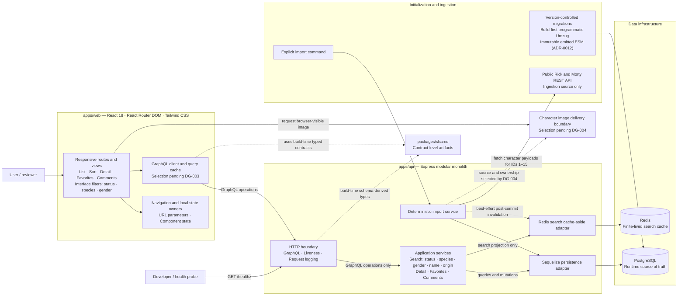

# Target System Module Diagram

- Status: Target architecture; not implemented
- Detail level: System modules and principal data flows
- Documentation entry point: [repository documentation map](../README.md#documentation-map)
- Architecture authority: [ADR index](./adrs/README.md)
- Execution authority: [implementation plan](./IMPLEMENTATION_PLAN.md)

## Document role

This diagram provides a compact view of the modules expected when the application is complete. It is derived from the requirements, accepted ADRs, and canonical implementation plan, including its active decision gates. It does not introduce architecture, select a pending option, or prove that any module exists.

## Module view

## Edge convention

- Solid arrows use `caller or initiator -> invoked boundary`. Response data returns through the same interaction and is not drawn as a separate arrow.
- Dotted arrows identify secondary relationships whose exact meaning is stated on the edge: build-time type derivation, best-effort post-commit coordination, or the image relationship pending DG-004.

## Architectural boundaries

- The browser uses the project GraphQL API for product data; it does not query PostgreSQL, Redis, or the public character API directly.
- PostgreSQL is the runtime source of truth. Redis is a finite-lived search optimization and falls back to PostgreSQL on a miss or failure.
- The public Rick and Morty API is accessed by the explicit importer, not by normal character queries or API startup.
- Imported character attributes are source-owned. Favorites and comments are application-owned, and a repeated import must not overwrite or delete them.
- The [`TASK-003` `GET /healthz` contract](./IMPLEMENTATION_PLAN.md#task-003---establish-the-operational-walking-skeleton) proves only that the Express process is alive; it does not claim GraphQL, PostgreSQL, or Redis readiness.
- Accepted [ADR-0012](./adrs/0012-use-a-build-first-programmatic-migration-lifecycle.md) resolves [DG-002](./IMPLEMENTATION_PLAN.md#dg-002---sequelize-migration-lifecycle) and defines the target build-first programmatic migration boundary; no runner or migration exists yet. [DG-003](./IMPLEMENTATION_PLAN.md#dg-003---frontend-graphql-client-and-query-cache) remains generic until an owner-approved ADR selects the frontend GraphQL client.
- Character-image delivery is represented as a neutral boundary because [DG-004](./IMPLEMENTATION_PLAN.md#dg-004---character-image-delivery-boundary) has not selected whether images are copied, served by the application, or requested from an external asset host.
- Favorites and comments use the global single-user demonstration semantics accepted by ADR-0005. Public anonymous writes or user accounts require its security and ownership follow-up before deployment.
- [ADR-0010](./adrs/0010-use-a-targeted-automated-testing-strategy.md) and [DG-001](./IMPLEMENTATION_PLAN.md#dg-001---typescript-test-harness) govern verification and the future test harness; they are intentionally not represented as runtime modules.
- The [AI-assistant task DAG](./IMPLEMENTATION_PLAN.md#canonical-task-graph) coordinates development work; it is not a runtime application module or data flow.
- Deferred optional capabilities such as scheduled synchronization, soft deletion, Swagger, and a query-timing decorator are intentionally absent.

## References

- [Requirements specification](./REQUIREMENTS.md)
- [ADR-0001: Modular monolith workspace](./adrs/0001-use-a-modular-monolith-workspace.md)
- [ADR-0002: TypeScript across the stack](./adrs/0002-use-typescript-across-the-stack.md)
- [ADR-0003: PostgreSQL relational persistence](./adrs/0003-use-postgresql-for-relational-persistence.md)
- [ADR-0004: Database as runtime source of truth](./adrs/0004-use-the-database-as-the-runtime-source-of-truth.md)
- [ADR-0005: Single-user character interactions](./adrs/0005-use-single-user-persistence-for-character-interactions.md)
- [ADR-0006: Use-case-oriented GraphQL contract](./adrs/0006-define-a-use-case-oriented-graphql-contract.md)
- [ADR-0007: Cache-aside character searches](./adrs/0007-use-cache-aside-for-character-searches.md)
- [ADR-0008: Deterministic bootstrap and import](./adrs/0008-use-deterministic-bootstrap-and-idempotent-sync.md)
- [ADR-0009: Frontend state ownership](./adrs/0009-keep-frontend-state-close-to-its-owner.md)
- [ADR-0010: Targeted automated testing strategy](./adrs/0010-use-a-targeted-automated-testing-strategy.md)
- [ADR-0011: TypeScript test harness](./adrs/0011-define-the-typescript-test-harness.md)
- [ADR-0012: Build-first programmatic migration lifecycle](./adrs/0012-use-a-build-first-programmatic-migration-lifecycle.md)
- [Active decision gates](./IMPLEMENTATION_PLAN.md#active-decision-gates)
