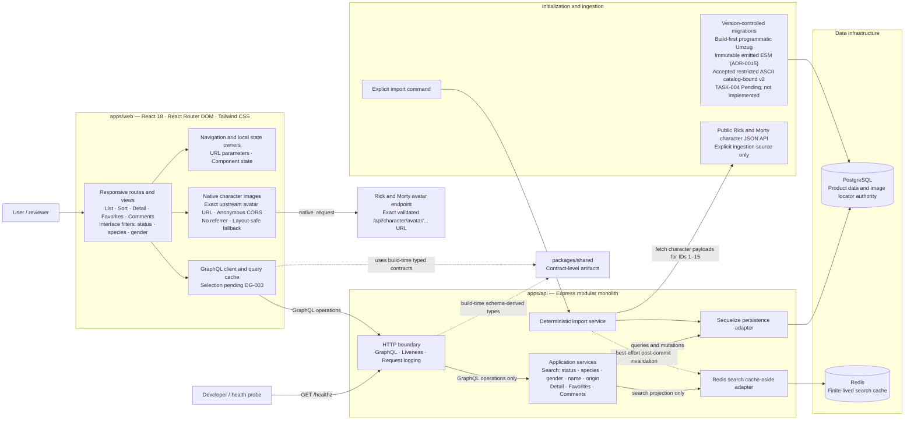

# Target System Module Diagram

- Status: Target architecture; not implemented
- Detail level: System modules and principal data flows
- Documentation entry point: [repository documentation map](../README.md#documentation-map)
- Architecture authority: [ADR index](./adrs/README.md)
- Execution authority: [implementation plan](./IMPLEMENTATION_PLAN.md)

## Document role

This diagram provides a compact view of the modules expected when the application is complete. It is derived from the requirements, accepted ADRs, and canonical implementation plan, including its active decision gates. It does not introduce architecture or prove that any module exists.

## Module view

## Edge convention

- Solid arrows use `caller or initiator -> invoked boundary`. Response data returns through the same interaction and is not drawn as a separate arrow.
- Dotted arrows identify secondary relationships whose exact meaning is stated on the edge: build-time type derivation or best-effort post-commit coordination.

## Architectural boundaries

- The browser uses the project GraphQL API for product data and never queries PostgreSQL, Redis, or the upstream character JSON API. Native image elements may request only the exact validated upstream avatar URLs accepted by ADR-0014, using anonymous CORS, no referrer, an enforcing path-qualified CSP, and a layout-safe fallback.
- PostgreSQL is the runtime source of truth. Redis is a finite-lived search optimization and falls back to PostgreSQL on a miss or failure.
- The public Rick and Morty character JSON API is accessed by the explicit importer, not by normal character queries or API startup. Direct avatar representation requests are the only accepted browser exception.
- Imported character attributes are source-owned. Favorites and comments are application-owned, and a repeated import must not overwrite or delete them.
- The [`TASK-003` `GET /healthz` contract](./IMPLEMENTATION_PLAN.md#task-003---establish-the-operational-walking-skeleton) proves only that the Express process is alive; it does not claim GraphQL, PostgreSQL, or Redis readiness.
- Now-Superseded [ADR-0012](./adrs/0012-use-a-build-first-programmatic-migration-lifecycle.md) historically resolved [DG-002](./IMPLEMENTATION_PLAN.md#dg-002---sequelize-migration-lifecycle). Accepted [ADR-0015](./adrs/0015-use-a-build-first-migration-lifecycle-with-exact-catalog-byte-lock-identity.md), prepared by completed [TASK-018](./IMPLEMENTATION_PLAN.md#task-018---resolve-the-postgresql-migration-lock-namespace-identity), is the current whole-record build-first migration authority and replaces ADR-0012's NFC identity with a restricted-ASCII catalog-bound v2 identity. Fresh independent review returned `PASS` on exact proposal SHA-256 `8B7B9EC9508DF01E57EA067344896814CD0B0B1B3D8083B889C7ED44AA5432B1`, and the project owner explicitly approved those bytes on 2026-08-14. [DG-005](./IMPLEMENTATION_PLAN.md#dg-005---postgresql-migration-lock-namespace-identity) is Resolved. TASK-004 remains Pending until separate execution authorization, so no runner or migration exists. [DG-003](./IMPLEMENTATION_PLAN.md#dg-003---frontend-graphql-client-and-query-cache) remains generic until an owner-approved ADR selects the frontend GraphQL client.
- Accepted [ADR-0014](./adrs/0014-persist-and-deliver-character-image-urls-directly.md) resolves [DG-006](./IMPLEMENTATION_PLAN.md#dg-006---character-image-url-successor-boundary): the importer persists only the exact validated absolute `Character.image` URL, GraphQL and finite Redis projections return that URL, and the browser requests the avatar directly. The application owns no image bytes, decoder, proxy, asset route, or image lifecycle. ADR-0001, ADR-0004, and ADR-0013 are Superseded history. [AUTH-001](./IMPLEMENTATION_PLAN.md#auth-001---character-image-content-rights-authorization) is `Authorized`; the implementation plan owns authorization continuity, while ADR-0014 owns the direct-URL technical boundary. No image-delivery implementation exists.
- Favorites and comments use the global single-user demonstration semantics accepted by ADR-0005. Public anonymous writes or user accounts require its security and ownership follow-up before deployment.
- [ADR-0010](./adrs/0010-use-a-targeted-automated-testing-strategy.md) and [DG-001](./IMPLEMENTATION_PLAN.md#dg-001---typescript-test-harness) govern verification and the future test harness; they are intentionally not represented as runtime modules.
- The [AI-assistant task DAG](./IMPLEMENTATION_PLAN.md#canonical-task-graph) coordinates development work; it is not a runtime application module or data flow.
- Deferred optional capabilities such as scheduled synchronization, soft deletion, Swagger, and a query-timing decorator are intentionally absent.

## References

- [Requirements specification](./REQUIREMENTS.md)
- [ADR-0001: Modular monolith workspace (`Superseded`)](./adrs/0001-use-a-modular-monolith-workspace.md)
- [ADR-0002: TypeScript across the stack](./adrs/0002-use-typescript-across-the-stack.md)
- [ADR-0003: PostgreSQL relational persistence](./adrs/0003-use-postgresql-for-relational-persistence.md)
- [ADR-0004: Database as runtime source of truth (`Superseded`)](./adrs/0004-use-the-database-as-the-runtime-source-of-truth.md)
- [ADR-0005: Single-user character interactions](./adrs/0005-use-single-user-persistence-for-character-interactions.md)
- [ADR-0006: Use-case-oriented GraphQL contract](./adrs/0006-define-a-use-case-oriented-graphql-contract.md)
- [ADR-0007: Cache-aside character searches](./adrs/0007-use-cache-aside-for-character-searches.md)
- [ADR-0008: Deterministic bootstrap and import](./adrs/0008-use-deterministic-bootstrap-and-idempotent-sync.md)
- [ADR-0009: Frontend state ownership](./adrs/0009-keep-frontend-state-close-to-its-owner.md)
- [ADR-0010: Targeted automated testing strategy](./adrs/0010-use-a-targeted-automated-testing-strategy.md)
- [ADR-0011: TypeScript test harness](./adrs/0011-define-the-typescript-test-harness.md)
- [ADR-0012: Superseded build-first programmatic migration lifecycle](./adrs/0012-use-a-build-first-programmatic-migration-lifecycle.md)
- [ADR-0013: Materialize character images during ingestion (`Superseded`)](./adrs/superseded/0013-materialize-character-images-during-ingestion.md)
- [ADR-0014: Persist and deliver character image URLs directly (`Accepted`)](./adrs/0014-persist-and-deliver-character-image-urls-directly.md)
- [ADR-0015: Build-first migration lifecycle with restricted ASCII catalog-bound lock identity (`Accepted`)](./adrs/0015-use-a-build-first-migration-lifecycle-with-exact-catalog-byte-lock-identity.md)
- [Active decision gates](./IMPLEMENTATION_PLAN.md#active-decision-gates)
