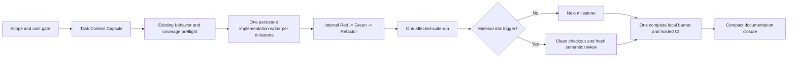

# Agentic Workflow Efficiency Audit — TASK-004

- Date: 2026-08-16
- Scope: repository guidance, documentation governance, project-scoped agents and skills, the worker-first implementation workflow, and the recorded execution of TASK-004
- Method: read-only repository, Git-history, execution-record, and lease-log analysis; the project worker-first workflow was not used for this audit
- Implementation baseline: `ee2785ff`
- Closure commit: `973166f`
- Status: advisory point-in-time review; this document changes no requirement, ADR, task status, authorization, or implementation behavior

## Executive Summary

TASK-004 consumed disproportionate elapsed time and agent usage because three multipliers were combined:

1. A relatively narrow persistence requirement expanded into a high-assurance migration artifact, session, locking, rollback, recovery, and compatibility subsystem.
2. The implementation workflow converted each small behavior into separate, serial Red and Green assignments with fresh context, packets, leases, receipts, inspections, and frequent command repetition.
3. Execution evidence and governing context grew across the ExecPlan, execution log, lease records, reviews, and closure documents, and fresh agents repeatedly reloaded parts of that growing context.

The final record reconciles 209 contract/receipt pairs across 109 cycles. No write leases overlapped, so the multi-agent topology provided no implementation parallelism. It functioned as a serial handoff pipeline.

The most effective correction is not simply to choose a larger model. The repository should introduce a risk-tiered fast path in which one persistent implementation writer owns a coherent milestone and performs internal Red-Green-Refactor under one lease. Scope proportionality, cost budgets, existing-behavior preflight, validation cadence, and early clean-checkout evidence should become explicit controls. Independent review should remain because it found material defects, but deterministic bookkeeping should be machine-validated and semantic re-review should be proportional to finding severity.

## Scope and Method

The audit examined:

- [repository-wide guidance](../../AGENTS.md);
- the [documentation map and change-impact policy](../../README.md#documentation-map);
- the [implementation workflow](../../.codex/execplan-implementation-workflow.md), [write-lease guard](../../.codex/write-lease-guard.md), agent definitions, and model policy;
- the repository skills under `../../.agents/skills/`;
- TASK-004 requirements, planning, implementation evidence, reviews, Git history, and ignored runtime lease records;
- the scope introduced by [ADR-0015](../adrs/0015-use-a-build-first-migration-lifecycle-with-exact-catalog-byte-lock-identity.md);
- the available metrics instrumentation and event output.

The audit did not run the project's worker-first agent flow, modify implementation files, or rerun the test suites. Runtime claims below come from preserved repository evidence. Lease durations are derived from filesystem timestamps and may include waiting, pausing, or abandoned time; they are not equivalent to model compute time.

Exact token usage, prompt-cache effectiveness, per-role cost, and weekly-plan consumption cannot be reconstructed. The metrics event directory contained no usable TASK-004 events. This report therefore distinguishes measured repository facts from inferences about token or quota consumption.

## Reconstructed Execution

### Requirement-to-scope expansion

The source requirement is concise: the API must connect to PostgreSQL through Sequelize and the relational structure must be expressed through migrations ([FR-BE-003](../REQUIREMENTS.md#fr-be-003---relational-persistence)). The canonical task outcome is also concise: an empty database must migrate to the accepted character/comment relational model ([TASK-004](../IMPLEMENTATION_PLAN.md#task-004---create-relational-persistence-from-migrations)).

The accepted implementation scope became substantially broader. The completed ExecPlan includes:

- authenticated, immutable, content-addressed migration artifacts;
- source identity, path grammar, manifests, source maps, and tamper matrices;
- checksummed history, drift detection, rollback grammar, and reapply behavior;
- transaction atomicity, metadata-failure recovery, and physical socket destruction;
- startup-packet identity, environment closure, protocol OIDs, advisory-lock vectors, contention, and destructive timeouts;
- a dedicated verification controller, Windows evidence, clean-checkout evidence, hosted CI, and negative compatibility checks.

These obligations are visible in [ExecPlan milestones 4 through 8](../plans/completed/TASK-004-relational-persistence-from-migrations.md#milestone-4-harden-and-fully-authenticate-the-immutable-emitted-artifact) and the twenty hard gates and LOCK-INV-01 through LOCK-INV-21 required by [ADR-0015](../adrs/0015-use-a-build-first-migration-lifecycle-with-exact-catalog-byte-lock-identity.md#validation).

The result was therefore not merely a migration task. It was a migration-control subsystem with a high assurance profile.

### Timeline

| Milestone | Observed time |
|---|---:|
| ExecPlan registration to closure | 82 h 30 min |
| Implementation authorization to closure | 44 h 29 min |
| First lease contract to last receipt | 38 h 02 min |
| First integrated implementation commit to closure | 9 h 28 min |

Implementation was authorized on 2026-08-14 at 16:44 UTC from baseline `ee2785ff`. The first integrated implementation commit, `26d7dc1`, arrived approximately 35 hours later. The first acceptance review returned `REVISE` after 203 leases and 107 cycles because inherited TypeScript configuration files were omitted from authenticated artifact identity and current-state documentation was stale ([first review](./2026-08-16-task-004-acceptance-review.md)). A later clean checkout exposed LF/CRLF-dependent emitted identity. The final re-review reconciled 209 leases across 109 cycles and returned `PASS` ([final re-review](./2026-08-16-task-004-acceptance-re-review.md)).

### Agent and lease mechanics

Direct analysis of `logs/agent-flow-leases/v1/` produced the following counts:

| Measure | Count |
|---|---:|
| Contracts | 209 |
| Compliant terminal receipts | 209 |
| Red/test-worker assignments | 129 |
| Green/code-worker assignments | 74 |
| Setup/code-worker assignments | 6 |
| Red+Green cycles | 61 |
| Red-only cycles | 42 |
| Setup-only cycles | 5 |
| Green-only cycles | 1 |
| Attempt-2 assignments | 42 |
| Zero-net-change receipts | 22 |
| Overlapping leases | 0 |

Thirty-three execution-log entries classify a Red attempt as existing behavior confirmed. Depending on whether the ExecPlan progress summary or the durable chronology is counted, the total is 33 or 34. These assignments attempted to produce a behavioral failure for behavior already implemented or already covered.

Filesystem timestamps provide the following elapsed-time proxy:

- leases-open total: 23 h 55 min;
- inter-lease gaps: 14 h 08 min, with a 2.6-minute median;
- one Red outlier: 4 h 48 min;
- one Green outlier: 71 min;
- total excluding those two outliers: approximately 17 h 56 min.

No leases overlapped. The workflow's separate Red and Green roles, one active lease, coordinator inspection barrier, and fresh assignment for every correction structurally enforce this serialization ([normal flow](../../.codex/execplan-implementation-workflow.md#normal-flow)).

### Implementation and test scale

The diff from authorization baseline `ee2785ff` to closure `973166f` contains:

| Category | Files | Added lines |
|---|---:|---:|
| Tests | 22 | 17,154 |
| Production TypeScript | 19 | 3,242 |
| TASK-004 verification controller | 1 | 592 |
| Complete diff | 63 | 23,357 added / 569 removed |

Tests were 5.29 times the production TypeScript volume, or 4.47 times production plus the verification controller. High test volume is not automatically waste, because ADR-0015 deliberately requires negative and concurrency evidence. The ratio nevertheless shows that the accepted architecture imposed a large permanent verification surface.

The largest file, [migration-lifecycle.integration.test.ts](../../apps/api/src/infrastructure/database/migration-lifecycle.integration.test.ts), contains 9,174 lines and was modified by 47 leases. This monolith increased reading, editing, conflict, and focused-execution cost throughout the task.

### Validation repetition

Conservative counts of results mentioned in the ExecPlan include:

- 88 unit-test results covering 2,842 summed cases;
- 67 integration-test results covering 2,351 summed cases;
- 62 application-test results covering 124 summed cases;
- 172 typecheck mentions;
- 115 build mentions.

These are evidence mentions, not exact command invocations. Some entries summarize multiple commands, while worker-plus-coordinator repetition may make the true count higher.

The TASK-004 controller runs unit, integration, application, and smoke scopes separately and then invokes the root `npm test` command ([verification controller](../../scripts/verify-task-004.ts)). The root command reruns those suites ([package scripts](../../package.json)). A successful complete controller execution therefore duplicates significant test work by construction.

### Documentation and context amplification

During implementation:

- the ExecPlan grew from approximately 10,532 to 45,679 words;
- the execution log grew by approximately 31,014 words;
- the two surfaces added more than 66,000 words combined;
- the final ExecPlan contains 250 progress entries;
- the execution log contains more than 200 TASK-004 chronology rows;
- TASK-004 lease contracts and receipts occupy several megabytes of ignored runtime data.

The worker definitions require every fresh writer to read the task, ExecPlan, mapped requirements, ADRs, active gates, and applicable SPEC/HS rules before editing ([test worker](../../.codex/agents/test-worker.toml), [code worker](../../.codex/agents/code-worker.toml)). The packet is defined as a minimum context floor rather than a maximum boundary. Repeatedly rehydrating this growing authority chain is a likely token multiplier, although absent event telemetry prevents exact quantification.

## Root Causes

### 1. Scope expansion upstream of implementation

The dominant cause was the difference between the source persistence need and the accepted high-assurance lifecycle. The ADR evaluation rubric gives proportionality only 15 of 100 points and does not make cost proportionality a hard gate ([ADR evaluation method](../adrs/README.md#evaluation-method)). A decision can therefore pass while creating a very large implementation and test obligation.

ADR-0015 records several negative consequences: custom artifact ownership, driver/session controls, platform-sensitive identity, locking semantics, and a large validation surface. Those tradeoffs were accepted, so the implementation team could not safely remove them during TASK-004. Scope control needed to happen before ADR acceptance or through an explicit successor decision.

### 2. Micro-TDD mapped one-to-one to agent handoffs

TDD requires observable Red before production Green. It does not require separate model instances for those phases. The project workflow nevertheless assigns one test worker to a minimal Red and a new code worker to reproduce it and reach Green. Each half requires a packet, lease, receipt, readback, and coordinator barrier.

This design provides independent test authorship, but its fixed use for every behavior makes the independence cost much larger than its value on ordinary slices. Merely combining each cycle's Red and Green in one persistent writer could have reduced the theoretical 209 writer assignments to no more than 109, approximately 48 percent fewer. Grouping related behavior into six to ten coherent milestones would reduce handoffs by more than 90 percent, though handoff reduction is not identical to token reduction.

### 3. No low-cost existing-behavior preflight

The workflow assumes a new behavioral Red should be produced. It lacks a standard phase for determining that the behavior is already present and only evidence or characterization is needed. The 33–34 invalid Reds demonstrate that this is a recurring, measurable problem.

A read-only coverage preflight would classify each proposed slice as new behavior, regression, characterization, or evidence. Green authorization should be opened only for a real missing behavior. Characterization can be recorded without pretending that passing existing behavior is a failed TDD attempt.

### 4. Validation duplicated at several trust boundaries

Workers validate, the coordinator repeats or inspects, the controller aggregates and repeats, clean checkout validates again, CI validates again, and the reviewer reconstructs the complete state. Multiple boundaries are appropriate for high-risk behavior, but applying every boundary to every micro-slice is disproportionate.

The validation strategy should distinguish focused proof, affected-suite proof, milestone integration, and closure proof. Deterministic evidence should be consumed rather than rerun unless the tree changed, evidence is incomplete, contamination is plausible, or risk explicitly requires independent reproduction.

### 5. Documentation became an operational event stream

ExecPlan Progress, Surprises, Decision Log, Revision Note, execution chronology, lease receipts, reviews, and closure records repeat overlapping evidence. This conflicts with the repository's separate guidance to link to authoritative owners instead of duplicating normative prose.

The ExecPlan should own concise current execution state and material decisions. A machine-readable cycle ledger should own granular events. The global execution log should record durable milestones and decisions, not each Red, Green, hash, and handoff.

### 6. Holistic evidence arrived too late

The independent review found a real inherited-configuration identity defect, and a later clean checkout found a real line-ending defect. Removing review would therefore reduce cost at the expense of correctness. The correct adjustment is to move end-to-end artifact and clean-checkout checks earlier, after the first working vertical milestone, and to make subsequent re-review proportional to the finding.

### 7. Fixed premium model policy

All five custom agents select `gpt-5.6-sol`; the primary and independent reviewer use the highest reasoning settings in normal policy ([model policy](../../.codex/README.md#model-and-reasoning-policy)). This applies premium reasoning not only to architecture and concurrency but also to packet validation, mechanical evidence reconciliation, documentation correction, and deterministic command execution.

[Official OpenAI model guidance](https://developers.openai.com/api/docs/guides/latest-model) recommends choosing Sol for frontier capability, Terra for a balance of intelligence and cost, and Luna for efficient high-volume work. It recommends `medium` as a balanced starting point and reserving higher efforts for workloads with measured quality gains. Repository roles should therefore route by task risk rather than permanently binding one expensive model and effort to every instance of a role.

### 8. Metrics machinery produced no decision data

The repository contains a substantial agent-flow metrics implementation and configured hooks, but the inspected event directory contained no TASK-004 data. As a result, the execution cannot answer the central optimization questions: tokens by role, cache reuse, exact active time, cost by phase, or validation count.

Instrumentation should either be reduced to a small reliable dataset and activated for representative tasks or explicitly retired. Complex inactive instrumentation adds maintenance without learning.

## Policy Tensions

The audit found several internal tensions:

- [AGENTS.md](../../AGENTS.md#implementation-simplicity-and-clean-code) requires KISS and YAGNI for workflow machinery, while the implementation workflow makes packets, leases, separate Red/Green workers, and fresh correction assignments mandatory for all owner-authorized implementation ExecPlans.
- [ADR-0010](../adrs/0010-use-a-targeted-automated-testing-strategy.md) seeks high confidence from a small targeted suite and warns about infrastructure-test friction, while TASK-004 adopted exhaustive matrices and a 9,174-line integration test.
- The documentation map discourages reading the entire repository, while fresh workers must repeatedly reconstruct a broad authority chain and the reviewer must reconcile every contract/receipt pair.
- The repository advises linking to authoritative owners instead of duplicating prose, while execution rules require overlapping state in multiple living and historical surfaces.

These are not isolated compliance errors. They indicate that the fixed workflow is not proportional to all task classes.

## Target Agentic Workflow

### Proposed roles

| Role | Default responsibility | When to use |
|---|---|---|
| Primary | Scope, integration, authority boundaries, evidence acceptance, and closure | Always |
| Implementation worker | Own one coherent milestone and perform full internal Red-Green-Refactor | When delegation provides useful context or write isolation |
| Independent reviewer | Review semantic diff, mapped DoD, final evidence, and detected anomalies | Material-risk milestones and substantial closure |
| Test worker | Author an independent adversarial or regression contract | Security, critical regression, or disputed behavior; not the normal path |
| Technology researcher | Resolve bounded external uncertainty using primary sources | Only when a current technical decision depends on external evidence |
| Decision analyst | Reconcile three or more genuinely complex options | Consequential decisions with non-obvious tradeoffs |

### Task Context Capsule

Each milestone should receive one immutable, concise capsule containing:

- governing task and requirement IDs;
- exact ADR/SPEC/HS anchors;
- objective and non-goals;
- allowed paths and ownership;
- current state and accepted tests;
- one decisive focused command;
- affected-suite command;
- explicit stop conditions and owner boundaries.

The primary retains the long-form authority context. Workers read the capsule and only the directly linked fragments needed for their slice, rather than the complete growing ExecPlan and chronology.

### Validation cadence

| Boundary | Default validation |
|---|---|
| Red | Run the smallest decisive focus once and retain intended-failure evidence |
| Green | Run the same focus once until it passes |
| Milestone | Run the affected suite once |
| First end-to-end artifact milestone | Run an early clean checkout and cross-platform-sensitive identity check |
| Closure | Run one complete local barrier and one hosted CI barrier |
| Coordinator repetition | Only for contamination, incomplete evidence, changed state, or explicit risk |
| Reviewer repetition | Reproduce semantic risk, not every deterministic bookkeeping check |

## Risk and Model Routing

| Tier | Typical work | Suggested topology | Suggested model/effort baseline |
|---|---|---|---|
| S0 | Documentation, indexing, hashes, validators, mechanical edits | Primary only; no LLM reviewer for deterministic checks | Luna or Terra, low/medium |
| S1 | Ordinary feature, bug, or local refactor | Primary or one implementation worker with internal TDD | Terra high or Sol medium |
| S2 | PostgreSQL, GraphQL wiring, cross-platform build behavior | One Sol implementation worker and one fresh reviewer | Sol high; reviewer high |
| S3 | Security, irreversible migration, concurrency, destructive recovery | Budgeted strict topology with independent adversarial testing and review | Sol xhigh/max or an operator-selected Ultra-quality mode |

Model routing must be evaluated against representative repository tasks. The subscription's weekly usage meter is not interchangeable with public API token prices, so savings should be measured in the actual Codex environment rather than inferred from API pricing alone.

## Prioritized Recommendations

### P0 — Highest expected return

1. Add a risk-tiered fast path to [AGENTS.md](../../AGENTS.md), the [project Codex guide](../../.codex/README.md), and the [implementation workflow](../../.codex/execplan-implementation-workflow.md).
2. Replace normal separate Red and Green agents with one persistent implementation writer per coherent milestone. Retain separate test authorship only when independence has an explicit risk benefit.
3. Add a scope-and-cost gate before ADR approval and task authorization. Require estimates for files, production LOC, test LOC, cycles, full-suite runs, elapsed time, and maintenance surface.
4. Make proportionality a hard ADR gate rather than a low-weight scoring dimension.
5. Add an existing-behavior and coverage preflight. Two invalid Reds within a milestone must stop new cycles and trigger a coverage audit.
6. Remove duplicate suite execution from the TASK-004 verification controller.
7. Run clean-checkout and end-to-end artifact validation at an early milestone instead of waiting for final acceptance.

### P1 — Context, review, and documentation

8. Introduce a compact Task Context Capsule and stop requiring every implementation worker to reload complete living records.
9. Generate packet and lease projection from one validated structured object. Omit redundant `None` fields from the human prompt while retaining any machine-required normalized values.
10. Use one lease per milestone or coherent slice rather than one lease per TDD half-cycle. Permit a no-lease single-writer path when the workspace and ownership are already exclusive.
11. Validate contract/receipt integrity and TDD ordering deterministically. Give the reviewer the semantic diff, DoD, final evidence, and anomaly summary rather than all conforming bookkeeping.
12. Make re-review proportional: full re-review for Blocker/Major, focused semantic re-review for code Minor, and documentation validator plus diff inspection for non-normative documentation Minor.
13. Keep the ExecPlan at a stable path with a status field rather than moving it at closure, or otherwise automate all inbound-link repair.
14. Make the ExecPlan the task execution-evidence owner. Restrict the global execution log to start, material decisions, milestones, exceptions, and closure.
15. Split the 9,174-line integration test by concern: artifact identity, migration lifecycle/history, lock/session recovery, and CLI/controller behavior.

### P2 — Skills, models, and architecture follow-up

16. Change `verify-repository` to explicit `focus`, `milestone`, and `closure` tiers and remove automatic full verification from ordinary worker handoff.
17. Restrict `review-acceptance` to product or release readiness. Task-scoped review should assess only mapped requirements, local DoD, and non-regression.
18. Restrict `plan-implementation` reading to mapped authority rather than broad portfolio reloads.
19. Extend `govern-adrs` with implementation-cost and proportionality evidence requirements.
20. Remove fixed premium model overrides from mechanical roles or introduce explicit risk-tier selection.
21. Activate a minimal, reliable metrics pilot for one or two representative tasks, or retire the inactive complex instrumentation.
22. Do not treat ADR-0015 as a template for ordinary infrastructure work. If its ownership cost blocks future delivery, evaluate a successor ADR rather than silently weakening its accepted guarantees.
23. Prefer vertical roadmap slices that produce acceptance progress. TASK-004 closed while overall product acceptance remained 0/12; a minimal migration plus deterministic import could have produced earlier AC-009 value before advanced hardening.

## Proposed Budgets and Stop Rules

These values are starting hypotheses for a pilot, not permanent normative limits:

| Control | Ordinary-task default |
|---|---:|
| Expected implementation cycles | 6–10 |
| Owner approval required | More than 12 cycles |
| Concurrent implementation writers | 1 unless paths and integration are genuinely independent |
| Fresh implementation agent instances | 1–2 |
| Invalid Reds before coverage audit | 2 |
| Complete local suite runs | 1 at closure, plus one only after material integration change |
| Hosted CI barriers | 1 clean closure run |
| Test-volume re-scope trigger | More than 2,000 planned added test lines for an ordinary task |
| Budget review | At 50 percent of expected usage |
| Scope freeze | At 80 percent unless a correctness defect requires work |
| Mandatory stop/replan | At 100 percent before opening new scope |

An S3 task may exceed these values, but the estimate and owner authorization must state why the heavier topology is justified.

## Measurement Plan

A useful pilot needs only five reliable measures:

1. agent turns by role;
2. wall-clock time from authorization to closure;
3. focused test executions;
4. affected-suite and complete-suite executions;
5. exact usage counters exposed by the runtime, including cached input when available.

Track additional task descriptors so results are comparable:

- risk tier;
- files and LOC changed;
- test-to-production ratio;
- number of invalid Reds;
- number and severity of review findings;
- clean-checkout and CI retry counts;
- acceptance criteria advanced.

Compare at least two similarly scoped tasks before and after the fast path. Optimize for successful, complete delivery with no increase in escaped Major/Blocker findings, not for token reduction alone.

## Counterfactual: One Sol Ultra Session

A single persistent, high-capability Sol session would likely have reduced TASK-004 wall time and repeated context usage relative to 209 serial fresh assignments. It would have removed most packet, lease, handoff, and context-rehydration overhead.

It would not have made the accepted scope small. Preserving ADR-0015 still required approximately 3,800 lines of runtime and controller code, more than 17,000 lines of tests, PostgreSQL integration, platform-sensitive artifact identity, concurrency, and recovery evidence.

The stronger counterfactual is therefore:

> proportional scope, one persistent Sol high/max writer, internal TDD, early end-to-end validation, and one independent semantic review at material risk boundaries.

For ordinary S1 work, a persistent Terra-high or Sol-medium session may provide a better efficiency baseline than maximum or Ultra-quality reasoning. The highest effort should be justified by measured quality gain or S3 risk.

## Conclusion

TASK-004's cost was structurally predictable once ADR-0015 scope and the fixed worker-first microcycle protocol were combined. The execution did not demonstrate that multi-agent work is inherently inefficient; it demonstrated that serial multi-agent handoffs without independent parallel work can be much more expensive than a persistent writer.

The repository should preserve the controls that found real defects: TDD ordering, PostgreSQL boundary evidence, early cross-platform clean-checkout validation, hosted CI, and independent semantic review. It should remove or narrow the controls that did not scale: separate Red/Green instances for every behavior, full-context reloads, per-half-cycle leases, duplicated suite execution, manual review of conforming bookkeeping, and documentation of every micro-event in several places.

The first pilot should implement the fast path, capsule, preflight, validation cadence, and five basic metrics on one S1 or S2 task. If quality remains stable, those changes should become the default and the existing strict topology should remain available only for explicitly budgeted S3 work.

## Owner Disposition — 2026-08-16

The project owner accepted the audit's core diagnosis with the following binding adjustments, now recorded by [ADR-0016](../adrs/0016-use-milestone-slice-tdd-with-independent-test-and-implementation-ownership.md):

- retain test-first development, but use one coherent milestone slice rather than micro-level Red-Green cycles for every assertion;
- retain independent `test_worker` and `code_worker` ownership because separate contexts provide useful challenge and output quality;
- require the exact `EXISTING_AND_COVERED`, `EXISTING_BUT_UNCOVERED`, `MISSING`, `REGRESSION`, `PARTIAL`, `CONFLICTING`, and `UNKNOWN` preflight classifications; existing-but-uncovered behavior receives passing characterization evidence without Green, a partial gap proceeds only after coordinator confirmation, and conflicting or unknown evidence stops dependent work;
- remove redundant validation, run focused Green after each coherent slice, and run one affected-boundary join plus independent semantic review after each ExecPlan milestone with reasoning depth proportional to risk;
- keep model and reasoning-level selection as risk-tiered operational routing rather than fixed architectural policy;
- preserve completed plans, reviews, ADRs, and TASK-004 chronology as historical evidence; and
- keep ADR-0015 unchanged while adding a proportional extension-cost watch before future work expands its migration lifecycle.

This disposition does not adopt the audit's combined-writer default or recommend removing the separate test and implementation roles. It also does not remove completed TASK-004 work. The owner authorized ADR-0016 as repository policy without a product `TASK-*`, decision gate, or ExecPlan because adding those artifacts solely to reduce workflow overhead would reproduce the problem being corrected. Pending and future implementation work follows ADR-0016; completed TASK-004 retains ADR-0010 as its point-in-time authority.
